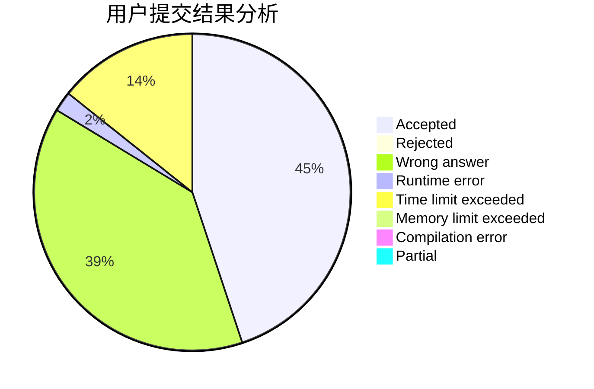
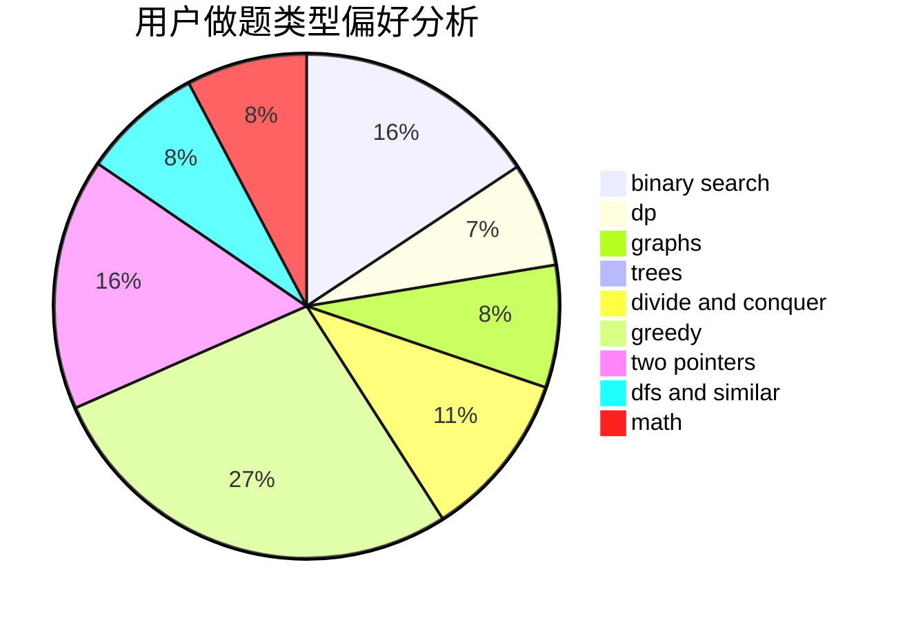

# Oooycc

<!-- tabs:start -->

#### **用户提交结果分析**

#### **用户做题类型偏好分析**

<!-- tabs:end -->
# 推荐题目
[804F](https://codeforces.com/contest/804/problem/F)
[638A](https://codeforces.com/contest/638/problem/A)
[318C](https://codeforces.com/contest/318/problem/C)
[893B](https://codeforces.com/contest/893/problem/B)
[683B](https://codeforces.com/contest/683/problem/B)
[1118B](https://codeforces.com/contest/1118/problem/B)
[863E](https://codeforces.com/contest/863/problem/E)
[254B](https://codeforces.com/contest/254/problem/B)
[1034D](https://codeforces.com/contest/1034/problem/D)
[1252F](https://codeforces.com/contest/1252/problem/F)
