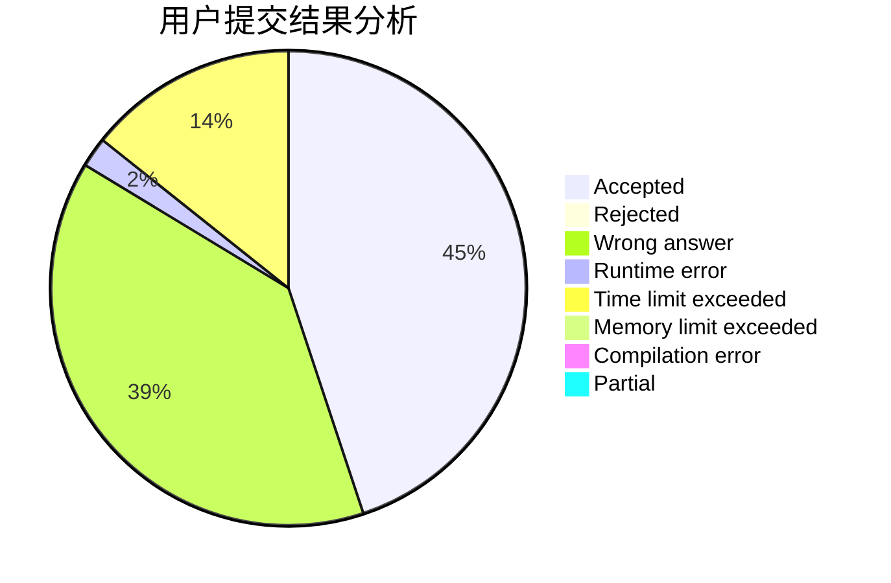
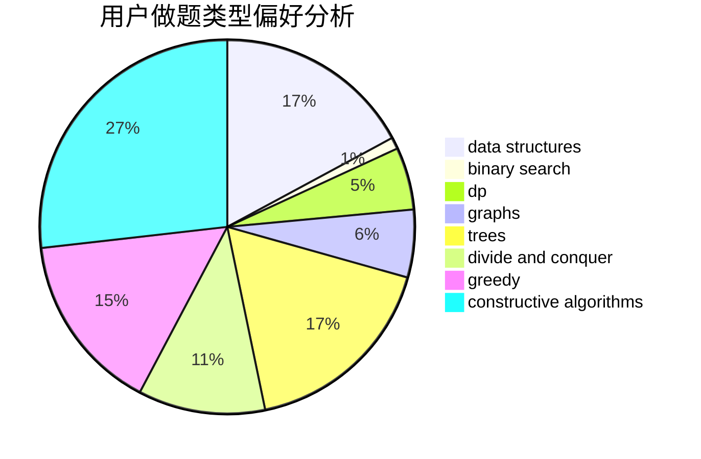
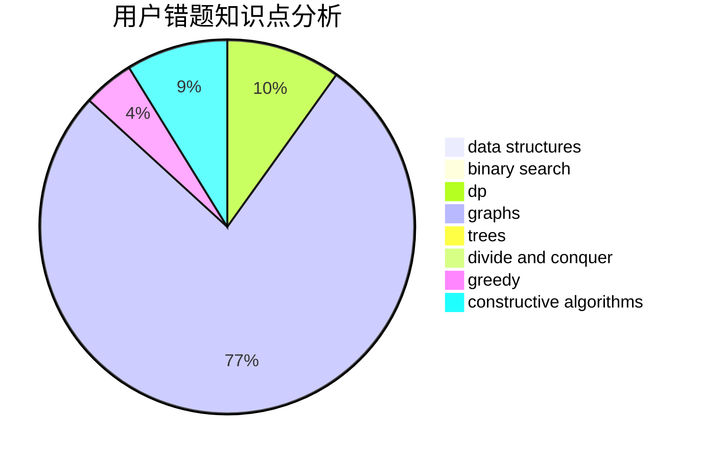

# Oooycc

<!-- tabs:start -->

#### **用户提交结果分析**

#### **用户做题类型偏好分析**

#### **用户错题知识点分析**

<!-- tabs:end -->
# 推荐题目
[789D](https://codeforces.com/contest/789/problem/D)		dsu,graphs,sortings,trees		  
[618B](https://codeforces.com/contest/618/problem/B)		constructive algorithms		  
[300A](https://codeforces.com/contest/300/problem/A)		brute force,
                        constructive algorithms,
                        implementation		  
[871E](https://codeforces.com/contest/871/problem/E)		graphs,
                        greedy,
                        trees		  
[664A](https://codeforces.com/contest/664/problem/A)		math,
                        number theory		  
[1116D2](https://codeforces.com/contest/1116D/problem/2)		nan		  
[845D](https://codeforces.com/contest/845/problem/D)		data structures,
                        dp,
                        greedy		  
[232C](https://codeforces.com/contest/232/problem/C)		constructive algorithms,
                        divide and conquer,
                        dp,
                        graphs,
                        shortest paths		  
[1034A](https://codeforces.com/contest/1034/problem/A)		number theory		  
[1248D2](https://codeforces.com/contest/1248D/problem/2)		dsu,graphs,sortings,trees		  
