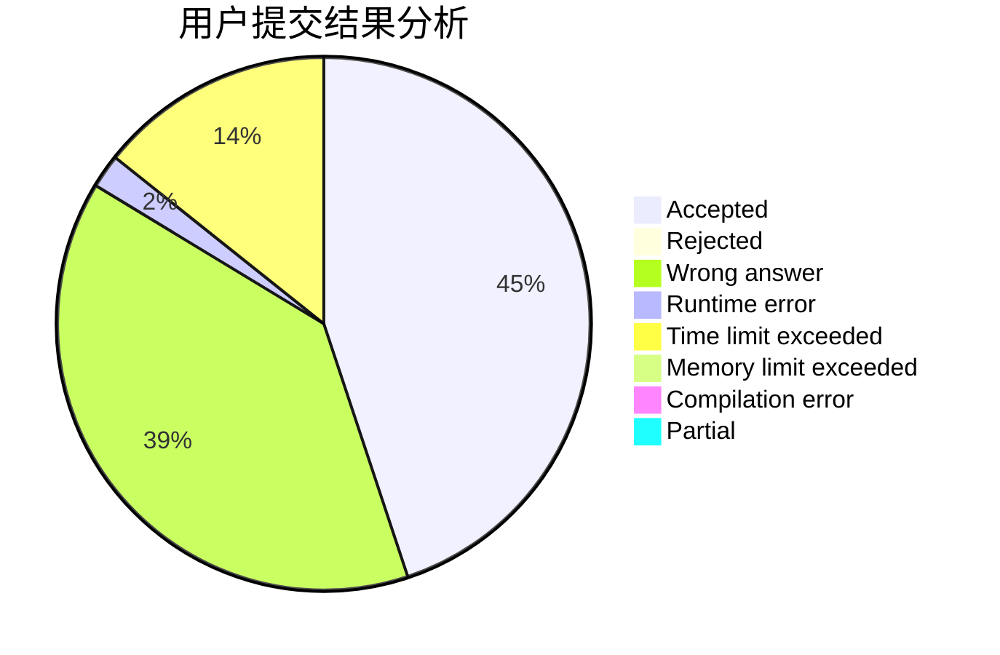
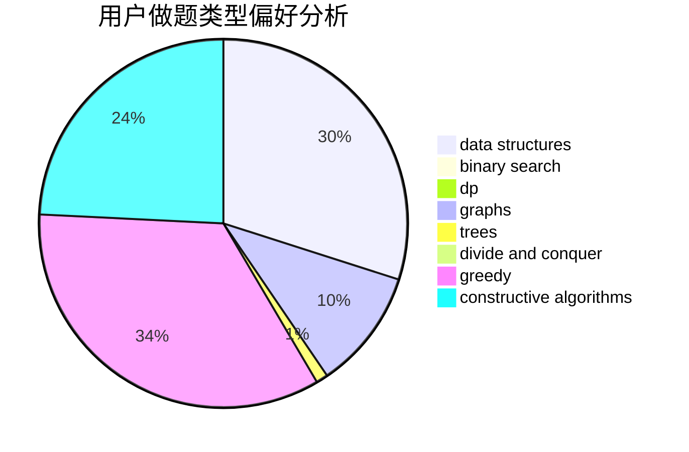
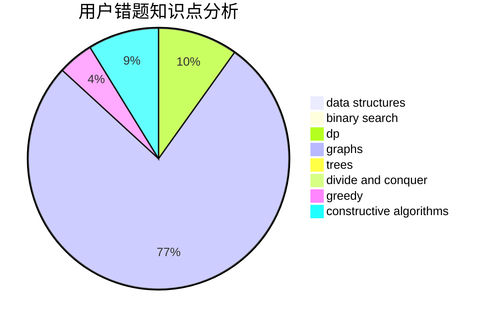

# Oooycc

<!-- tabs:start -->

#### **用户提交结果分析**

#### **用户做题类型偏好分析**

#### **用户错题知识点分析**

<!-- tabs:end -->
# 推荐题目
[804F](https://codeforces.com/contest/804/problem/F)		combinatorics,
                        dfs and similar,
                        dp,
                        graphs,
                        number theory		  
[638A](https://codeforces.com/contest/638/problem/A)		*special problem,
                        constructive algorithms,
                        math		  
[318C](https://codeforces.com/contest/318/problem/C)		dsu,graphs,sortings,trees		  
[893B](https://codeforces.com/contest/893/problem/B)		brute force,
                        implementation		  
[683B](https://codeforces.com/contest/683/problem/B)		*special problem		  
[1118B](https://codeforces.com/contest/1118/problem/B)		implementation		  
[863E](https://codeforces.com/contest/863/problem/E)		data structures,
                        sortings		  
[254B](https://codeforces.com/contest/254/problem/B)		brute force,
                        implementation		  
[1034D](https://codeforces.com/contest/1034/problem/D)		binary search,
                        data structures,
                        two pointers		  
[1252F](https://codeforces.com/contest/1252/problem/F)		hashing,
                        trees		  
