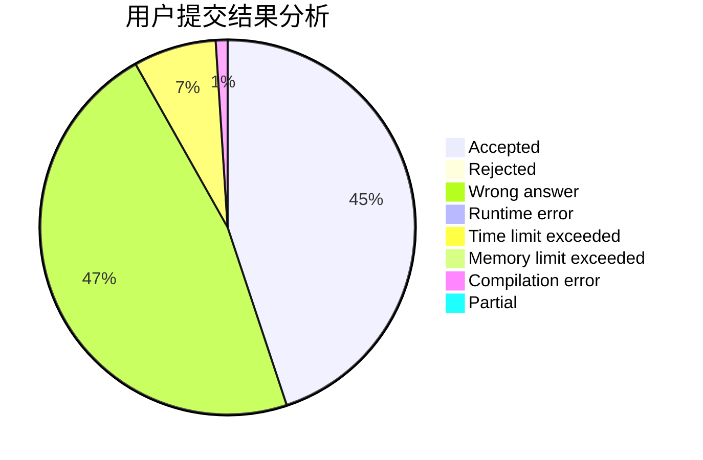
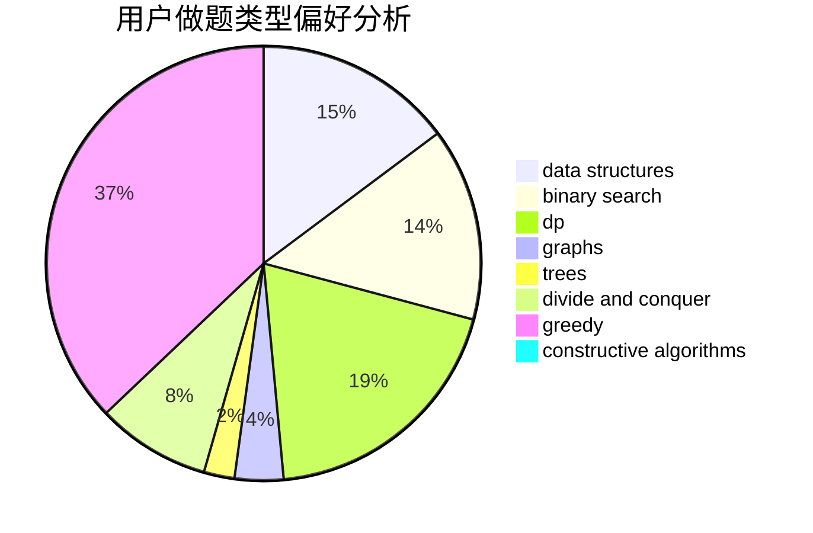
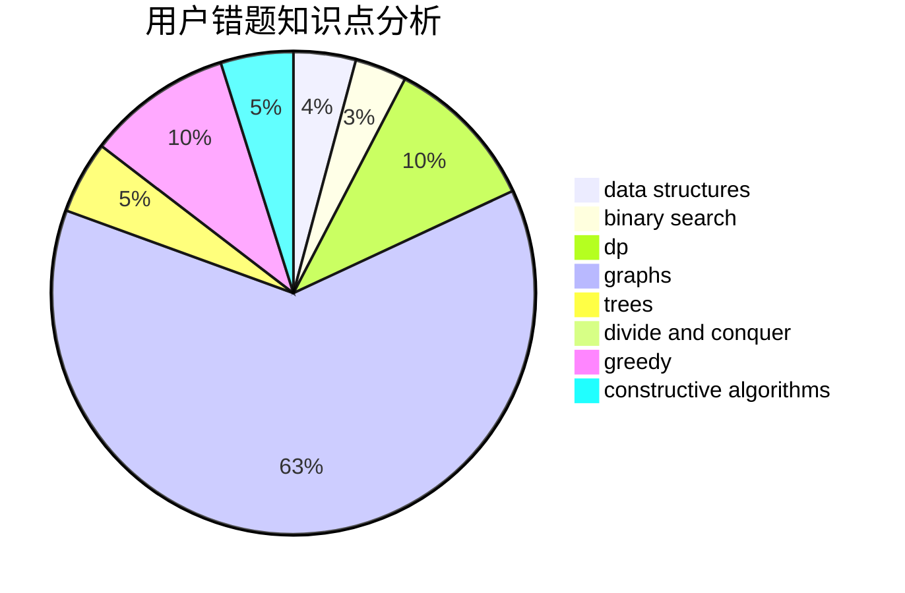

# Orange_JuiCE

<!-- tabs:start -->

#### **用户提交结果分析**

#### **用户做题类型偏好分析**

#### **用户错题知识点分析**

<!-- tabs:end -->
# 推荐题目
[1189A](https://codeforces.com/contest/1189/problem/A)		strings		  
[28D](https://codeforces.com/contest/28/problem/D)		binary search,
                        data structures,
                        dp,
                        hashing		  
[850F](https://codeforces.com/contest/850/problem/F)		math		  
[815B](https://codeforces.com/contest/815/problem/B)		brute force,
                        combinatorics,
                        constructive algorithms,
                        math		  
[1153A](https://codeforces.com/contest/1153/problem/A)		brute force,
                        math		  
[445A](https://codeforces.com/contest/445/problem/A)		dfs and similar,
                        implementation		  
[165C](https://codeforces.com/contest/165/problem/C)		binary search,
                        brute force,
                        dp,
                        math,
                        strings,
                        two pointers		  
[289B](https://codeforces.com/contest/289/problem/B)		brute force,
                        dp,
                        implementation,
                        sortings,
                        ternary search		  
[95A](https://codeforces.com/contest/95/problem/A)		implementation,
                        strings		  
[352E](https://codeforces.com/contest/352/problem/E)		dsu,graphs,sortings,trees		  
