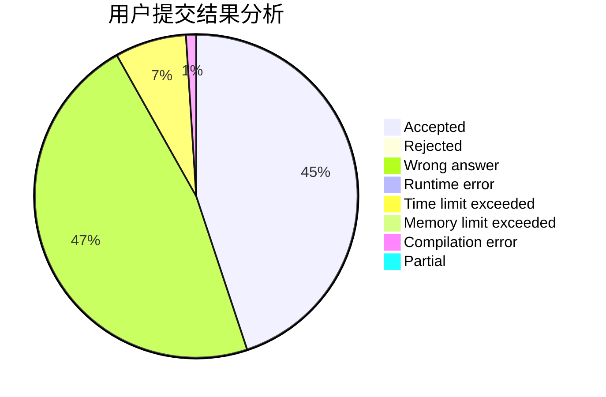
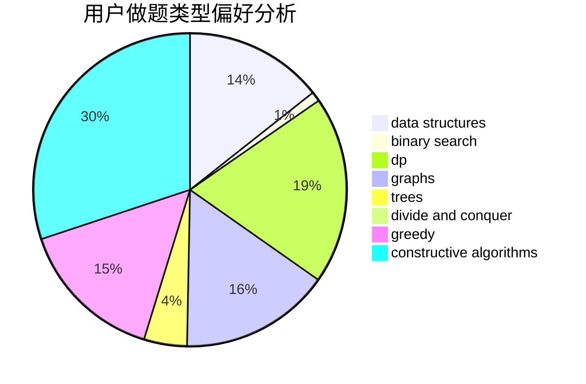
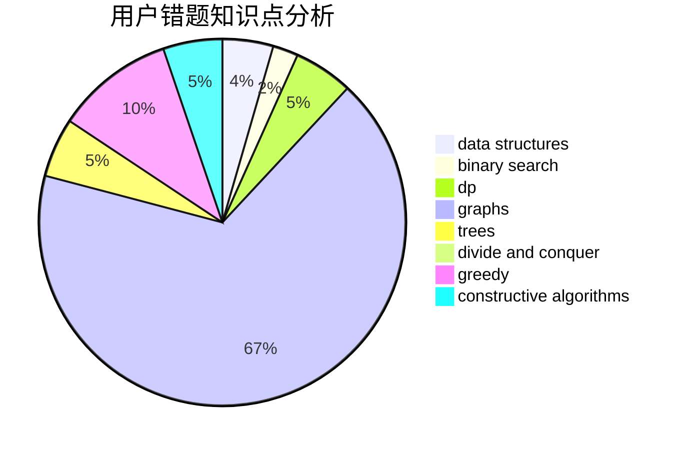

# Orange_JuiCE

<!-- tabs:start -->

#### **用户提交结果分析**

#### **用户做题类型偏好分析**

#### **用户错题知识点分析**

<!-- tabs:end -->
# 推荐题目
[1194C](https://codeforces.com/contest/1194/problem/C)		implementation,
                        strings		  
[304D](https://codeforces.com/contest/304/problem/D)		dsu,graphs,sortings,trees		  
[869E](https://codeforces.com/contest/869/problem/E)		data structures,
                        hashing		  
[834B](https://codeforces.com/contest/834/problem/B)		data structures,
                        implementation		  
[1155A](https://codeforces.com/contest/1155/problem/A)		implementation,
                        sortings,
                        strings		  
[464E](https://codeforces.com/contest/464/problem/E)		data structures,
                        graphs,
                        shortest paths		  
[18E](https://codeforces.com/contest/18/problem/E)		dp		  
[303B](https://codeforces.com/contest/303/problem/B)		implementation,
                        math		  
[981E](https://codeforces.com/contest/981/problem/E)		bitmasks,
                        data structures,
                        divide and conquer,
                        dp		  
[379D](https://codeforces.com/contest/379/problem/D)		bitmasks,
                        brute force,
                        dp		  
