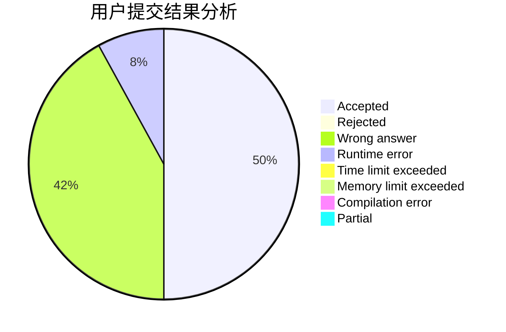
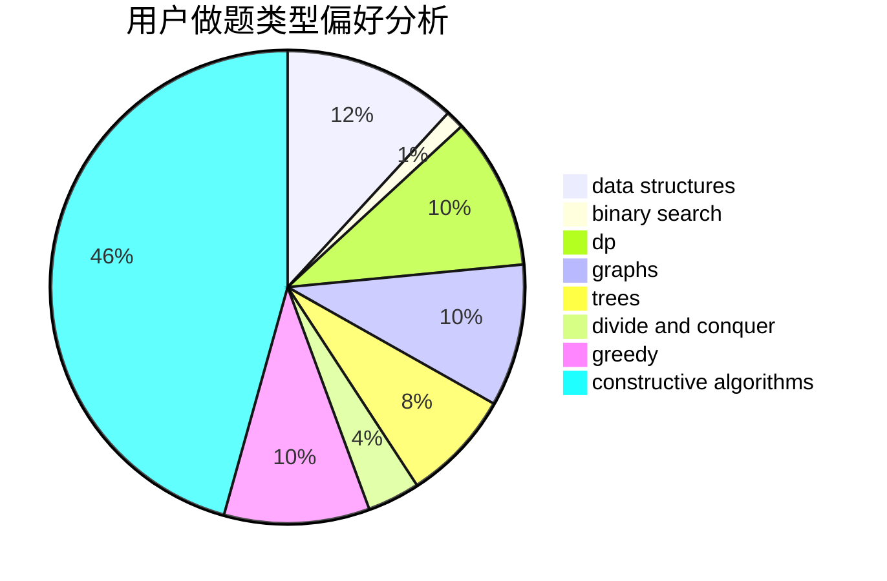
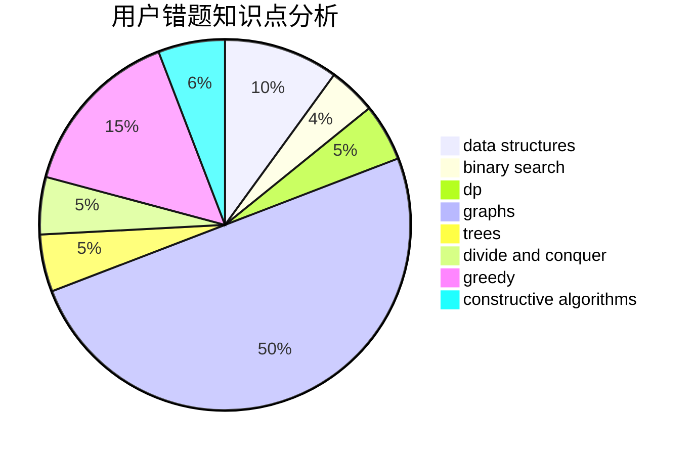

# OrekiEru
<!-- tabs:start -->
#### **用户提交结果分析**

#### **用户做题类型偏好分析**

#### **用户错题知识点分析**

<!-- tabs:end -->
# 推荐题目
[Binary String To Subsequences](http://codeforces.com/problemset/problem/1399/D)		constructive algorithms,
                        data structures,
                        greedy,
                        implementation		  
[Points on the line](http://codeforces.com/problemset/problem/940/A)		brute force,
                        greedy,
                        sortings		  
[Alex and Julian](http://codeforces.com/problemset/problem/1220/D)		bitmasks,
                        math,
                        number theory		  
[Recursive Queries](http://codeforces.com/problemset/problem/932/B)		binary search,
                        data structures,
                        dfs and similar		  
[Unordered Subsequence](http://codeforces.com/problemset/problem/27/C)		constructive algorithms,
                        greedy		  
[Bear and Up-Down](http://codeforces.com/problemset/problem/653/C)		brute force,
                        implementation		  
[Best Subsegment](http://codeforces.com/problemset/problem/1117/A)		implementation,
                        math		  
[Success Rate](https://codeforces.com/contest/807/problem/C)		binary search,
                        math		  
[Bombing](http://codeforces.com/problemset/problem/50/D)		binary search,
                        dp,
                        probabilities		  
[Information Graph](http://codeforces.com/problemset/problem/466/E)		dfs and similar,
                        dsu,
                        graphs,
                        trees		  
<!-- tabs:start -->
#### **data structures**
[Binary String To Subsequences](http://codeforces.com/problemset/problem/1399/D)		constructive algorithms,
                        data structures,
                        greedy,
                        implementation		  
[Points on the line](http://codeforces.com/problemset/problem/932/B)		binary search,
                        data structures,
                        dfs and similar		  
[Alex and Julian](http://codeforces.com/problemset/problem/480/E)		data structures,
                        divide and conquer		  
[Recursive Queries](http://codeforces.com/problemset/problem/18/C)		data structures,
                        implementation		  
[Unordered Subsequence](http://codeforces.com/problemset/problem/733/D)		data structures,
                        hashing		  
[Bear and Up-Down](http://codeforces.com/problemset/problem/1237/G)		data structures,
                        dp,
                        greedy		  
[Best Subsegment](http://codeforces.com/problemset/problem/549/F)		data structures,
                        divide and conquer		  
[Success Rate](http://codeforces.com/problemset/problem/311/B)		data structures,
                        dp		  
[Bombing](http://codeforces.com/problemset/problem/1200/A)		brute force,
                        data structures,
                        implementation		  
[Information Graph](http://codeforces.com/problemset/problem/150/E)		binary search,
                        data structures,
                        divide and conquer,
                        trees		  
#### **binary search**
[Binary String To Subsequences](http://codeforces.com/problemset/problem/932/B)		binary search,
                        data structures,
                        dfs and similar		  
[Points on the line](https://codeforces.com/contest/807/problem/C)		binary search,
                        math		  
[Alex and Julian](http://codeforces.com/problemset/problem/50/D)		binary search,
                        dp,
                        probabilities		  
[Recursive Queries](http://codeforces.com/problemset/problem/837/F)		binary search,
                        brute force,
                        combinatorics,
                        math,
                        matrices		  
[Unordered Subsequence](http://codeforces.com/problemset/problem/1279/F)		binary search,
                        dp		  
[Bear and Up-Down](https://codeforces.com/contest/1247/problem/E)		binary search,
                        dp		  
[Best Subsegment](https://codeforces.com/contest/957/problem/C)		binary search,
                        greedy,
                        two pointers		  
[Success Rate](http://codeforces.com/problemset/problem/150/E)		binary search,
                        data structures,
                        divide and conquer,
                        trees		  
[Bombing](http://codeforces.com/problemset/problem/1408/D)		binary search,
                        brute force,
                        data structures,
                        dp,
                        implementation,
                        sortings,
                        two pointers		  
[Information Graph](http://codeforces.com/problemset/problem/1462/E1)		binary search,
                        combinatorics,
                        math,
                        sortings,
                        two pointers		  
#### **dp**
[Binary String To Subsequences](http://codeforces.com/problemset/problem/50/D)		binary search,
                        dp,
                        probabilities		  
[Points on the line](http://codeforces.com/problemset/problem/1237/G)		data structures,
                        dp,
                        greedy		  
[Alex and Julian](http://codeforces.com/problemset/problem/1279/F)		binary search,
                        dp		  
[Recursive Queries](http://codeforces.com/problemset/problem/1056/D)		constructive algorithms,
                        dfs and similar,
                        dp,
                        graphs,
                        greedy,
                        sortings,
                        trees		  
[Unordered Subsequence](http://codeforces.com/problemset/problem/311/B)		data structures,
                        dp		  
[Bear and Up-Down](https://codeforces.com/contest/1247/problem/E)		binary search,
                        dp		  
[Best Subsegment](http://codeforces.com/problemset/problem/763/A)		dfs and similar,
                        dp,
                        dsu,
                        graphs,
                        implementation,
                        trees		  
[Success Rate](http://codeforces.com/problemset/problem/1313/C2)		data structures,
                        dp,
                        greedy		  
[Bombing](http://codeforces.com/problemset/problem/1408/D)		binary search,
                        brute force,
                        data structures,
                        dp,
                        implementation,
                        sortings,
                        two pointers		  
[Information Graph](http://codeforces.com/problemset/problem/1485/B)		dp,
                        implementation,
                        math		  
#### **graph**
[Binary String To Subsequences](http://codeforces.com/problemset/problem/466/E)		dfs and similar,
                        dsu,
                        graphs,
                        trees		  
[Points on the line](https://codeforces.com/contest/218/problem/C)		brute force,
                        dfs and similar,
                        dsu,
                        graphs		  
[Alex and Julian](http://codeforces.com/problemset/problem/1056/D)		constructive algorithms,
                        dfs and similar,
                        dp,
                        graphs,
                        greedy,
                        sortings,
                        trees		  
[Recursive Queries](http://codeforces.com/problemset/problem/557/D)		combinatorics,
                        dfs and similar,
                        graphs,
                        math		  
[Unordered Subsequence](http://codeforces.com/problemset/problem/763/A)		dfs and similar,
                        dp,
                        dsu,
                        graphs,
                        implementation,
                        trees		  
[Bear and Up-Down](http://codeforces.com/problemset/problem/1487/C)		brute force,
                        constructive algorithms,
                        dfs and similar,
                        graphs,
                        greedy,
                        implementation,
                        math		  
[Best Subsegment](http://codeforces.com/problemset/problem/1437/C)		dp,
                        flows,
                        graph matchings,
                        greedy,
                        math,
                        sortings		  
[Success Rate](http://codeforces.com/problemset/problem/1470/D)		constructive algorithms,
                        dfs and similar,
                        graph matchings,
                        graphs,
                        greedy		  
[Bombing](http://codeforces.com/problemset/problem/1476/C)		dp,
                        graphs,
                        greedy		  
[Information Graph](http://codeforces.com/problemset/problem/1304/D)		constructive algorithms,
                        graphs,
                        greedy,
                        two pointers		  
#### **trees**
[Binary String To Subsequences](http://codeforces.com/problemset/problem/466/E)		dfs and similar,
                        dsu,
                        graphs,
                        trees		  
[Points on the line](http://codeforces.com/problemset/problem/1056/D)		constructive algorithms,
                        dfs and similar,
                        dp,
                        graphs,
                        greedy,
                        sortings,
                        trees		  
[Alex and Julian](http://codeforces.com/problemset/problem/150/E)		binary search,
                        data structures,
                        divide and conquer,
                        trees		  
[Recursive Queries](http://codeforces.com/problemset/problem/763/A)		dfs and similar,
                        dp,
                        dsu,
                        graphs,
                        implementation,
                        trees		  
[Unordered Subsequence](http://codeforces.com/problemset/problem/1479/D)		binary search,
                        bitmasks,
                        brute force,
                        data structures,
                        probabilities,
                        trees		  
[Bear and Up-Down](http://codeforces.com/problemset/problem/1511/C)		brute force,
                        data structures,
                        implementation,
                        trees		  
[Best Subsegment](http://codeforces.com/problemset/problem/1499/F)		combinatorics,
                        dfs and similar,
                        dp,
                        trees		  
[Success Rate](http://codeforces.com/problemset/problem/1491/E)		brute force,
                        dfs and similar,
                        divide and conquer,
                        number theory,
                        trees		  
[Bombing](http://codeforces.com/problemset/problem/1466/D)		data structures,
                        greedy,
                        sortings,
                        trees		  
[Information Graph](http://codeforces.com/problemset/problem/1495/D)		combinatorics,
                        dfs and similar,
                        graphs,
                        math,
                        shortest paths,
                        trees		  
#### **divide and conquer**
[Binary String To Subsequences](http://codeforces.com/problemset/problem/480/E)		data structures,
                        divide and conquer		  
[Points on the line](http://codeforces.com/problemset/problem/549/F)		data structures,
                        divide and conquer		  
[Alex and Julian](http://codeforces.com/problemset/problem/873/D)		constructive algorithms,
                        divide and conquer		  
[Recursive Queries](http://codeforces.com/problemset/problem/150/E)		binary search,
                        data structures,
                        divide and conquer,
                        trees		  
[Unordered Subsequence](http://codeforces.com/problemset/problem/1461/D)		binary search,
                        brute force,
                        data structures,
                        divide and conquer,
                        implementation,
                        sortings		  
[Bear and Up-Down](http://codeforces.com/problemset/problem/1466/G)		combinatorics,
                        divide and conquer,
                        hashing,
                        math,
                        string suffix structures,
                        strings		  
[Best Subsegment](http://codeforces.com/problemset/problem/1490/D)		dfs and similar,
                        divide and conquer,
                        implementation		  
[Success Rate](https://codeforces.com/contest/1483/problem/C)		data structures,
                        divide and conquer,
                        dp		  
[Bombing](http://codeforces.com/problemset/problem/1491/E)		brute force,
                        dfs and similar,
                        divide and conquer,
                        number theory,
                        trees		  
[Information Graph](http://codeforces.com/problemset/problem/1303/G)		data structures,
                        divide and conquer,
                        geometry,
                        trees		  
#### **greedy**
[Binary String To Subsequences](http://codeforces.com/problemset/problem/1399/D)		constructive algorithms,
                        data structures,
                        greedy,
                        implementation		  
[Points on the line](http://codeforces.com/problemset/problem/940/A)		brute force,
                        greedy,
                        sortings		  
[Alex and Julian](http://codeforces.com/problemset/problem/27/C)		constructive algorithms,
                        greedy		  
[Recursive Queries](http://codeforces.com/problemset/problem/1237/G)		data structures,
                        dp,
                        greedy		  
[Unordered Subsequence](http://codeforces.com/problemset/problem/1056/D)		constructive algorithms,
                        dfs and similar,
                        dp,
                        graphs,
                        greedy,
                        sortings,
                        trees		  
[Bear and Up-Down](http://codeforces.com/problemset/problem/3/D)		greedy		  
[Best Subsegment](https://codeforces.com/contest/957/problem/C)		binary search,
                        greedy,
                        two pointers		  
[Success Rate](http://codeforces.com/problemset/problem/1293/B)		combinatorics,
                        greedy,
                        math		  
[Bombing](http://codeforces.com/problemset/problem/1278/B)		greedy,
                        math		  
[Information Graph](http://codeforces.com/problemset/problem/1313/C2)		data structures,
                        dp,
                        greedy		  
#### **constructive algorithms**
[Binary String To Subsequences](http://codeforces.com/problemset/problem/1399/D)		constructive algorithms,
                        data structures,
                        greedy,
                        implementation		  
[Points on the line](http://codeforces.com/problemset/problem/27/C)		constructive algorithms,
                        greedy		  
[Alex and Julian](http://codeforces.com/problemset/problem/417/E)		constructive algorithms,
                        math,
                        probabilities		  
[Recursive Queries](http://codeforces.com/problemset/problem/1028/E)		constructive algorithms		  
[Unordered Subsequence](http://codeforces.com/problemset/problem/1336/D)		constructive algorithms,
                        interactive		  
[Bear and Up-Down](http://codeforces.com/problemset/problem/873/D)		constructive algorithms,
                        divide and conquer		  
[Best Subsegment](https://codeforces.com/contest/287/problem/C)		constructive algorithms,
                        math		  
[Success Rate](http://codeforces.com/problemset/problem/1056/D)		constructive algorithms,
                        dfs and similar,
                        dp,
                        graphs,
                        greedy,
                        sortings,
                        trees		  
[Bombing](http://codeforces.com/problemset/problem/1493/A)		constructive algorithms,
                        greedy		  
[Information Graph](http://codeforces.com/problemset/problem/1463/D)		binary search,
                        constructive algorithms,
                        greedy,
                        two pointers		  
#### **sortings**
[Binary String To Subsequences](http://codeforces.com/problemset/problem/940/A)		brute force,
                        greedy,
                        sortings		  
[Points on the line](http://codeforces.com/problemset/problem/681/E)		geometry,
                        sortings		  
[Alex and Julian](http://codeforces.com/problemset/problem/1056/D)		constructive algorithms,
                        dfs and similar,
                        dp,
                        graphs,
                        greedy,
                        sortings,
                        trees		  
[Recursive Queries](http://codeforces.com/problemset/problem/1408/D)		binary search,
                        brute force,
                        data structures,
                        dp,
                        implementation,
                        sortings,
                        two pointers		  
[Unordered Subsequence](http://codeforces.com/problemset/problem/1462/E1)		binary search,
                        combinatorics,
                        math,
                        sortings,
                        two pointers		  
[Bear and Up-Down](https://codeforces.com/contest/1496/problem/C)		geometry,
                        greedy,
                        math,
                        sortings		  
[Best Subsegment](http://codeforces.com/problemset/problem/1495/A)		geometry,
                        greedy,
                        math,
                        sortings		  
[Success Rate](http://codeforces.com/problemset/problem/1497/A)		brute force,
                        data structures,
                        greedy,
                        sortings		  
[Bombing](http://codeforces.com/problemset/problem/1427/A)		math,
                        sortings		  
[Information Graph](http://codeforces.com/problemset/problem/1461/D)		binary search,
                        brute force,
                        data structures,
                        divide and conquer,
                        implementation,
                        sortings		  
<!-- tabs:end -->
