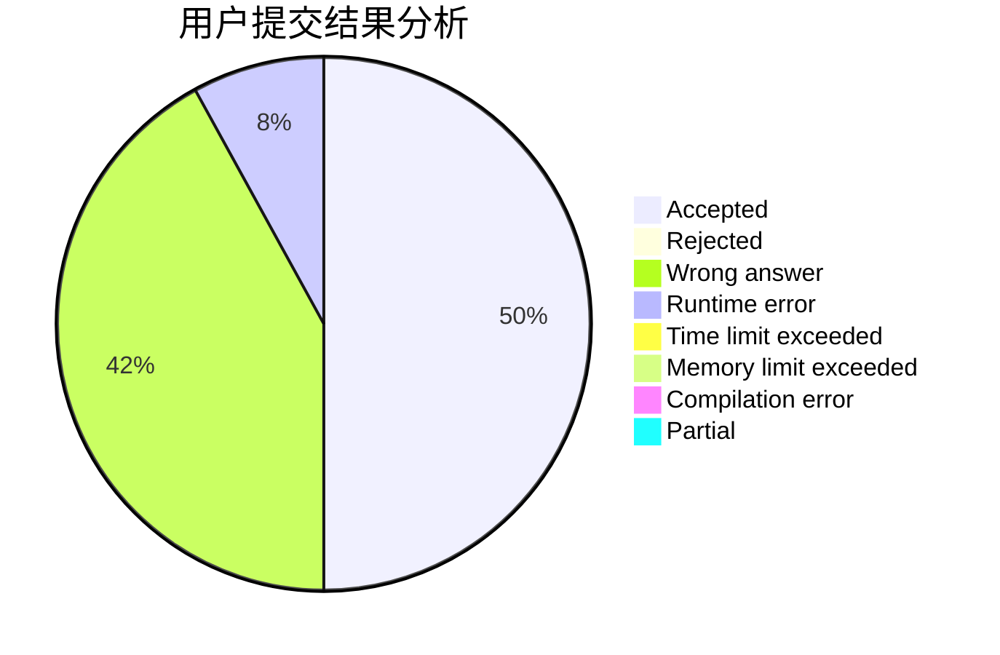
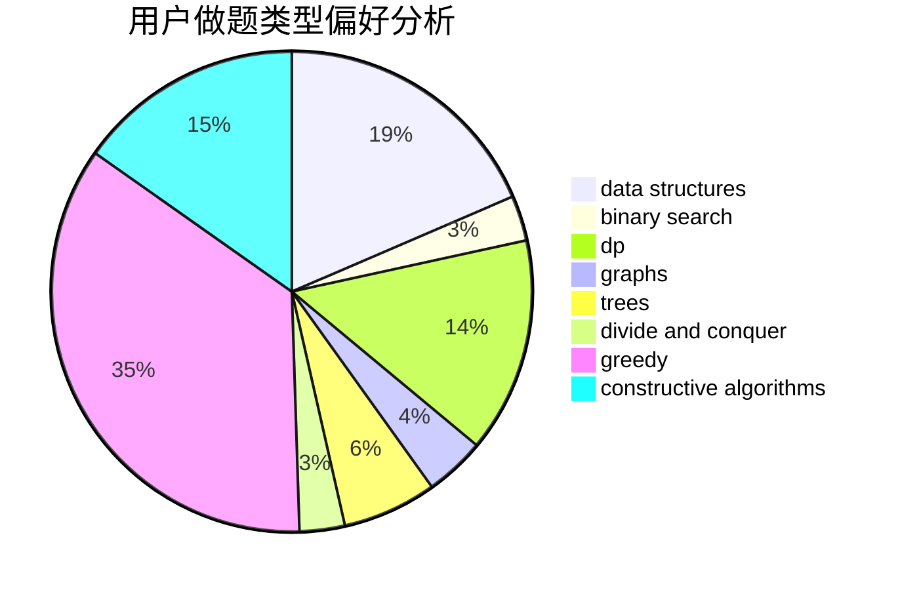
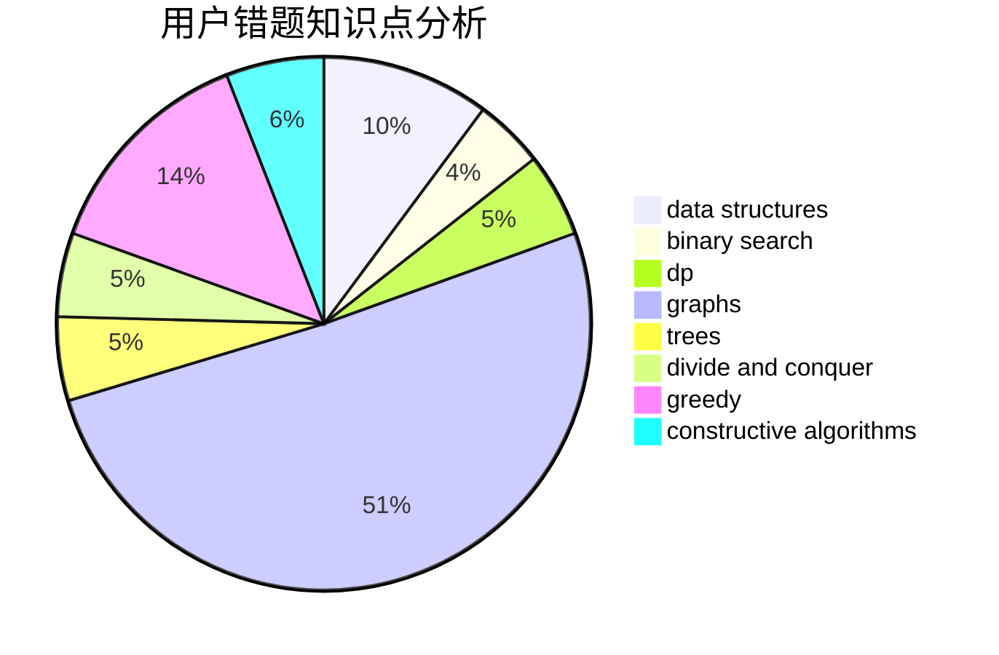

# OrekiEru

<!-- tabs:start -->

#### **用户提交结果分析**

#### **用户做题类型偏好分析**

#### **用户错题知识点分析**

<!-- tabs:end -->
# 推荐题目
[961E](https://codeforces.com/contest/961/problem/E)		data structures		  
[1408E](https://codeforces.com/contest/1408/problem/E)		data structures,
                        dsu,
                        graphs,
                        greedy,
                        sortings,
                        trees		  
[1228D](https://codeforces.com/contest/1228/problem/D)		brute force,
                        constructive algorithms,
                        graphs,
                        hashing,
                        implementation		  
[677C](https://codeforces.com/contest/677/problem/C)		bitmasks,
                        combinatorics,
                        implementation,
                        strings		  
[295B](https://codeforces.com/contest/295/problem/B)		dp,
                        graphs,
                        shortest paths		  
[822D](https://codeforces.com/contest/822/problem/D)		brute force,
                        dp,
                        greedy,
                        math,
                        number theory		  
[500D](https://codeforces.com/contest/500/problem/D)		combinatorics,
                        dfs and similar,
                        graphs,
                        trees		  
[334B](https://codeforces.com/contest/334/problem/B)		sortings		  
[1056G](https://codeforces.com/contest/1056/problem/G)		brute force,
                        data structures,
                        graphs		  
[978F](https://codeforces.com/contest/978/problem/F)		binary search,
                        data structures,
                        implementation		  
