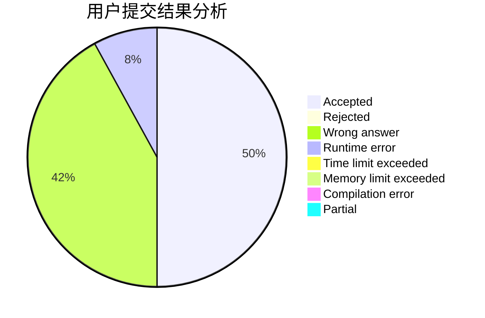
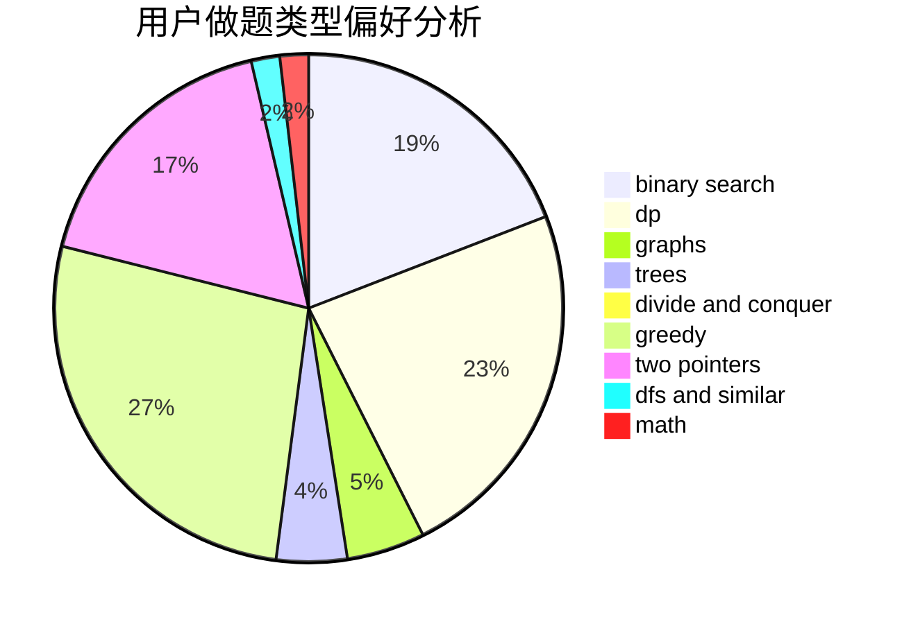

# OrekiEru

<!-- tabs:start -->

#### **用户提交结果分析**

#### **用户做题类型偏好分析**

<!-- tabs:end -->
# 推荐题目
[961E](https://codeforces.com/contest/961/problem/E)
[1408E](https://codeforces.com/contest/1408/problem/E)
[1228D](https://codeforces.com/contest/1228/problem/D)
[677C](https://codeforces.com/contest/677/problem/C)
[295B](https://codeforces.com/contest/295/problem/B)
[822D](https://codeforces.com/contest/822/problem/D)
[500D](https://codeforces.com/contest/500/problem/D)
[334B](https://codeforces.com/contest/334/problem/B)
[1056G](https://codeforces.com/contest/1056/problem/G)
[978F](https://codeforces.com/contest/978/problem/F)
