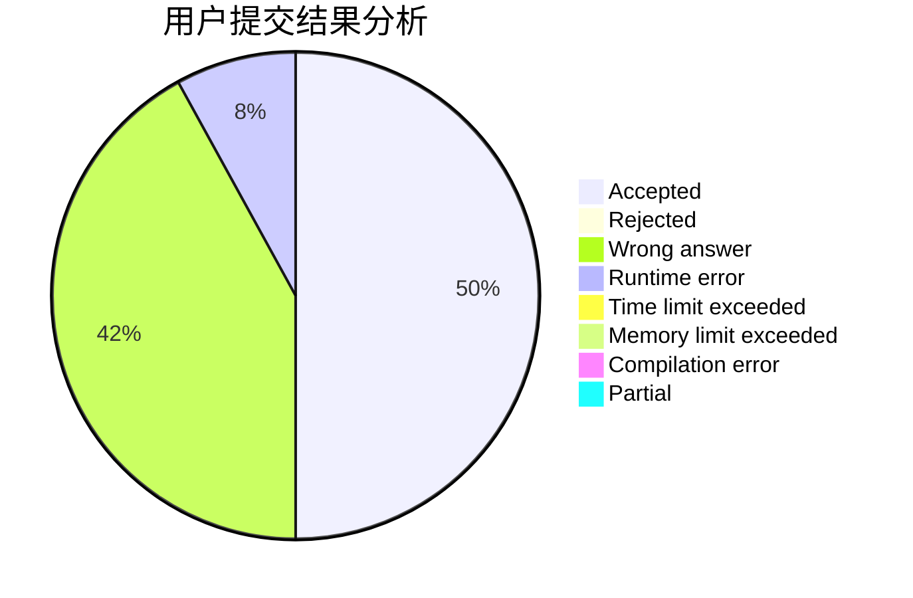
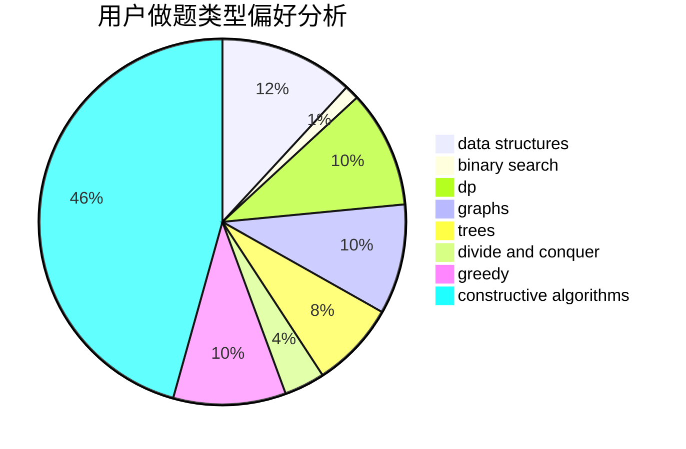
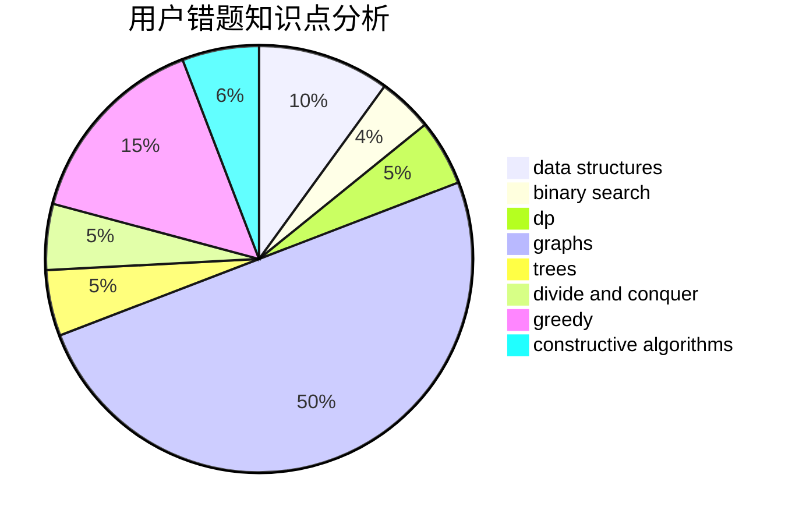

# OrekiEru

<!-- tabs:start -->

#### **用户提交结果分析**

#### **用户做题类型偏好分析**

#### **用户错题知识点分析**

<!-- tabs:end -->
# 推荐题目
[940A](https://codeforces.com/contest/940/problem/A)		brute force,
                        greedy,
                        sortings		  
[1399D](https://codeforces.com/contest/1399/problem/D)		constructive algorithms,
                        data structures,
                        greedy,
                        implementation		  
[1220D](https://codeforces.com/contest/1220/problem/D)		bitmasks,
                        math,
                        number theory		  
[653C](https://codeforces.com/contest/653/problem/C)		brute force,
                        implementation		  
[27C](https://codeforces.com/contest/27/problem/C)		constructive algorithms,
                        greedy		  
[807C](https://codeforces.com/contest/807/problem/C)		dsu,graphs,sortings,trees		  
[480E](https://codeforces.com/contest/480/problem/E)		data structures,
                        divide and conquer		  
[311B](https://codeforces.com/contest/311/problem/B)		data structures,
                        dp		  
[1056D](https://codeforces.com/contest/1056/problem/D)		constructive algorithms,
                        dfs and similar,
                        dp,
                        graphs,
                        greedy,
                        sortings,
                        trees		  
[957C](https://codeforces.com/contest/957/problem/C)		dsu,graphs,sortings,trees		  
