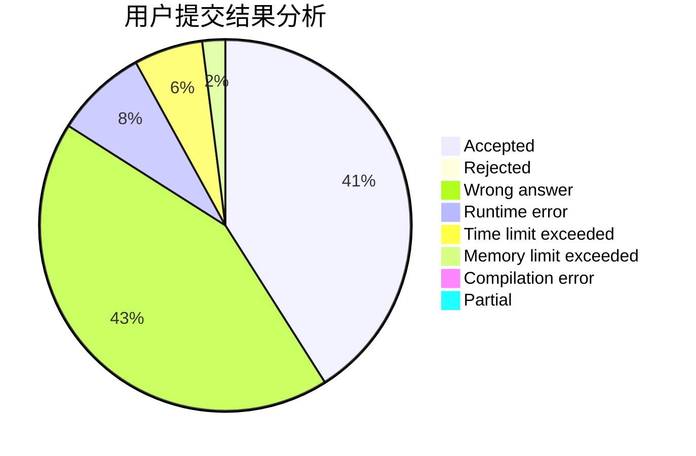
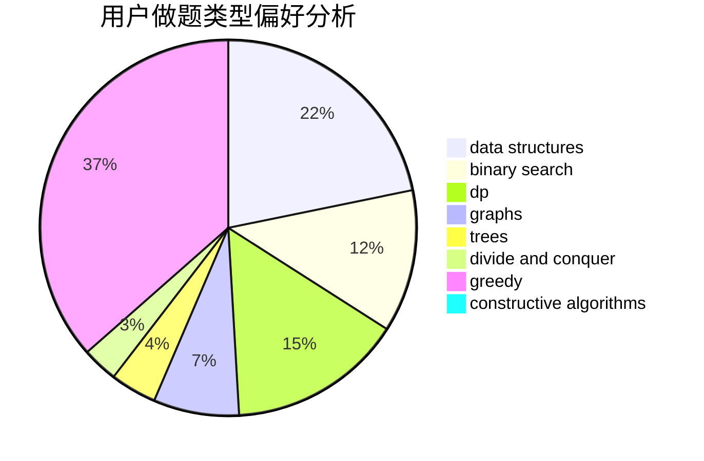

# A.K.E.E.

<!-- tabs:start -->

#### **用户提交结果分析**

#### **用户做题类型偏好分析**

#### **用户错题知识点分析**

<!-- tabs:end -->
# 推荐题目
[1244G](https://codeforces.com/contest/1244/problem/G)		constructive algorithms,
                        greedy,
                        math		  
[1466G](https://codeforces.com/contest/1466/problem/G)		combinatorics,
                        divide and conquer,
                        hashing,
                        math,
                        string suffix structures,
                        strings		  
[114B](https://codeforces.com/contest/114/problem/B)		bitmasks,
                        brute force,
                        graphs		  
[127A](https://codeforces.com/contest/127/problem/A)		geometry		  
[1464E](https://codeforces.com/contest/1464/problem/E)		dsu,graphs,sortings,trees		  
[1072A](https://codeforces.com/contest/1072/problem/A)		dsu,graphs,sortings,trees		  
[1148D](https://codeforces.com/contest/1148/problem/D)		greedy,
                        sortings		  
[1261A](https://codeforces.com/contest/1261/problem/A)		dsu,graphs,sortings,trees		  
[1044D](https://codeforces.com/contest/1044/problem/D)		data structures,
                        dsu		  
[1198A](https://codeforces.com/contest/1198/problem/A)		sortings,
                        two pointers		  
