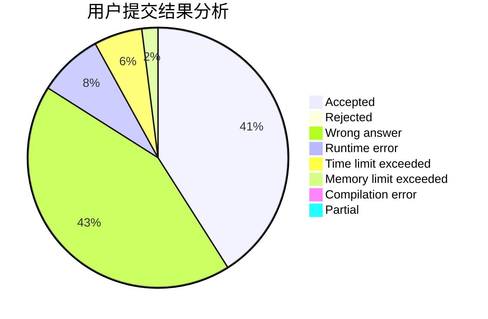
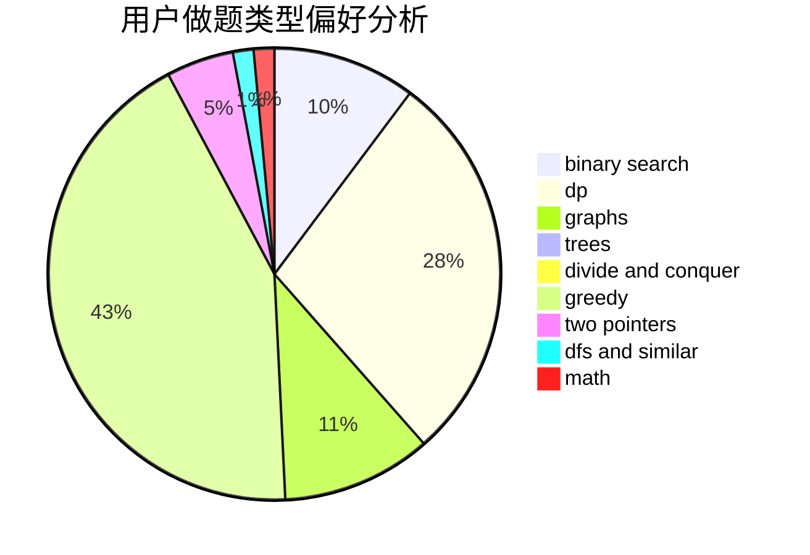

# A.K.E.E.

<!-- tabs:start -->

#### **用户提交结果分析**

#### **用户做题类型偏好分析**

<!-- tabs:end -->
# 推荐题目
[1250B](https://codeforces.com/contest/1250/problem/B)
[1473G](https://codeforces.com/contest/1473/problem/G)
[1151E](https://codeforces.com/contest/1151/problem/E)
[12862](https://codeforces.com/contest/1286/problem/2)
[1471F](https://codeforces.com/contest/1471/problem/F)
[1072D](https://codeforces.com/contest/1072/problem/D)
[114D](https://codeforces.com/contest/114/problem/D)
[1266G](https://codeforces.com/contest/1266/problem/G)
[1045E](https://codeforces.com/contest/1045/problem/E)
[1201C](https://codeforces.com/contest/1201/problem/C)
