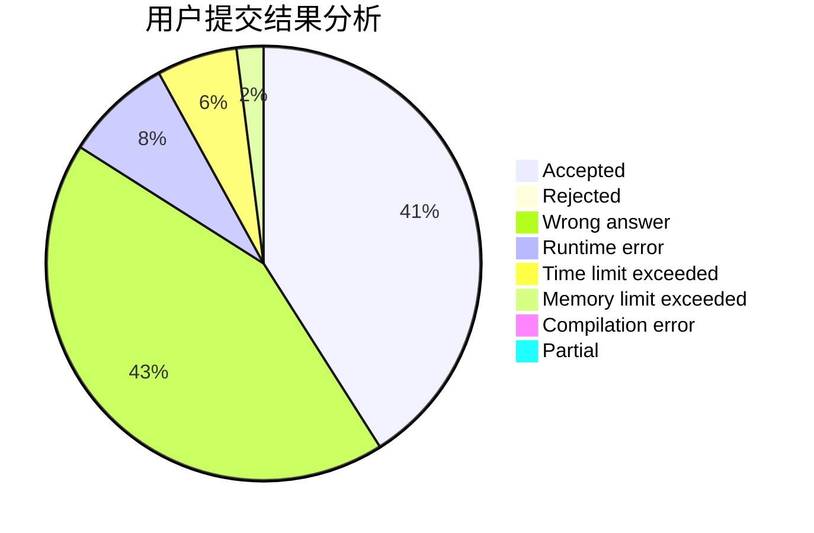
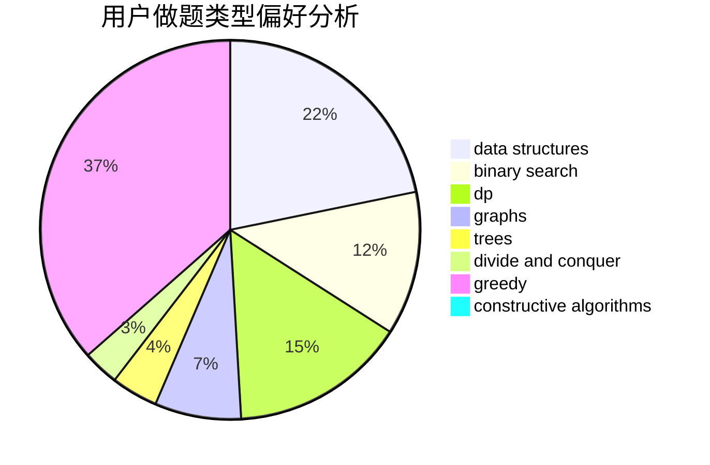

# A.K.E.E.
<!-- tabs:start -->
#### **用户提交结果分析**

#### **用户做题类型偏好分析**

#### **用户错题知识点分析**

<!-- tabs:end -->
# 推荐题目
[Running in Pairs](http://codeforces.com/problemset/problem/1244/G)		constructive algorithms,
                        greedy,
                        math		  
[Deduction Queries](http://codeforces.com/problemset/problem/1044/D)		data structures,
                        dsu		  
[Equalize Prices Again](https://codeforces.com/contest/1432/problem/C)		math		  
[The Thorny Path](https://codeforces.com/contest/1465/problem/F)		greedy,
                        math		  
[Wasted Time](http://codeforces.com/problemset/problem/127/A)		geometry		  
[PFAST Inc.](http://codeforces.com/problemset/problem/114/B)		bitmasks,
                        brute force,
                        graphs		  
[Vova and Trophies](http://codeforces.com/problemset/problem/1082/B)		greedy		  
[Enchanted Artifact](http://codeforces.com/problemset/problem/1282/D)		constructive algorithms,
                        interactive,
                        strings		  
[Farewell Party](http://codeforces.com/problemset/problem/1081/B)		constructive algorithms,
                        implementation		  
[Song of the Sirens](http://codeforces.com/problemset/problem/1466/G)		combinatorics,
                        divide and conquer,
                        hashing,
                        math,
                        string suffix structures,
                        strings		  
<!-- tabs:start -->
#### **data structures**
[Running in Pairs](http://codeforces.com/problemset/problem/1044/D)		data structures,
                        dsu		  
[Deduction Queries](http://codeforces.com/problemset/problem/1468/B)		data structures,
                        dsu		  
[Equalize Prices Again](http://codeforces.com/problemset/problem/1467/E)		data structures,
                        dfs and similar,
                        dp,
                        trees		  
[The Thorny Path](http://codeforces.com/problemset/problem/1464/F)		data structures,
                        trees		  
[Wasted Time](http://codeforces.com/problemset/problem/1468/C)		data structures,
                        implementation		  
[PFAST Inc.](http://codeforces.com/problemset/problem/1466/I)		binary search,
                        data structures,
                        data structures,
                        interactive		  
[Vova and Trophies](http://codeforces.com/problemset/problem/1468/A)		data structures,
                        dp,
                        greedy		  
[Enchanted Artifact](http://codeforces.com/problemset/problem/1466/D)		data structures,
                        greedy,
                        sortings,
                        trees		  
[Farewell Party](http://codeforces.com/problemset/problem/1492/C)		binary search,
                        data structures,
                        dp,
                        greedy,
                        two pointers		  
[Song of the Sirens](http://codeforces.com/problemset/problem/1490/G)		binary search,
                        data structures,
                        math		  
#### **binary search**
[Running in Pairs](http://codeforces.com/problemset/problem/1249/C2)		binary search,
                        greedy,
                        math,
                        meet-in-the-middle		  
[Deduction Queries](http://codeforces.com/problemset/problem/1359/C)		binary search,
                        math		  
[Equalize Prices Again](http://codeforces.com/problemset/problem/1466/I)		binary search,
                        data structures,
                        data structures,
                        interactive		  
[The Thorny Path](http://codeforces.com/problemset/problem/1492/C)		binary search,
                        data structures,
                        dp,
                        greedy,
                        two pointers		  
[Wasted Time](http://codeforces.com/problemset/problem/1463/D)		binary search,
                        constructive algorithms,
                        greedy,
                        two pointers		  
[PFAST Inc.](http://codeforces.com/problemset/problem/1490/G)		binary search,
                        data structures,
                        math		  
[Vova and Trophies](http://codeforces.com/problemset/problem/1479/D)		binary search,
                        bitmasks,
                        brute force,
                        data structures,
                        probabilities,
                        trees		  
[Enchanted Artifact](http://codeforces.com/problemset/problem/1436/E)		binary search,
                        data structures,
                        two pointers		  
[Farewell Party](http://codeforces.com/problemset/problem/1461/D)		binary search,
                        brute force,
                        data structures,
                        divide and conquer,
                        implementation,
                        sortings		  
[Song of the Sirens](http://codeforces.com/problemset/problem/1493/C)		binary search,
                        brute force,
                        constructive algorithms,
                        greedy,
                        strings		  
#### **dp**
[Running in Pairs](http://codeforces.com/problemset/problem/1467/D)		combinatorics,
                        dp,
                        math		  
[Deduction Queries](http://codeforces.com/problemset/problem/1466/H)		combinatorics,
                        dp,
                        graphs,
                        greedy,
                        math		  
[Equalize Prices Again](http://codeforces.com/problemset/problem/1467/E)		data structures,
                        dfs and similar,
                        dp,
                        trees		  
[The Thorny Path](http://codeforces.com/problemset/problem/1466/C)		dp,
                        greedy,
                        strings		  
[Wasted Time](http://codeforces.com/problemset/problem/1468/A)		data structures,
                        dp,
                        greedy		  
[PFAST Inc.](http://codeforces.com/problemset/problem/1466/B)		dp,
                        greedy		  
[Vova and Trophies](http://codeforces.com/problemset/problem/1492/C)		binary search,
                        data structures,
                        dp,
                        greedy,
                        two pointers		  
[Enchanted Artifact](https://codeforces.com/contest/1457/problem/C)		brute force,
                        dp,
                        implementation		  
[Farewell Party](http://codeforces.com/problemset/problem/1491/C)		brute force,
                        data structures,
                        dp,
                        greedy,
                        implementation		  
[Song of the Sirens](http://codeforces.com/problemset/problem/1437/C)		dp,
                        flows,
                        graph matchings,
                        greedy,
                        math,
                        sortings		  
#### **graph**
[Running in Pairs](http://codeforces.com/problemset/problem/114/B)		bitmasks,
                        brute force,
                        graphs		  
[Deduction Queries](https://codeforces.com/contest/1465/problem/C)		dfs and similar,
                        dsu,
                        graphs		  
[Equalize Prices Again](http://codeforces.com/problemset/problem/1284/G)		graphs		  
[The Thorny Path](http://codeforces.com/problemset/problem/1466/H)		combinatorics,
                        dp,
                        graphs,
                        greedy,
                        math		  
[Wasted Time](http://codeforces.com/problemset/problem/1466/F)		bitmasks,
                        dfs and similar,
                        dsu,
                        graphs,
                        greedy,
                        math,
                        sortings		  
[PFAST Inc.](http://codeforces.com/problemset/problem/1487/C)		brute force,
                        constructive algorithms,
                        dfs and similar,
                        graphs,
                        greedy,
                        implementation,
                        math		  
[Vova and Trophies](http://codeforces.com/problemset/problem/1437/C)		dp,
                        flows,
                        graph matchings,
                        greedy,
                        math,
                        sortings		  
[Enchanted Artifact](http://codeforces.com/problemset/problem/1470/D)		constructive algorithms,
                        dfs and similar,
                        graph matchings,
                        graphs,
                        greedy		  
[Farewell Party](http://codeforces.com/problemset/problem/1476/C)		dp,
                        graphs,
                        greedy		  
[Song of the Sirens](http://codeforces.com/problemset/problem/1304/D)		constructive algorithms,
                        graphs,
                        greedy,
                        two pointers		  
#### **trees**
[Running in Pairs](http://codeforces.com/problemset/problem/1467/E)		data structures,
                        dfs and similar,
                        dp,
                        trees		  
[Deduction Queries](http://codeforces.com/problemset/problem/1464/F)		data structures,
                        trees		  
[Equalize Prices Again](http://codeforces.com/problemset/problem/1466/D)		data structures,
                        greedy,
                        sortings,
                        trees		  
[The Thorny Path](http://codeforces.com/problemset/problem/1479/D)		binary search,
                        bitmasks,
                        brute force,
                        data structures,
                        probabilities,
                        trees		  
[Wasted Time](http://codeforces.com/problemset/problem/1511/C)		brute force,
                        data structures,
                        implementation,
                        trees		  
[PFAST Inc.](http://codeforces.com/problemset/problem/1499/F)		combinatorics,
                        dfs and similar,
                        dp,
                        trees		  
[Vova and Trophies](http://codeforces.com/problemset/problem/1491/E)		brute force,
                        dfs and similar,
                        divide and conquer,
                        number theory,
                        trees		  
[Enchanted Artifact](http://codeforces.com/problemset/problem/1466/D)		data structures,
                        greedy,
                        sortings,
                        trees		  
[Farewell Party](http://codeforces.com/problemset/problem/1495/D)		combinatorics,
                        dfs and similar,
                        graphs,
                        math,
                        shortest paths,
                        trees		  
[Song of the Sirens](http://codeforces.com/problemset/problem/1303/G)		data structures,
                        divide and conquer,
                        geometry,
                        trees		  
#### **divide and conquer**
[Running in Pairs](http://codeforces.com/problemset/problem/1466/G)		combinatorics,
                        divide and conquer,
                        hashing,
                        math,
                        string suffix structures,
                        strings		  
[Deduction Queries](http://codeforces.com/problemset/problem/1461/D)		binary search,
                        brute force,
                        data structures,
                        divide and conquer,
                        implementation,
                        sortings		  
[Equalize Prices Again](http://codeforces.com/problemset/problem/1466/G)		combinatorics,
                        divide and conquer,
                        hashing,
                        math,
                        string suffix structures,
                        strings		  
[The Thorny Path](http://codeforces.com/problemset/problem/1490/D)		dfs and similar,
                        divide and conquer,
                        implementation		  
[Wasted Time](https://codeforces.com/contest/1483/problem/C)		data structures,
                        divide and conquer,
                        dp		  
[PFAST Inc.](http://codeforces.com/problemset/problem/1491/E)		brute force,
                        dfs and similar,
                        divide and conquer,
                        number theory,
                        trees		  
[Vova and Trophies](http://codeforces.com/problemset/problem/1303/G)		data structures,
                        divide and conquer,
                        geometry,
                        trees		  
[Enchanted Artifact](http://codeforces.com/problemset/problem/1494/D)		constructive algorithms,
                        data structures,
                        dfs and similar,
                        divide and conquer,
                        dsu,
                        greedy,
                        sortings,
                        trees		  
[Farewell Party](http://codeforces.com/problemset/problem/1482/E)		data structures,
                        divide and conquer,
                        dp		  
[Song of the Sirens](http://codeforces.com/problemset/problem/566/C)		dfs and similar,
                        divide and conquer,
                        trees		  
#### **greedy**
[Running in Pairs](http://codeforces.com/problemset/problem/1244/G)		constructive algorithms,
                        greedy,
                        math		  
[Deduction Queries](https://codeforces.com/contest/1465/problem/F)		greedy,
                        math		  
[Equalize Prices Again](http://codeforces.com/problemset/problem/1082/B)		greedy		  
[The Thorny Path](http://codeforces.com/problemset/problem/1249/C2)		binary search,
                        greedy,
                        math,
                        meet-in-the-middle		  
[Wasted Time](http://codeforces.com/problemset/problem/1365/A)		games,
                        greedy,
                        implementation		  
[PFAST Inc.](http://codeforces.com/problemset/problem/1466/H)		combinatorics,
                        dp,
                        graphs,
                        greedy,
                        math		  
[Vova and Trophies](https://codeforces.com/contest/1465/problem/E)		bitmasks,
                        greedy,
                        math,
                        strings		  
[Enchanted Artifact](http://codeforces.com/problemset/problem/1466/C)		dp,
                        greedy,
                        strings		  
[Farewell Party](http://codeforces.com/problemset/problem/1467/C)		constructive algorithms,
                        greedy		  
[Song of the Sirens](http://codeforces.com/problemset/problem/1148/D)		greedy,
                        sortings		  
#### **constructive algorithms**
[Running in Pairs](http://codeforces.com/problemset/problem/1244/G)		constructive algorithms,
                        greedy,
                        math		  
[Deduction Queries](http://codeforces.com/problemset/problem/1282/D)		constructive algorithms,
                        interactive,
                        strings		  
[Equalize Prices Again](http://codeforces.com/problemset/problem/1081/B)		constructive algorithms,
                        implementation		  
[The Thorny Path](https://codeforces.com/contest/1261/problem/A)		constructive algorithms		  
[Wasted Time](http://codeforces.com/problemset/problem/1467/C)		constructive algorithms,
                        greedy		  
[PFAST Inc.](http://codeforces.com/problemset/problem/1372/C)		constructive algorithms,
                        math		  
[Vova and Trophies](http://codeforces.com/problemset/problem/1467/A)		constructive algorithms,
                        greedy,
                        math		  
[Enchanted Artifact](http://codeforces.com/problemset/problem/1493/A)		constructive algorithms,
                        greedy		  
[Farewell Party](http://codeforces.com/problemset/problem/1463/D)		binary search,
                        constructive algorithms,
                        greedy,
                        two pointers		  
[Song of the Sirens](https://codeforces.com/contest/1456/problem/B)		bitmasks,
                        brute force,
                        constructive algorithms		  
#### **sortings**
[Running in Pairs](http://codeforces.com/problemset/problem/1198/A)		sortings,
                        two pointers		  
[Deduction Queries](http://codeforces.com/problemset/problem/1148/D)		greedy,
                        sortings		  
[Equalize Prices Again](http://codeforces.com/problemset/problem/1466/F)		bitmasks,
                        dfs and similar,
                        dsu,
                        graphs,
                        greedy,
                        math,
                        sortings		  
[The Thorny Path](http://codeforces.com/problemset/problem/1466/D)		data structures,
                        greedy,
                        sortings,
                        trees		  
[Wasted Time](https://codeforces.com/contest/1496/problem/C)		geometry,
                        greedy,
                        math,
                        sortings		  
[PFAST Inc.](http://codeforces.com/problemset/problem/1495/A)		geometry,
                        greedy,
                        math,
                        sortings		  
[Vova and Trophies](http://codeforces.com/problemset/problem/1497/A)		brute force,
                        data structures,
                        greedy,
                        sortings		  
[Enchanted Artifact](http://codeforces.com/problemset/problem/1427/A)		math,
                        sortings		  
[Farewell Party](http://codeforces.com/problemset/problem/1461/D)		binary search,
                        brute force,
                        data structures,
                        divide and conquer,
                        implementation,
                        sortings		  
[Song of the Sirens](http://codeforces.com/problemset/problem/1437/C)		dp,
                        flows,
                        graph matchings,
                        greedy,
                        math,
                        sortings		  
<!-- tabs:end -->
