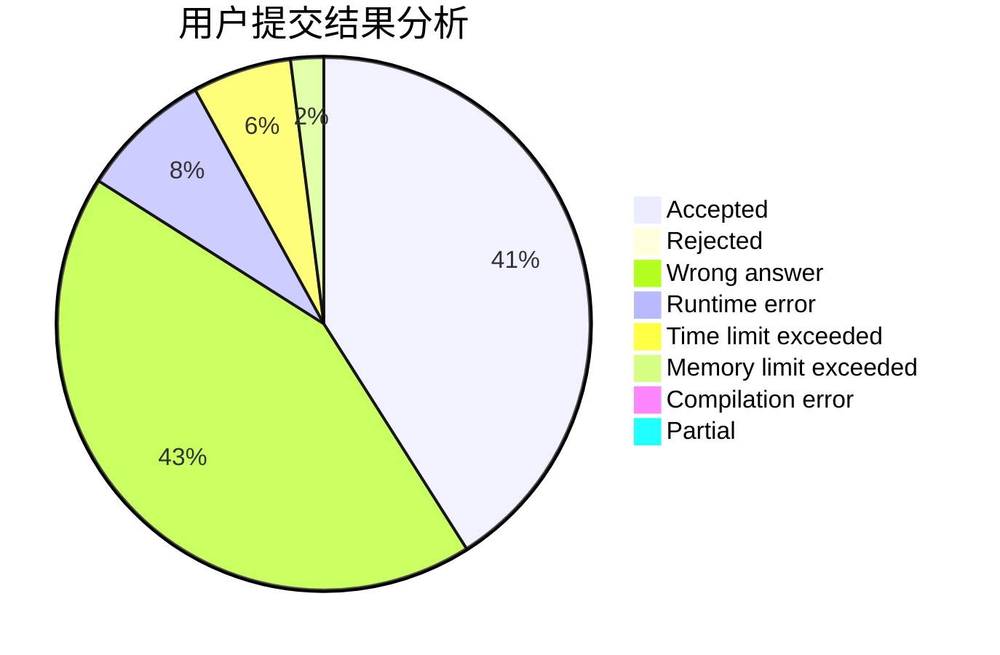
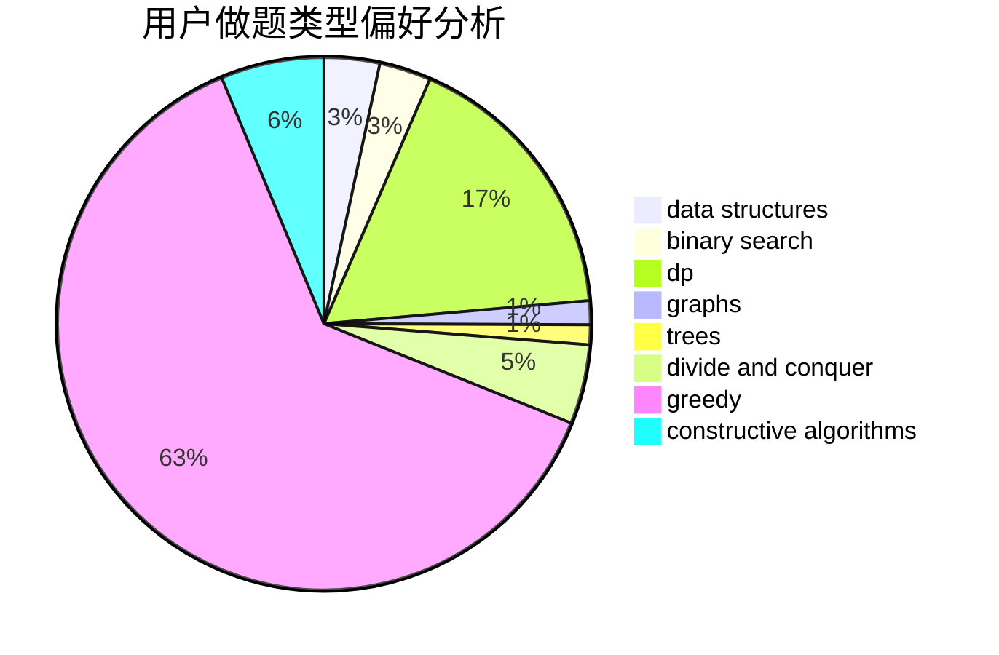

# A.K.E.E.

<!-- tabs:start -->

#### **用户提交结果分析**

#### **用户做题类型偏好分析**

#### **用户错题知识点分析**

<!-- tabs:end -->
# 推荐题目
[1250B](https://codeforces.com/contest/1250/problem/B)		brute force,
                        constructive algorithms,
                        greedy,
                        math		  
[1473G](https://codeforces.com/contest/1473/problem/G)		combinatorics,
                        dp,
                        fft,
                        math		  
[1151E](https://codeforces.com/contest/1151/problem/E)		combinatorics,
                        data structures,
                        dp,
                        math		  
[12862](https://codeforces.com/contest/1286/problem/2)		dsu,graphs,sortings,trees		  
[1471F](https://codeforces.com/contest/1471/problem/F)		dsu,graphs,sortings,trees		  
[1072D](https://codeforces.com/contest/1072/problem/D)		dsu,graphs,sortings,trees		  
[114D](https://codeforces.com/contest/114/problem/D)		dsu,graphs,sortings,trees		  
[1266G](https://codeforces.com/contest/1266/problem/G)		string suffix structures		  
[1045E](https://codeforces.com/contest/1045/problem/E)		constructive algorithms,
                        geometry		  
[1201C](https://codeforces.com/contest/1201/problem/C)		binary search,
                        greedy,
                        math,
                        sortings		  
