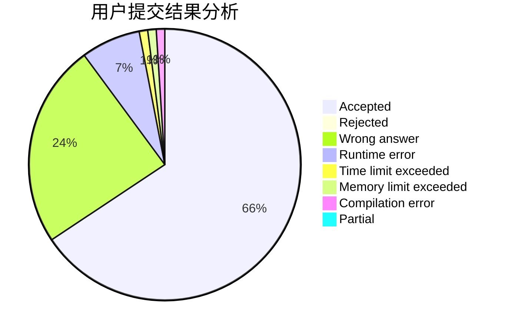
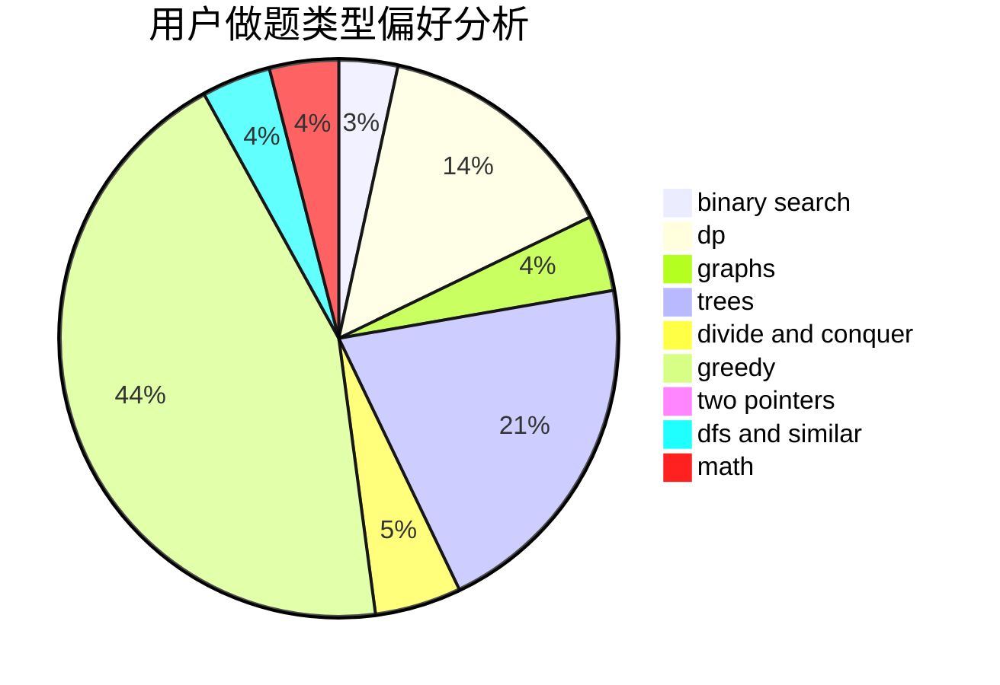

# Origenes

<!-- tabs:start -->

#### **用户提交结果分析**

#### **用户做题类型偏好分析**

<!-- tabs:end -->
# 推荐题目
[578B](https://codeforces.com/contest/578/problem/B)
[788D](https://codeforces.com/contest/788/problem/D)
[13577](https://codeforces.com/contest/1357/problem/7)
[515E](https://codeforces.com/contest/515/problem/E)
[1016D](https://codeforces.com/contest/1016/problem/D)
[485D](https://codeforces.com/contest/485/problem/D)
[523A](https://codeforces.com/contest/523/problem/A)
[603E](https://codeforces.com/contest/603/problem/E)
[930D](https://codeforces.com/contest/930/problem/D)
[1426D](https://codeforces.com/contest/1426/problem/D)
