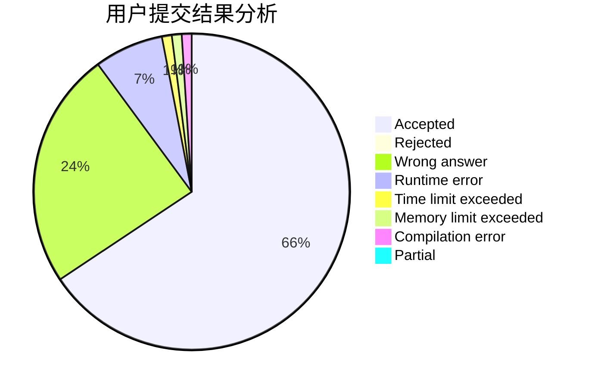
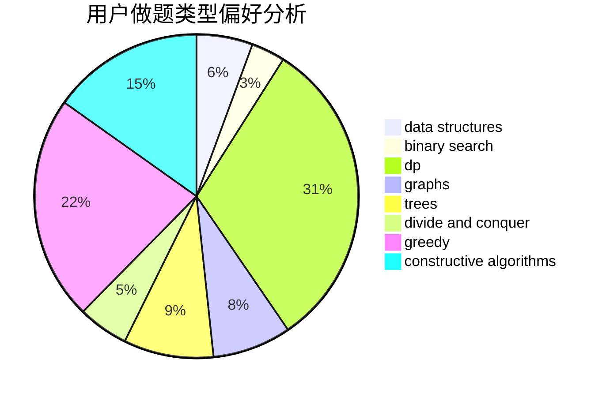
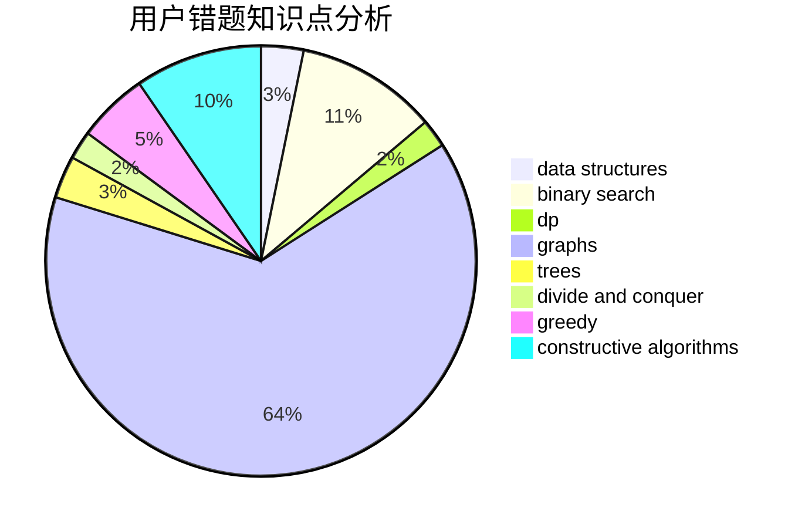

# Origenes

<!-- tabs:start -->

#### **用户提交结果分析**

#### **用户做题类型偏好分析**

#### **用户错题知识点分析**

<!-- tabs:end -->
# 推荐题目
[578B](https://codeforces.com/contest/578/problem/B)		brute force,
                        greedy		  
[788D](https://codeforces.com/contest/788/problem/D)		constructive algorithms,
                        divide and conquer,
                        interactive		  
[13577](https://codeforces.com/contest/1357/problem/7)		dsu,graphs,sortings,trees		  
[515E](https://codeforces.com/contest/515/problem/E)		data structures		  
[1016D](https://codeforces.com/contest/1016/problem/D)		constructive algorithms,
                        flows,
                        math		  
[485D](https://codeforces.com/contest/485/problem/D)		dsu,graphs,sortings,trees		  
[523A](https://codeforces.com/contest/523/problem/A)		*special problem,
                        implementation		  
[603E](https://codeforces.com/contest/603/problem/E)		data structures,
                        divide and conquer,
                        dsu,
                        math,
                        trees		  
[930D](https://codeforces.com/contest/930/problem/D)		data structures,
                        games,
                        implementation		  
[1426D](https://codeforces.com/contest/1426/problem/D)		constructive algorithms,
                        data structures,
                        greedy,
                        sortings		  
