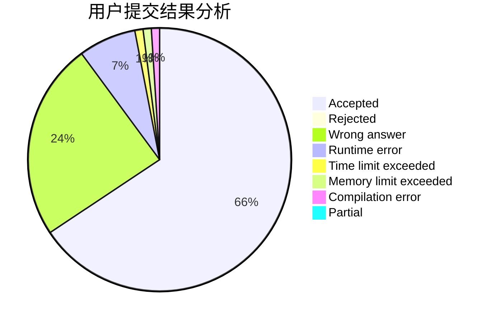
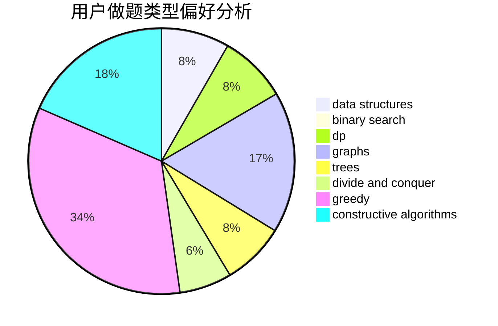
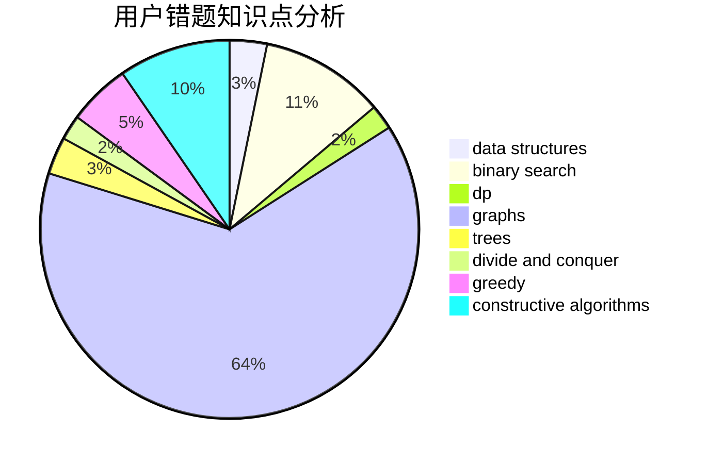

# Origenes

<!-- tabs:start -->

#### **用户提交结果分析**

#### **用户做题类型偏好分析**

#### **用户错题知识点分析**

<!-- tabs:end -->
# 推荐题目
[552E](https://codeforces.com/contest/552/problem/E)		brute force,
                        dp,
                        expression parsing,
                        greedy,
                        implementation,
                        strings		  
[768E](https://codeforces.com/contest/768/problem/E)		bitmasks,
                        dp,
                        games		  
[1350D](https://codeforces.com/contest/1350/problem/D)		dsu,graphs,sortings,trees		  
[496B](https://codeforces.com/contest/496/problem/B)		brute force,
                        constructive algorithms,
                        implementation		  
[1016A](https://codeforces.com/contest/1016/problem/A)		greedy,
                        implementation,
                        math		  
[466B](https://codeforces.com/contest/466/problem/B)		brute force,
                        math		  
[501C](https://codeforces.com/contest/501/problem/C)		constructive algorithms,
                        data structures,
                        greedy,
                        sortings,
                        trees		  
[582D](https://codeforces.com/contest/582/problem/D)		dp,
                        math,
                        number theory		  
[912A](https://codeforces.com/contest/912/problem/A)		implementation		  
[1418G](https://codeforces.com/contest/1418/problem/G)		data structures,
                        divide and conquer,
                        hashing,
                        two pointers		  
