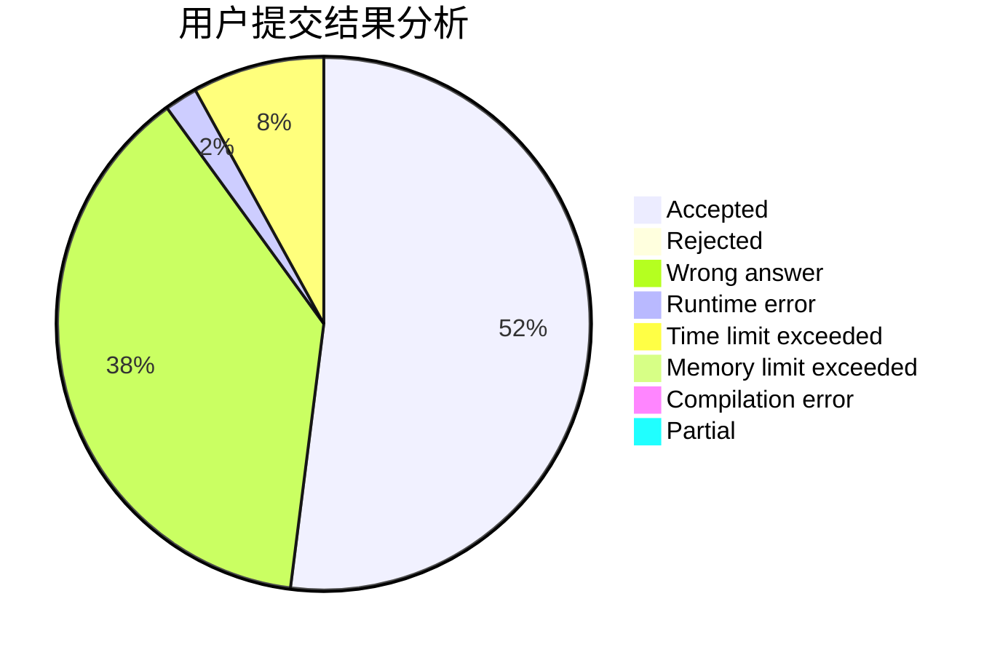
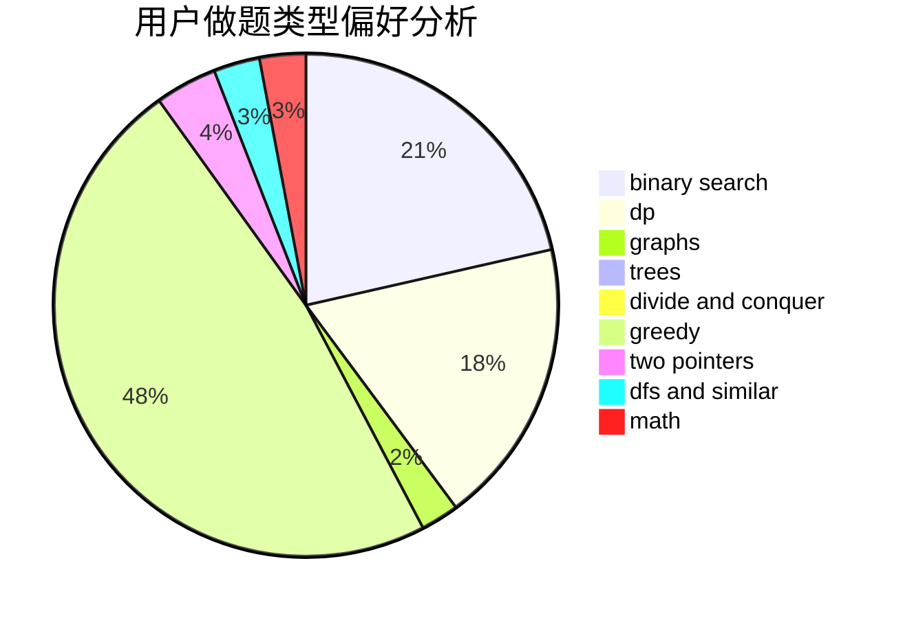

# OrzJiian

<!-- tabs:start -->

#### **用户提交结果分析**

#### **用户做题类型偏好分析**

<!-- tabs:end -->
# 推荐题目
[1450F](https://codeforces.com/contest/1450/problem/F)
[1028D](https://codeforces.com/contest/1028/problem/D)
[731C](https://codeforces.com/contest/731/problem/C)
[877F](https://codeforces.com/contest/877/problem/F)
[398A](https://codeforces.com/contest/398/problem/A)
[274D](https://codeforces.com/contest/274/problem/D)
[1203A](https://codeforces.com/contest/1203/problem/A)
[710C](https://codeforces.com/contest/710/problem/C)
[463D](https://codeforces.com/contest/463/problem/D)
[808F](https://codeforces.com/contest/808/problem/F)
