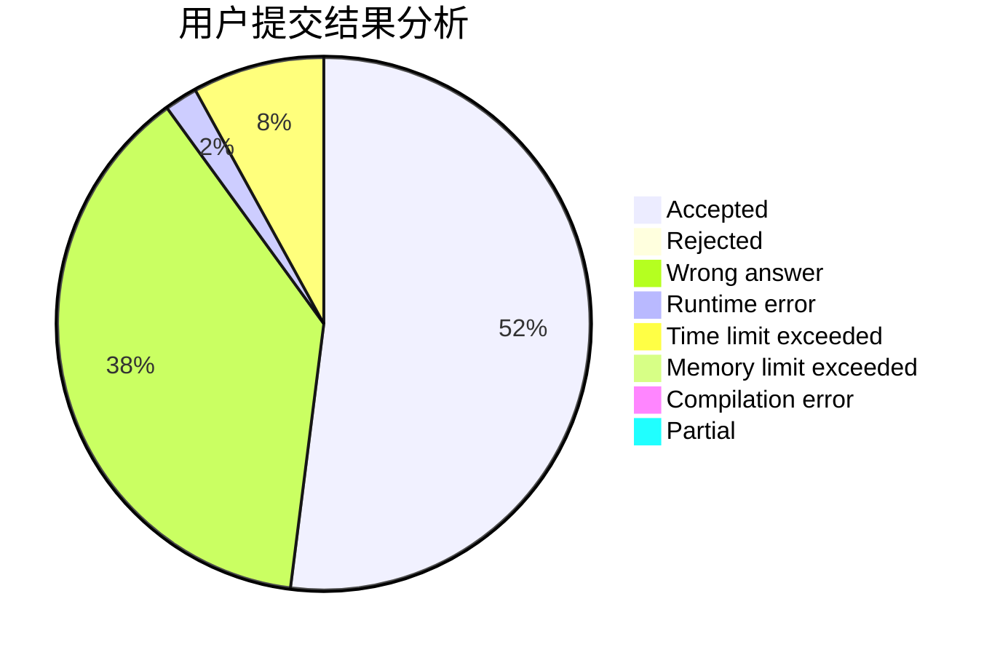
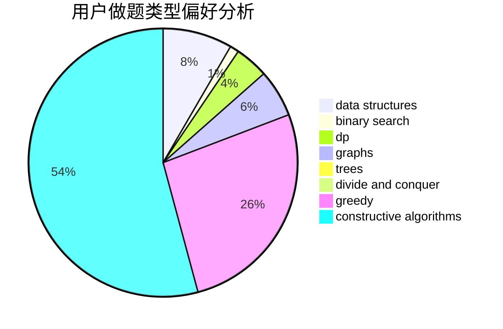
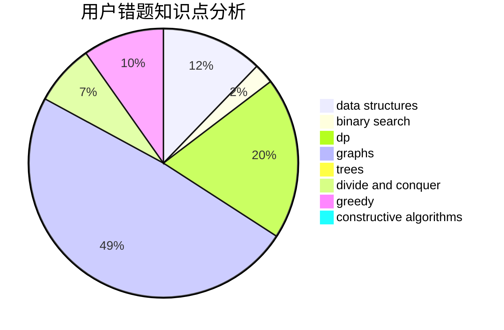

# OrzJiian
<!-- tabs:start -->
#### **用户提交结果分析**

#### **用户做题类型偏好分析**

#### **用户错题知识点分析**

<!-- tabs:end -->
# 推荐题目
[Binary Table (Hard Version)](https://codeforces.com/contest/1440/problem/C2)		constructive algorithms,
                        graphs,
                        greedy,
                        implementation		  
[Find Square](http://codeforces.com/problemset/problem/1028/A)		implementation		  
[Sum](http://codeforces.com/problemset/problem/257/D)		greedy,
                        math		  
[Anton and Ira](http://codeforces.com/problemset/problem/584/E)		constructive algorithms,
                        greedy,
                        math		  
[Oranges and Apples](http://codeforces.com/problemset/problem/23/C)		constructive algorithms,
                        sortings		  
[Coloring Trees](http://codeforces.com/problemset/problem/711/C)		dp		  
[Collective Mindsets (medium)](http://codeforces.com/problemset/problem/690/A2)		nan		  
[Sonya and Queries](http://codeforces.com/problemset/problem/713/A)		data structures,
                        implementation		  
[Root of quantum Fourier transform](http://codeforces.com/problemset/problem/1357/E2)		nan		  
[Tic-Tac-Toe](http://codeforces.com/problemset/problem/907/B)		implementation		  
<!-- tabs:start -->
#### **data structures**
[Binary Table (Hard Version)](http://codeforces.com/problemset/problem/713/A)		data structures,
                        implementation		  
[Find Square](http://codeforces.com/problemset/problem/1137/F)		data structures,
                        trees		  
[Sum](http://codeforces.com/problemset/problem/367/B)		binary search,
                        data structures		  
[Anton and Ira](http://codeforces.com/problemset/problem/38/G)		data structures		  
[Oranges and Apples](http://codeforces.com/problemset/problem/1175/F)		brute force,
                        data structures,
                        divide and conquer,
                        hashing,
                        math		  
[Coloring Trees](http://codeforces.com/problemset/problem/609/F)		data structures,
                        greedy		  
[Collective Mindsets (medium)](https://codeforces.com/contest/1435/problem/D)		data structures,
                        greedy,
                        implementation		  
[Sonya and Queries](http://codeforces.com/problemset/problem/1466/I)		binary search,
                        data structures,
                        data structures,
                        interactive		  
[Root of quantum Fourier transform](http://codeforces.com/problemset/problem/1268/C)		binary search,
                        data structures		  
[Tic-Tac-Toe](http://codeforces.com/problemset/problem/1492/C)		binary search,
                        data structures,
                        dp,
                        greedy,
                        two pointers		  
#### **binary search**
[Binary Table (Hard Version)](http://codeforces.com/problemset/problem/85/E)		binary search,
                        dsu,
                        geometry,
                        graphs,
                        sortings		  
[Find Square](http://codeforces.com/problemset/problem/367/B)		binary search,
                        data structures		  
[Sum](https://codeforces.com/contest/504/problem/C)		binary search,
                        combinatorics,
                        implementation		  
[Anton and Ira](http://codeforces.com/problemset/problem/1466/I)		binary search,
                        data structures,
                        data structures,
                        interactive		  
[Oranges and Apples](http://codeforces.com/problemset/problem/1268/C)		binary search,
                        data structures		  
[Coloring Trees](http://codeforces.com/problemset/problem/1492/C)		binary search,
                        data structures,
                        dp,
                        greedy,
                        two pointers		  
[Collective Mindsets (medium)](http://codeforces.com/problemset/problem/1463/D)		binary search,
                        constructive algorithms,
                        greedy,
                        two pointers		  
[Sonya and Queries](http://codeforces.com/problemset/problem/1490/G)		binary search,
                        data structures,
                        math		  
[Root of quantum Fourier transform](http://codeforces.com/problemset/problem/1479/D)		binary search,
                        bitmasks,
                        brute force,
                        data structures,
                        probabilities,
                        trees		  
[Tic-Tac-Toe](http://codeforces.com/problemset/problem/1436/E)		binary search,
                        data structures,
                        two pointers		  
#### **dp**
[Binary Table (Hard Version)](http://codeforces.com/problemset/problem/711/C)		dp		  
[Find Square](https://codeforces.com/contest/1078/problem/B)		dp,
                        math		  
[Sum](http://codeforces.com/problemset/problem/793/D)		dp,
                        graphs,
                        shortest paths		  
[Anton and Ira](http://codeforces.com/problemset/problem/95/B)		dp,
                        greedy		  
[Oranges and Apples](http://codeforces.com/problemset/problem/212/C)		combinatorics,
                        dp,
                        math		  
[Coloring Trees](http://codeforces.com/problemset/problem/1439/D)		combinatorics,
                        dp,
                        fft		  
[Collective Mindsets (medium)](http://codeforces.com/problemset/problem/538/B)		constructive algorithms,
                        dp,
                        greedy,
                        implementation		  
[Sonya and Queries](http://codeforces.com/problemset/problem/1492/C)		binary search,
                        data structures,
                        dp,
                        greedy,
                        two pointers		  
[Root of quantum Fourier transform](https://codeforces.com/contest/1457/problem/C)		brute force,
                        dp,
                        implementation		  
[Tic-Tac-Toe](http://codeforces.com/problemset/problem/1491/C)		brute force,
                        data structures,
                        dp,
                        greedy,
                        implementation		  
#### **graph**
[Binary Table (Hard Version)](https://codeforces.com/contest/1440/problem/C2)		constructive algorithms,
                        graphs,
                        greedy,
                        implementation		  
[Find Square](http://codeforces.com/problemset/problem/793/D)		dp,
                        graphs,
                        shortest paths		  
[Sum](https://codeforces.com/contest/1104/problem/E)		constructive algorithms,
                        dfs and similar,
                        graphs,
                        math		  
[Anton and Ira](http://codeforces.com/problemset/problem/85/E)		binary search,
                        dsu,
                        geometry,
                        graphs,
                        sortings		  
[Oranges and Apples](https://codeforces.com/contest/1199/problem/E)		constructive algorithms,
                        graphs,
                        greedy,
                        sortings		  
[Coloring Trees](http://codeforces.com/problemset/problem/1487/C)		brute force,
                        constructive algorithms,
                        dfs and similar,
                        graphs,
                        greedy,
                        implementation,
                        math		  
[Collective Mindsets (medium)](http://codeforces.com/problemset/problem/1437/C)		dp,
                        flows,
                        graph matchings,
                        greedy,
                        math,
                        sortings		  
[Sonya and Queries](http://codeforces.com/problemset/problem/1470/D)		constructive algorithms,
                        dfs and similar,
                        graph matchings,
                        graphs,
                        greedy		  
[Root of quantum Fourier transform](http://codeforces.com/problemset/problem/1476/C)		dp,
                        graphs,
                        greedy		  
[Tic-Tac-Toe](http://codeforces.com/problemset/problem/1304/D)		constructive algorithms,
                        graphs,
                        greedy,
                        two pointers		  
#### **trees**
[Binary Table (Hard Version)](http://codeforces.com/problemset/problem/1137/F)		data structures,
                        trees		  
[Find Square](http://codeforces.com/problemset/problem/1479/D)		binary search,
                        bitmasks,
                        brute force,
                        data structures,
                        probabilities,
                        trees		  
[Sum](http://codeforces.com/problemset/problem/1511/C)		brute force,
                        data structures,
                        implementation,
                        trees		  
[Anton and Ira](http://codeforces.com/problemset/problem/1499/F)		combinatorics,
                        dfs and similar,
                        dp,
                        trees		  
[Oranges and Apples](http://codeforces.com/problemset/problem/1491/E)		brute force,
                        dfs and similar,
                        divide and conquer,
                        number theory,
                        trees		  
[Coloring Trees](http://codeforces.com/problemset/problem/1466/D)		data structures,
                        greedy,
                        sortings,
                        trees		  
[Collective Mindsets (medium)](http://codeforces.com/problemset/problem/1495/D)		combinatorics,
                        dfs and similar,
                        graphs,
                        math,
                        shortest paths,
                        trees		  
[Sonya and Queries](http://codeforces.com/problemset/problem/1303/G)		data structures,
                        divide and conquer,
                        geometry,
                        trees		  
[Root of quantum Fourier transform](http://codeforces.com/problemset/problem/1454/E)		combinatorics,
                        dfs and similar,
                        graphs,
                        trees		  
[Tic-Tac-Toe](http://codeforces.com/problemset/problem/1494/D)		constructive algorithms,
                        data structures,
                        dfs and similar,
                        divide and conquer,
                        dsu,
                        greedy,
                        sortings,
                        trees		  
#### **divide and conquer**
[Binary Table (Hard Version)](http://codeforces.com/problemset/problem/1175/F)		brute force,
                        data structures,
                        divide and conquer,
                        hashing,
                        math		  
[Find Square](http://codeforces.com/problemset/problem/1461/D)		binary search,
                        brute force,
                        data structures,
                        divide and conquer,
                        implementation,
                        sortings		  
[Sum](http://codeforces.com/problemset/problem/1466/G)		combinatorics,
                        divide and conquer,
                        hashing,
                        math,
                        string suffix structures,
                        strings		  
[Anton and Ira](http://codeforces.com/problemset/problem/1490/D)		dfs and similar,
                        divide and conquer,
                        implementation		  
[Oranges and Apples](https://codeforces.com/contest/1483/problem/C)		data structures,
                        divide and conquer,
                        dp		  
[Coloring Trees](http://codeforces.com/problemset/problem/1491/E)		brute force,
                        dfs and similar,
                        divide and conquer,
                        number theory,
                        trees		  
[Collective Mindsets (medium)](http://codeforces.com/problemset/problem/1303/G)		data structures,
                        divide and conquer,
                        geometry,
                        trees		  
[Sonya and Queries](http://codeforces.com/problemset/problem/1494/D)		constructive algorithms,
                        data structures,
                        dfs and similar,
                        divide and conquer,
                        dsu,
                        greedy,
                        sortings,
                        trees		  
[Root of quantum Fourier transform](http://codeforces.com/problemset/problem/1482/E)		data structures,
                        divide and conquer,
                        dp		  
[Tic-Tac-Toe](http://codeforces.com/problemset/problem/566/C)		dfs and similar,
                        divide and conquer,
                        trees		  
#### **greedy**
[Binary Table (Hard Version)](https://codeforces.com/contest/1440/problem/C2)		constructive algorithms,
                        graphs,
                        greedy,
                        implementation		  
[Find Square](http://codeforces.com/problemset/problem/257/D)		greedy,
                        math		  
[Sum](http://codeforces.com/problemset/problem/584/E)		constructive algorithms,
                        greedy,
                        math		  
[Anton and Ira](http://codeforces.com/problemset/problem/381/A)		greedy,
                        implementation,
                        two pointers		  
[Oranges and Apples](http://codeforces.com/problemset/problem/95/B)		dp,
                        greedy		  
[Coloring Trees](https://codeforces.com/contest/1199/problem/E)		constructive algorithms,
                        graphs,
                        greedy,
                        sortings		  
[Collective Mindsets (medium)](http://codeforces.com/problemset/problem/609/F)		data structures,
                        greedy		  
[Sonya and Queries](https://codeforces.com/contest/1435/problem/D)		data structures,
                        greedy,
                        implementation		  
[Root of quantum Fourier transform](http://codeforces.com/problemset/problem/1453/C)		greedy,
                        implementation		  
[Tic-Tac-Toe](http://codeforces.com/problemset/problem/1480/A)		games,
                        greedy,
                        strings		  
#### **constructive algorithms**
[Binary Table (Hard Version)](https://codeforces.com/contest/1440/problem/C2)		constructive algorithms,
                        graphs,
                        greedy,
                        implementation		  
[Find Square](http://codeforces.com/problemset/problem/584/E)		constructive algorithms,
                        greedy,
                        math		  
[Sum](http://codeforces.com/problemset/problem/23/C)		constructive algorithms,
                        sortings		  
[Anton and Ira](https://codeforces.com/contest/1104/problem/E)		constructive algorithms,
                        dfs and similar,
                        graphs,
                        math		  
[Oranges and Apples](http://codeforces.com/problemset/problem/443/A)		constructive algorithms,
                        implementation		  
[Coloring Trees](https://codeforces.com/contest/1199/problem/E)		constructive algorithms,
                        graphs,
                        greedy,
                        sortings		  
[Collective Mindsets (medium)](http://codeforces.com/problemset/problem/1352/F)		constructive algorithms,
                        dfs and similar,
                        math		  
[Sonya and Queries](http://codeforces.com/problemset/problem/538/B)		constructive algorithms,
                        dp,
                        greedy,
                        implementation		  
[Root of quantum Fourier transform](http://codeforces.com/problemset/problem/1493/A)		constructive algorithms,
                        greedy		  
[Tic-Tac-Toe](http://codeforces.com/problemset/problem/1463/D)		binary search,
                        constructive algorithms,
                        greedy,
                        two pointers		  
#### **sortings**
[Binary Table (Hard Version)](http://codeforces.com/problemset/problem/23/C)		constructive algorithms,
                        sortings		  
[Find Square](http://codeforces.com/problemset/problem/85/E)		binary search,
                        dsu,
                        geometry,
                        graphs,
                        sortings		  
[Sum](https://codeforces.com/contest/1199/problem/E)		constructive algorithms,
                        graphs,
                        greedy,
                        sortings		  
[Anton and Ira](https://codeforces.com/contest/1496/problem/C)		geometry,
                        greedy,
                        math,
                        sortings		  
[Oranges and Apples](http://codeforces.com/problemset/problem/1495/A)		geometry,
                        greedy,
                        math,
                        sortings		  
[Coloring Trees](http://codeforces.com/problemset/problem/1497/A)		brute force,
                        data structures,
                        greedy,
                        sortings		  
[Collective Mindsets (medium)](http://codeforces.com/problemset/problem/1427/A)		math,
                        sortings		  
[Sonya and Queries](http://codeforces.com/problemset/problem/1461/D)		binary search,
                        brute force,
                        data structures,
                        divide and conquer,
                        implementation,
                        sortings		  
[Root of quantum Fourier transform](http://codeforces.com/problemset/problem/1437/C)		dp,
                        flows,
                        graph matchings,
                        greedy,
                        math,
                        sortings		  
[Tic-Tac-Toe](http://codeforces.com/problemset/problem/1473/A)		greedy,
                        implementation,
                        math,
                        sortings		  
<!-- tabs:end -->
