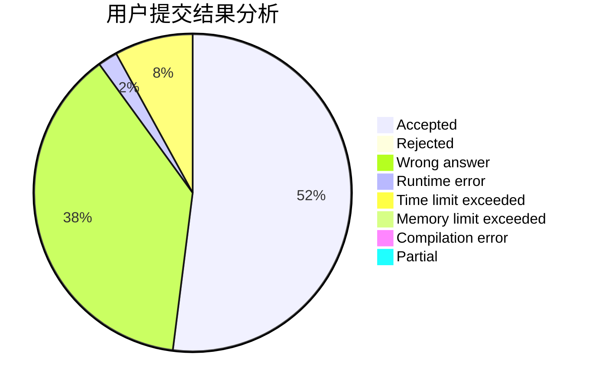
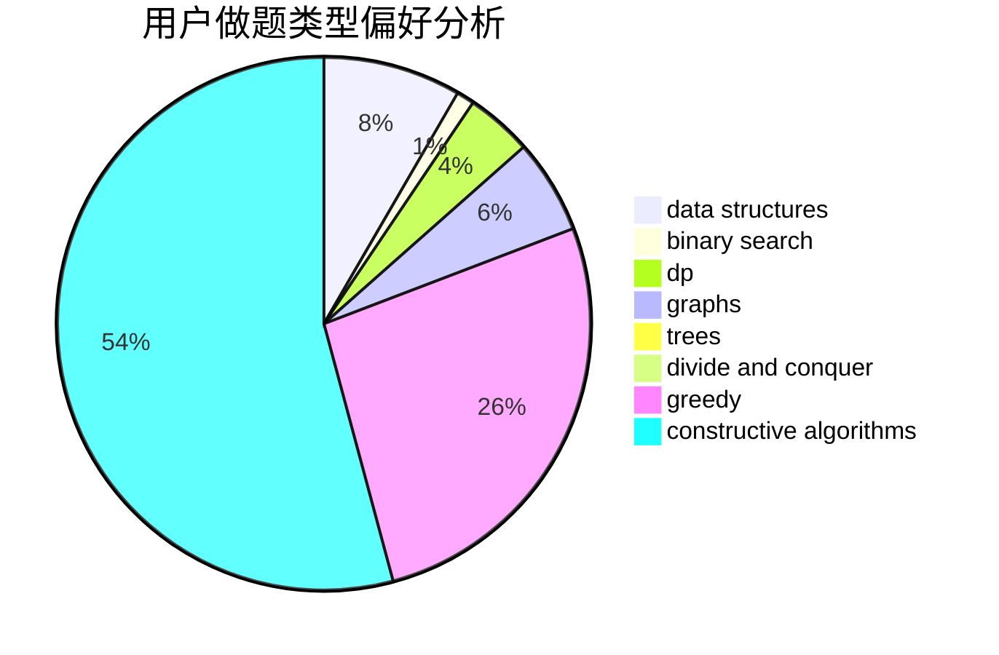
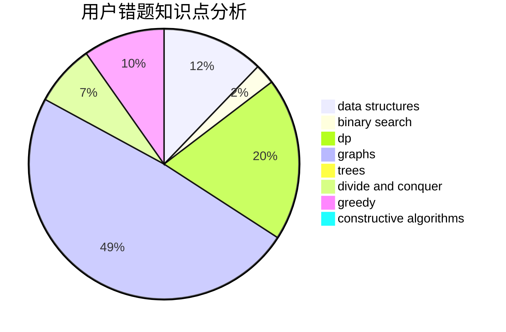

# OrzJiian

<!-- tabs:start -->

#### **用户提交结果分析**

#### **用户做题类型偏好分析**

#### **用户错题知识点分析**

<!-- tabs:end -->
# 推荐题目
[1439D](https://codeforces.com/contest/1439/problem/D)		combinatorics,
                        dp,
                        fft		  
[1028A](https://codeforces.com/contest/1028/problem/A)		implementation		  
[711C](https://codeforces.com/contest/711/problem/C)		dp		  
[85E](https://codeforces.com/contest/85/problem/E)		binary search,
                        dsu,
                        geometry,
                        graphs,
                        sortings		  
[367B](https://codeforces.com/contest/367/problem/B)		binary search,
                        data structures		  
[257D](https://codeforces.com/contest/257/problem/D)		greedy,
                        math		  
[1199E](https://codeforces.com/contest/1199/problem/E)		dsu,graphs,sortings,trees		  
[690A2](https://codeforces.com/contest/690A/problem/2)		nan		  
[443A](https://codeforces.com/contest/443/problem/A)		constructive algorithms,
                        implementation		  
[793D](https://codeforces.com/contest/793/problem/D)		dp,
                        graphs,
                        shortest paths		  
