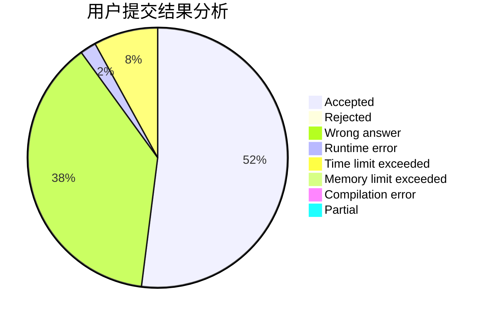
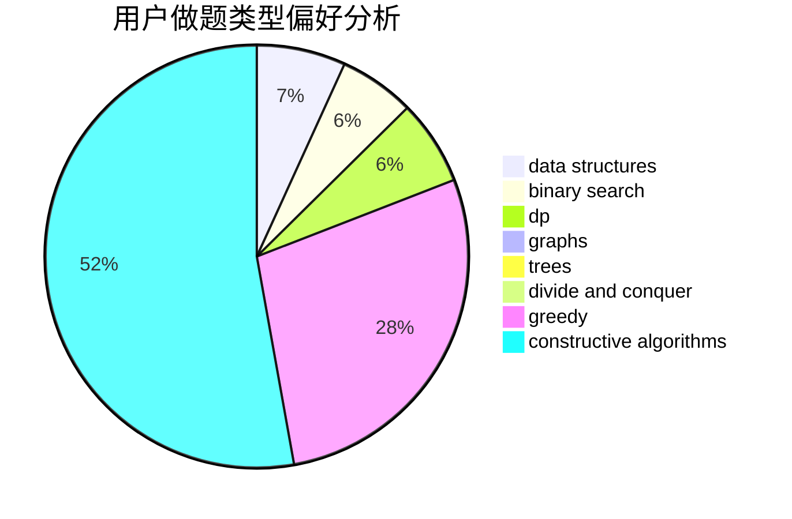
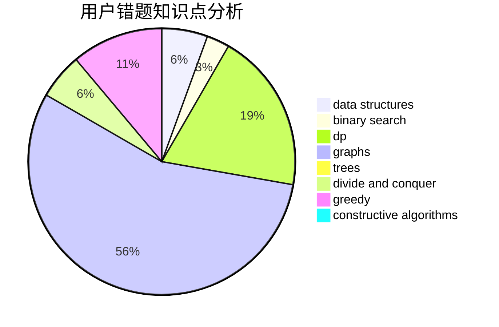

# OrzJiian

<!-- tabs:start -->

#### **用户提交结果分析**

#### **用户做题类型偏好分析**

#### **用户错题知识点分析**

<!-- tabs:end -->
# 推荐题目
[1450F](https://codeforces.com/contest/1450/problem/F)		constructive algorithms,
                        greedy		  
[1028D](https://codeforces.com/contest/1028/problem/D)		combinatorics,
                        data structures,
                        greedy		  
[731C](https://codeforces.com/contest/731/problem/C)		dfs and similar,
                        dsu,
                        graphs,
                        greedy		  
[877F](https://codeforces.com/contest/877/problem/F)		data structures,
                        flows,
                        hashing		  
[398A](https://codeforces.com/contest/398/problem/A)		constructive algorithms,
                        implementation		  
[274D](https://codeforces.com/contest/274/problem/D)		dfs and similar,
                        graphs,
                        greedy,
                        sortings		  
[1203A](https://codeforces.com/contest/1203/problem/A)		implementation		  
[710C](https://codeforces.com/contest/710/problem/C)		constructive algorithms,
                        math		  
[463D](https://codeforces.com/contest/463/problem/D)		dfs and similar,
                        dp,
                        graphs,
                        implementation		  
[808F](https://codeforces.com/contest/808/problem/F)		binary search,
                        flows,
                        graphs		  
