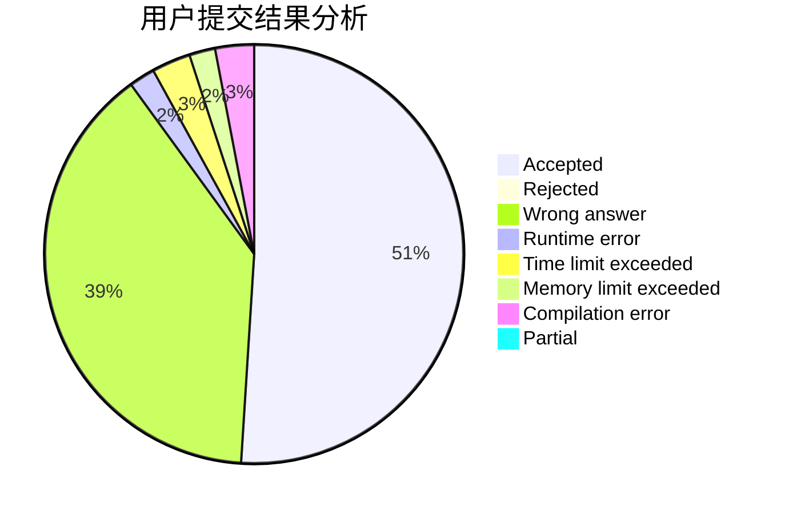
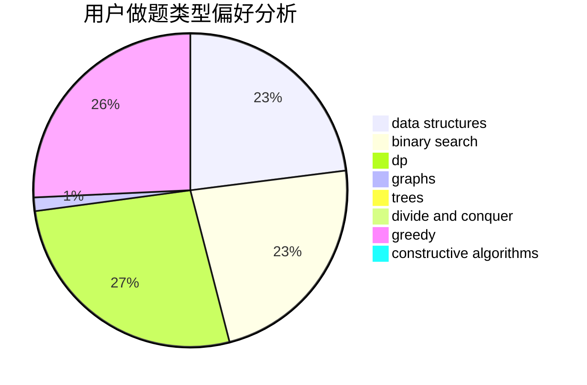
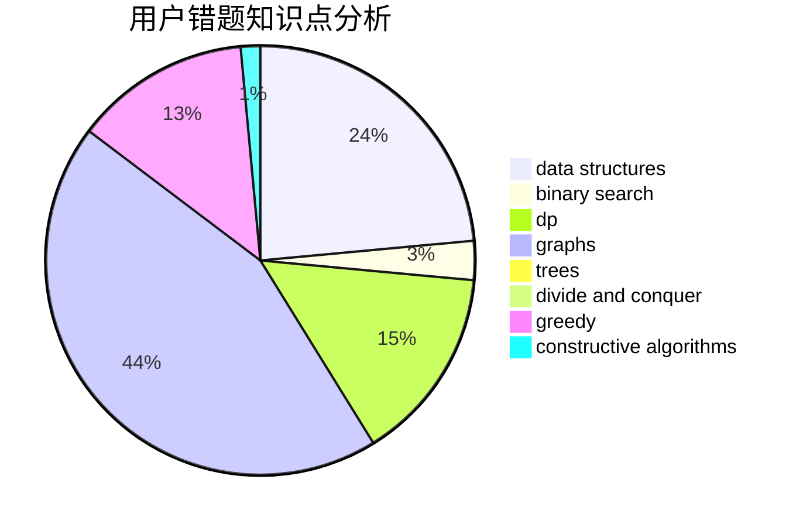

# Orz_Sponge_Bob

<!-- tabs:start -->

#### **用户提交结果分析**

#### **用户做题类型偏好分析**

#### **用户错题知识点分析**

<!-- tabs:end -->
# 推荐题目
[1196B](https://codeforces.com/contest/1196/problem/B)		constructive algorithms,
                        math		  
[442B](https://codeforces.com/contest/442/problem/B)		greedy,
                        math,
                        probabilities		  
[954C](https://codeforces.com/contest/954/problem/C)		implementation		  
[599E](https://codeforces.com/contest/599/problem/E)		bitmasks,
                        dp,
                        trees		  
[742C](https://codeforces.com/contest/742/problem/C)		dsu,graphs,sortings,trees		  
[1329E](https://codeforces.com/contest/1329/problem/E)		binary search,
                        greedy		  
[628D](https://codeforces.com/contest/628/problem/D)		dp		  
[84A](https://codeforces.com/contest/84/problem/A)		math,
                        number theory		  
[599D](https://codeforces.com/contest/599/problem/D)		brute force,
                        math		  
[84C](https://codeforces.com/contest/84/problem/C)		binary search,
                        implementation		  
