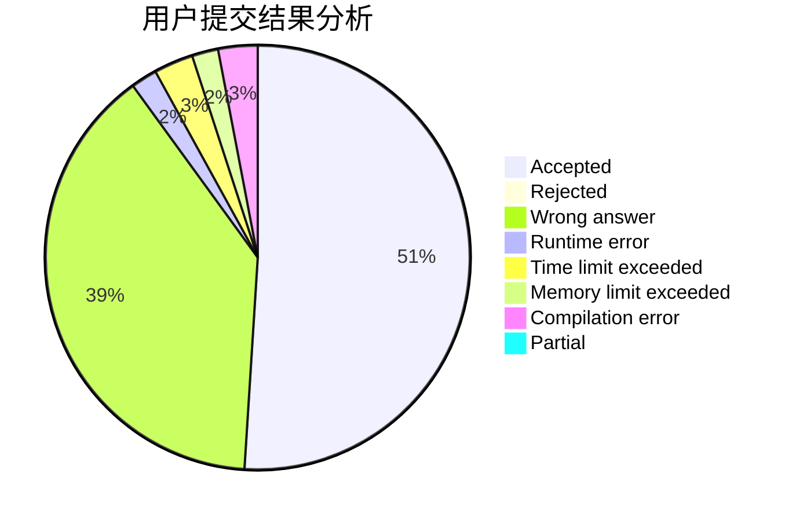
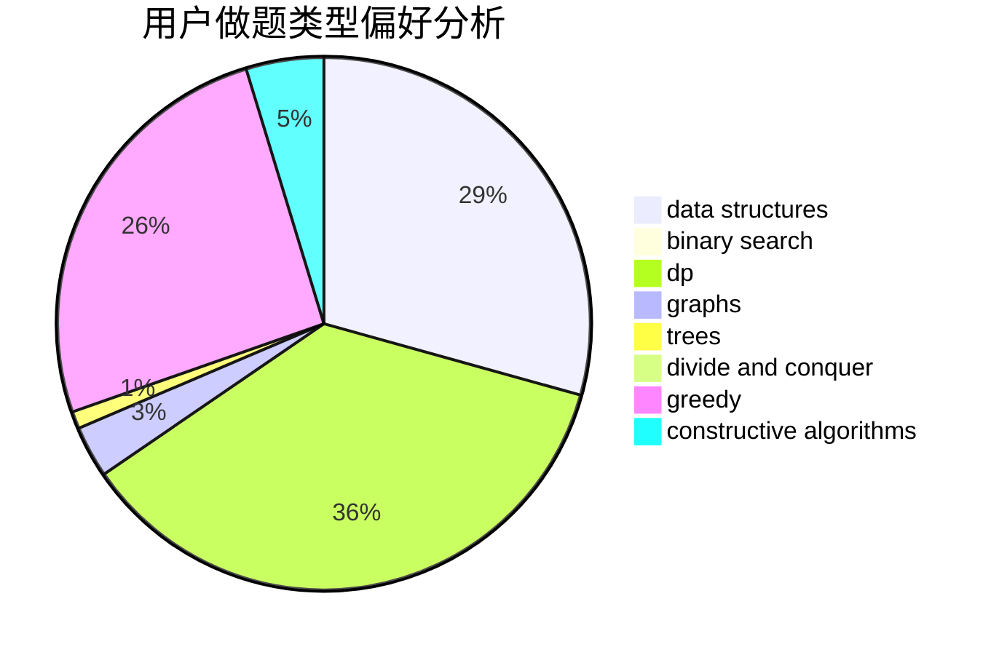
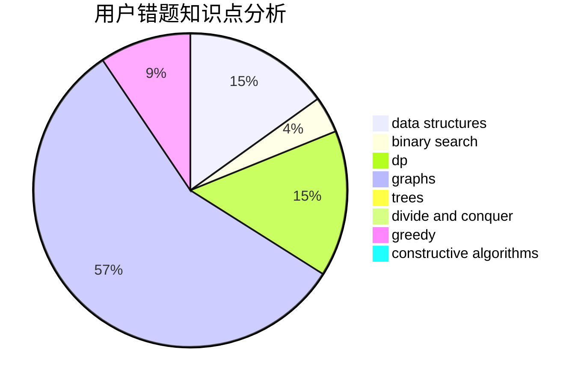

# Orz_Sponge_Bob

<!-- tabs:start -->

#### **用户提交结果分析**

#### **用户做题类型偏好分析**

#### **用户错题知识点分析**

<!-- tabs:end -->
# 推荐题目
[11C](https://codeforces.com/contest/11/problem/C)		implementation		  
[462E](https://codeforces.com/contest/462/problem/E)		dsu,graphs,sortings,trees		  
[976B](https://codeforces.com/contest/976/problem/B)		implementation,
                        math		  
[618A](https://codeforces.com/contest/618/problem/A)		implementation		  
[762F](https://codeforces.com/contest/762/problem/F)		combinatorics,
                        graphs,
                        trees		  
[1335F](https://codeforces.com/contest/1335/problem/F)		data structures,
                        dfs and similar,
                        dsu,
                        graphs,
                        greedy,
                        matrices		  
[656E](https://codeforces.com/contest/656/problem/E)		*special problem		  
[868E](https://codeforces.com/contest/868/problem/E)		dp,
                        graphs,
                        trees		  
[617E](https://codeforces.com/contest/617/problem/E)		data structures		  
[868F](https://codeforces.com/contest/868/problem/F)		divide and conquer,
                        dp		  
