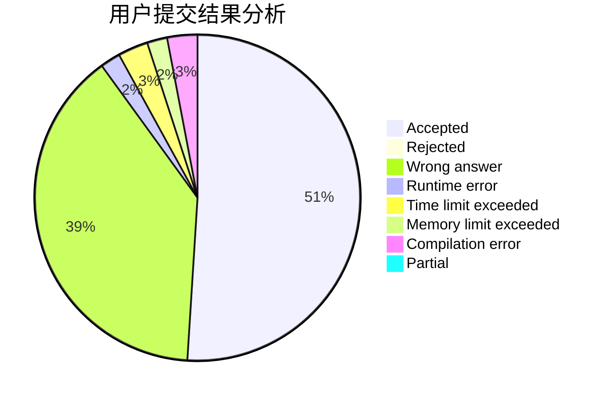
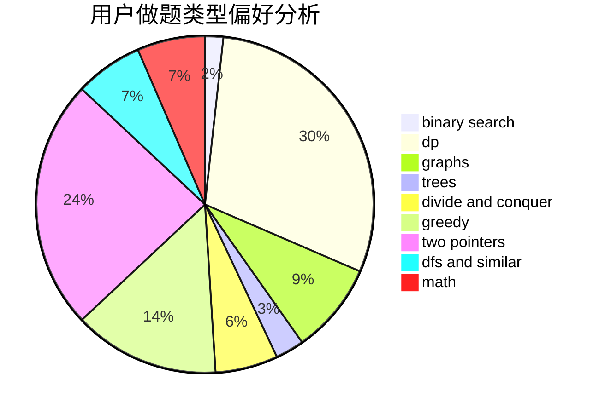

# Orz_Sponge_Bob

<!-- tabs:start -->

#### **用户提交结果分析**

#### **用户做题类型偏好分析**

<!-- tabs:end -->
# 推荐题目
[11C](https://codeforces.com/contest/11/problem/C)
[462E](https://codeforces.com/contest/462/problem/E)
[976B](https://codeforces.com/contest/976/problem/B)
[618A](https://codeforces.com/contest/618/problem/A)
[762F](https://codeforces.com/contest/762/problem/F)
[1335F](https://codeforces.com/contest/1335/problem/F)
[656E](https://codeforces.com/contest/656/problem/E)
[868E](https://codeforces.com/contest/868/problem/E)
[617E](https://codeforces.com/contest/617/problem/E)
[868F](https://codeforces.com/contest/868/problem/F)
