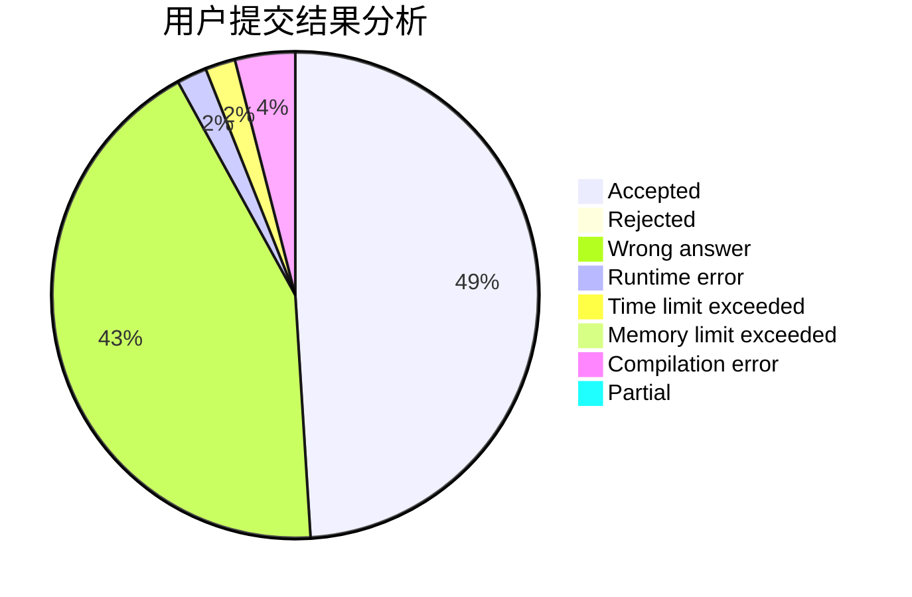
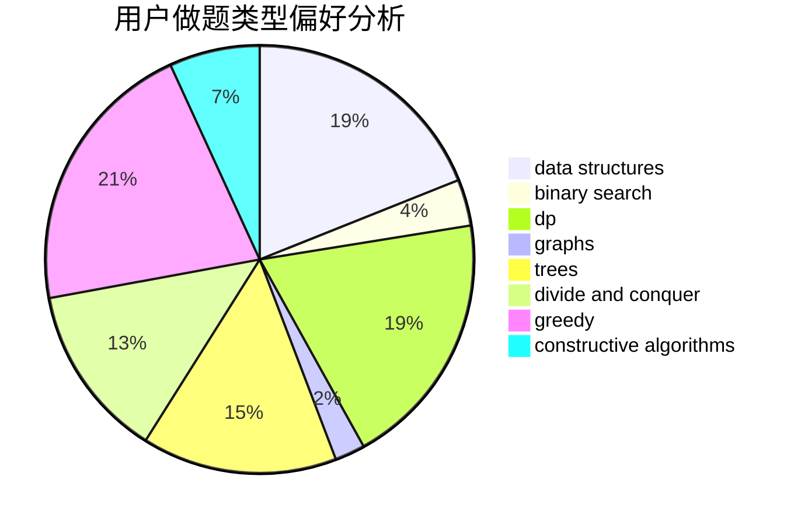
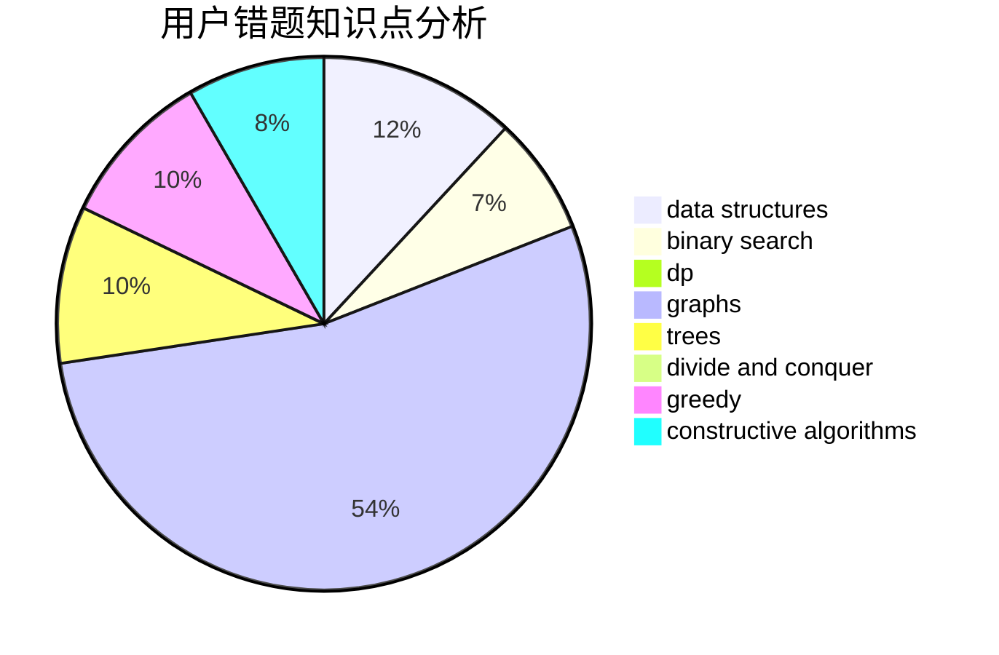

# Overmout

<!-- tabs:start -->

#### **用户提交结果分析**

#### **用户做题类型偏好分析**

#### **用户错题知识点分析**

<!-- tabs:end -->
# 推荐题目
[1164K](https://codeforces.com/contest/1164/problem/K)		dsu,graphs,sortings,trees		  
[788E](https://codeforces.com/contest/788/problem/E)		data structures		  
[659G](https://codeforces.com/contest/659/problem/G)		combinatorics,
                        dp,
                        number theory		  
[1101E](https://codeforces.com/contest/1101/problem/E)		implementation		  
[1225E](https://codeforces.com/contest/1225/problem/E)		binary search,
                        dp		  
[1083B](https://codeforces.com/contest/1083/problem/B)		greedy,
                        strings		  
[852D](https://codeforces.com/contest/852/problem/D)		binary search,
                        flows,
                        graph matchings,
                        shortest paths		  
[1314D](https://codeforces.com/contest/1314/problem/D)		dsu,graphs,sortings,trees		  
[590A](https://codeforces.com/contest/590/problem/A)		implementation		  
[948C](https://codeforces.com/contest/948/problem/C)		dsu,graphs,sortings,trees		  
