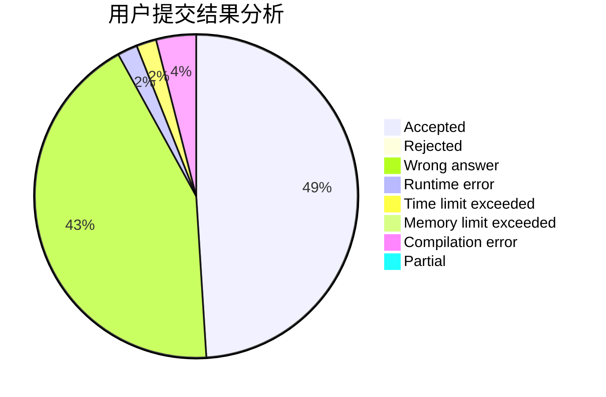
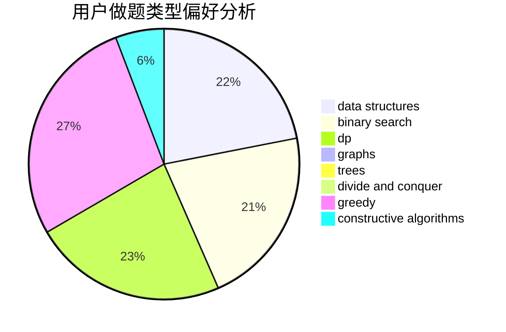
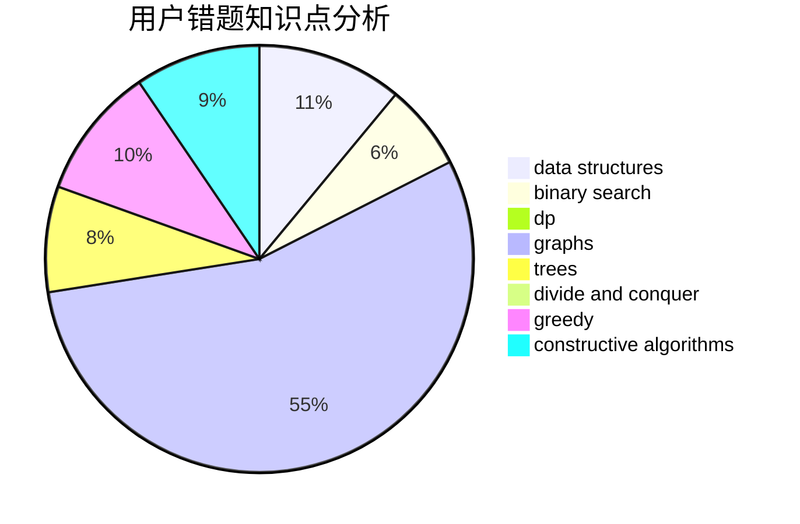

# Overmout
<!-- tabs:start -->
#### **用户提交结果分析**

#### **用户做题类型偏好分析**

#### **用户错题知识点分析**

<!-- tabs:end -->
# 推荐题目
[World Evil](http://codeforces.com/problemset/problem/62/E)		dp,
                        flows		  
[Chladni Figure](https://codeforces.com/contest/1162/problem/D)		brute force,
                        strings		  
[Alice and the Unfair Game](http://codeforces.com/problemset/problem/1236/E)		binary search,
                        data structures,
                        dp,
                        dsu		  
[Accordion](http://codeforces.com/problemset/problem/1101/B)		greedy,
                        implementation		  
[The Winds of Winter](http://codeforces.com/problemset/problem/768/G)		binary search,
                        data structures		  
[Petya and Square](http://codeforces.com/problemset/problem/112/B)		implementation,
                        math		  
[Pave the Parallelepiped](https://codeforces.com/contest/1008/problem/D)		bitmasks,
                        brute force,
                        combinatorics,
                        math,
                        number theory		  
[Jumping Transformers](http://codeforces.com/problemset/problem/1218/C)		dp		  
[Maze](http://codeforces.com/problemset/problem/123/E)		dfs and similar,
                        dp,
                        probabilities,
                        trees		  
[Mysterious numbers - 1](http://codeforces.com/problemset/problem/171/A)		*special problem,
                        constructive algorithms		  
<!-- tabs:start -->
#### **data structures**
[World Evil](http://codeforces.com/problemset/problem/1236/E)		binary search,
                        data structures,
                        dp,
                        dsu		  
[Chladni Figure](http://codeforces.com/problemset/problem/768/G)		binary search,
                        data structures		  
[Alice and the Unfair Game](http://codeforces.com/problemset/problem/899/F)		data structures,
                        strings		  
[Accordion](http://codeforces.com/problemset/problem/958/C3)		data structures,
                        dp		  
[The Winds of Winter](http://codeforces.com/problemset/problem/56/E)		binary search,
                        data structures,
                        sortings		  
[Petya and Square](https://codeforces.com/contest/871/problem/D)		data structures,
                        number theory		  
[Pave the Parallelepiped](http://codeforces.com/problemset/problem/1151/E)		combinatorics,
                        data structures,
                        dp,
                        math		  
[Jumping Transformers](http://codeforces.com/problemset/problem/749/E)		data structures,
                        probabilities		  
[Maze](http://codeforces.com/problemset/problem/1467/E)		data structures,
                        dfs and similar,
                        dp,
                        trees		  
[Mysterious numbers - 1](http://codeforces.com/problemset/problem/932/F)		data structures,
                        dp,
                        geometry		  
#### **binary search**
[World Evil](http://codeforces.com/problemset/problem/1236/E)		binary search,
                        data structures,
                        dp,
                        dsu		  
[Chladni Figure](http://codeforces.com/problemset/problem/768/G)		binary search,
                        data structures		  
[Alice and the Unfair Game](http://codeforces.com/problemset/problem/56/E)		binary search,
                        data structures,
                        sortings		  
[Accordion](http://codeforces.com/problemset/problem/1492/C)		binary search,
                        data structures,
                        dp,
                        greedy,
                        two pointers		  
[The Winds of Winter](http://codeforces.com/problemset/problem/1463/D)		binary search,
                        constructive algorithms,
                        greedy,
                        two pointers		  
[Petya and Square](http://codeforces.com/problemset/problem/1490/G)		binary search,
                        data structures,
                        math		  
[Pave the Parallelepiped](http://codeforces.com/problemset/problem/1479/D)		binary search,
                        bitmasks,
                        brute force,
                        data structures,
                        probabilities,
                        trees		  
[Jumping Transformers](http://codeforces.com/problemset/problem/1436/E)		binary search,
                        data structures,
                        two pointers		  
[Maze](http://codeforces.com/problemset/problem/1461/D)		binary search,
                        brute force,
                        data structures,
                        divide and conquer,
                        implementation,
                        sortings		  
[Mysterious numbers - 1](http://codeforces.com/problemset/problem/1493/C)		binary search,
                        brute force,
                        constructive algorithms,
                        greedy,
                        strings		  
#### **dp**
[World Evil](http://codeforces.com/problemset/problem/62/E)		dp,
                        flows		  
[Chladni Figure](http://codeforces.com/problemset/problem/1236/E)		binary search,
                        data structures,
                        dp,
                        dsu		  
[Alice and the Unfair Game](http://codeforces.com/problemset/problem/1218/C)		dp		  
[Accordion](http://codeforces.com/problemset/problem/123/E)		dfs and similar,
                        dp,
                        probabilities,
                        trees		  
[The Winds of Winter](http://codeforces.com/problemset/problem/958/C3)		data structures,
                        dp		  
[Petya and Square](http://codeforces.com/problemset/problem/1082/F)		dp,
                        strings,
                        trees		  
[Pave the Parallelepiped](http://codeforces.com/problemset/problem/115/D)		dp,
                        expression parsing		  
[Jumping Transformers](http://codeforces.com/problemset/problem/1151/E)		combinatorics,
                        data structures,
                        dp,
                        math		  
[Maze](http://codeforces.com/problemset/problem/666/A)		dp,
                        implementation,
                        strings		  
[Mysterious numbers - 1](http://codeforces.com/problemset/problem/1467/E)		data structures,
                        dfs and similar,
                        dp,
                        trees		  
#### **graph**
[World Evil](http://codeforces.com/problemset/problem/1422/D)		graphs,
                        shortest paths,
                        sortings		  
[Chladni Figure](http://codeforces.com/problemset/problem/1267/F)		graphs		  
[Alice and the Unfair Game](http://codeforces.com/problemset/problem/1487/C)		brute force,
                        constructive algorithms,
                        dfs and similar,
                        graphs,
                        greedy,
                        implementation,
                        math		  
[Accordion](http://codeforces.com/problemset/problem/1437/C)		dp,
                        flows,
                        graph matchings,
                        greedy,
                        math,
                        sortings		  
[The Winds of Winter](http://codeforces.com/problemset/problem/1470/D)		constructive algorithms,
                        dfs and similar,
                        graph matchings,
                        graphs,
                        greedy		  
[Petya and Square](http://codeforces.com/problemset/problem/1476/C)		dp,
                        graphs,
                        greedy		  
[Pave the Parallelepiped](http://codeforces.com/problemset/problem/1304/D)		constructive algorithms,
                        graphs,
                        greedy,
                        two pointers		  
[Jumping Transformers](http://codeforces.com/problemset/problem/1475/C)		combinatorics,
                        graphs,
                        math		  
[Maze](http://codeforces.com/problemset/problem/553/E)		dp,
                        fft,
                        graphs,
                        math,
                        probabilities		  
[Mysterious numbers - 1](http://codeforces.com/problemset/problem/1495/C)		constructive algorithms,
                        graphs		  
#### **trees**
[World Evil](http://codeforces.com/problemset/problem/123/E)		dfs and similar,
                        dp,
                        probabilities,
                        trees		  
[Chladni Figure](http://codeforces.com/problemset/problem/1082/F)		dp,
                        strings,
                        trees		  
[Alice and the Unfair Game](http://codeforces.com/problemset/problem/1467/E)		data structures,
                        dfs and similar,
                        dp,
                        trees		  
[Accordion](http://codeforces.com/problemset/problem/1205/D)		constructive algorithms,
                        trees		  
[The Winds of Winter](http://codeforces.com/problemset/problem/1479/D)		binary search,
                        bitmasks,
                        brute force,
                        data structures,
                        probabilities,
                        trees		  
[Petya and Square](http://codeforces.com/problemset/problem/1511/C)		brute force,
                        data structures,
                        implementation,
                        trees		  
[Pave the Parallelepiped](http://codeforces.com/problemset/problem/1499/F)		combinatorics,
                        dfs and similar,
                        dp,
                        trees		  
[Jumping Transformers](http://codeforces.com/problemset/problem/1491/E)		brute force,
                        dfs and similar,
                        divide and conquer,
                        number theory,
                        trees		  
[Maze](http://codeforces.com/problemset/problem/1466/D)		data structures,
                        greedy,
                        sortings,
                        trees		  
[Mysterious numbers - 1](http://codeforces.com/problemset/problem/1495/D)		combinatorics,
                        dfs and similar,
                        graphs,
                        math,
                        shortest paths,
                        trees		  
#### **divide and conquer**
[World Evil](http://codeforces.com/problemset/problem/1461/D)		binary search,
                        brute force,
                        data structures,
                        divide and conquer,
                        implementation,
                        sortings		  
[Chladni Figure](http://codeforces.com/problemset/problem/1466/G)		combinatorics,
                        divide and conquer,
                        hashing,
                        math,
                        string suffix structures,
                        strings		  
[Alice and the Unfair Game](http://codeforces.com/problemset/problem/1490/D)		dfs and similar,
                        divide and conquer,
                        implementation		  
[Accordion](https://codeforces.com/contest/1483/problem/C)		data structures,
                        divide and conquer,
                        dp		  
[The Winds of Winter](http://codeforces.com/problemset/problem/1491/E)		brute force,
                        dfs and similar,
                        divide and conquer,
                        number theory,
                        trees		  
[Petya and Square](http://codeforces.com/problemset/problem/1303/G)		data structures,
                        divide and conquer,
                        geometry,
                        trees		  
[Pave the Parallelepiped](http://codeforces.com/problemset/problem/1494/D)		constructive algorithms,
                        data structures,
                        dfs and similar,
                        divide and conquer,
                        dsu,
                        greedy,
                        sortings,
                        trees		  
[Jumping Transformers](http://codeforces.com/problemset/problem/1482/E)		data structures,
                        divide and conquer,
                        dp		  
[Maze](http://codeforces.com/problemset/problem/566/C)		dfs and similar,
                        divide and conquer,
                        trees		  
[Mysterious numbers - 1](http://codeforces.com/problemset/problem/1428/F)		binary search,
                        data structures,
                        divide and conquer,
                        dp,
                        two pointers		  
#### **greedy**
[World Evil](http://codeforces.com/problemset/problem/1101/B)		greedy,
                        implementation		  
[Chladni Figure](http://codeforces.com/problemset/problem/1185/C1)		greedy,
                        sortings		  
[Alice and the Unfair Game](http://codeforces.com/problemset/problem/1305/E)		constructive algorithms,
                        greedy,
                        implementation,
                        math		  
[Accordion](https://codeforces.com/contest/1443/problem/D)		constructive algorithms,
                        dp,
                        greedy		  
[The Winds of Winter](http://codeforces.com/problemset/problem/1492/C)		binary search,
                        data structures,
                        dp,
                        greedy,
                        two pointers		  
[Petya and Square](https://codeforces.com/contest/1496/problem/C)		geometry,
                        greedy,
                        math,
                        sortings		  
[Pave the Parallelepiped](http://codeforces.com/problemset/problem/1493/A)		constructive algorithms,
                        greedy		  
[Jumping Transformers](http://codeforces.com/problemset/problem/1463/D)		binary search,
                        constructive algorithms,
                        greedy,
                        two pointers		  
[Maze](http://codeforces.com/problemset/problem/1462/C)		brute force,
                        greedy,
                        math		  
[Mysterious numbers - 1](http://codeforces.com/problemset/problem/1494/B)		bitmasks,
                        brute force,
                        greedy,
                        implementation		  
#### **constructive algorithms**
[World Evil](http://codeforces.com/problemset/problem/171/A)		*special problem,
                        constructive algorithms		  
[Chladni Figure](http://codeforces.com/problemset/problem/398/C)		constructive algorithms		  
[Alice and the Unfair Game](http://codeforces.com/problemset/problem/303/A)		constructive algorithms,
                        implementation,
                        math		  
[Accordion](http://codeforces.com/problemset/problem/1205/D)		constructive algorithms,
                        trees		  
[The Winds of Winter](http://codeforces.com/problemset/problem/1305/E)		constructive algorithms,
                        greedy,
                        implementation,
                        math		  
[Petya and Square](https://codeforces.com/contest/1443/problem/D)		constructive algorithms,
                        dp,
                        greedy		  
[Pave the Parallelepiped](http://codeforces.com/problemset/problem/1493/A)		constructive algorithms,
                        greedy		  
[Jumping Transformers](http://codeforces.com/problemset/problem/1463/D)		binary search,
                        constructive algorithms,
                        greedy,
                        two pointers		  
[Maze](https://codeforces.com/contest/1456/problem/B)		bitmasks,
                        brute force,
                        constructive algorithms		  
[Mysterious numbers - 1](http://codeforces.com/problemset/problem/1492/D)		bitmasks,
                        constructive algorithms,
                        greedy,
                        math		  
#### **sortings**
[World Evil](http://codeforces.com/problemset/problem/56/E)		binary search,
                        data structures,
                        sortings		  
[Chladni Figure](http://codeforces.com/problemset/problem/1185/C1)		greedy,
                        sortings		  
[Alice and the Unfair Game](http://codeforces.com/problemset/problem/1422/D)		graphs,
                        shortest paths,
                        sortings		  
[Accordion](http://codeforces.com/problemset/problem/13/C)		dp,
                        sortings		  
[The Winds of Winter](https://codeforces.com/contest/1496/problem/C)		geometry,
                        greedy,
                        math,
                        sortings		  
[Petya and Square](http://codeforces.com/problemset/problem/1495/A)		geometry,
                        greedy,
                        math,
                        sortings		  
[Pave the Parallelepiped](http://codeforces.com/problemset/problem/1497/A)		brute force,
                        data structures,
                        greedy,
                        sortings		  
[Jumping Transformers](http://codeforces.com/problemset/problem/1427/A)		math,
                        sortings		  
[Maze](http://codeforces.com/problemset/problem/1461/D)		binary search,
                        brute force,
                        data structures,
                        divide and conquer,
                        implementation,
                        sortings		  
[Mysterious numbers - 1](http://codeforces.com/problemset/problem/1437/C)		dp,
                        flows,
                        graph matchings,
                        greedy,
                        math,
                        sortings		  
<!-- tabs:end -->
