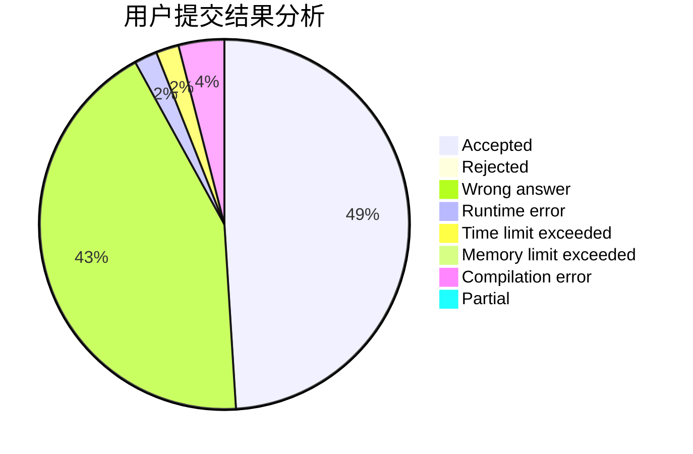
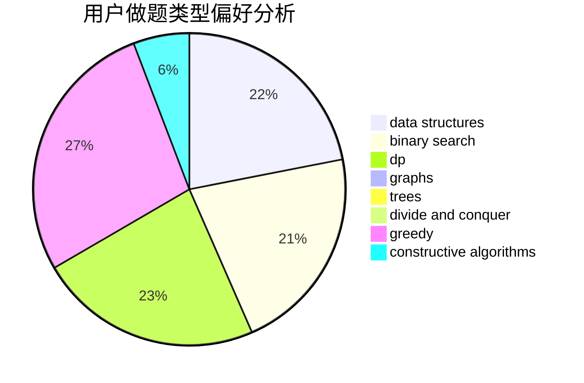
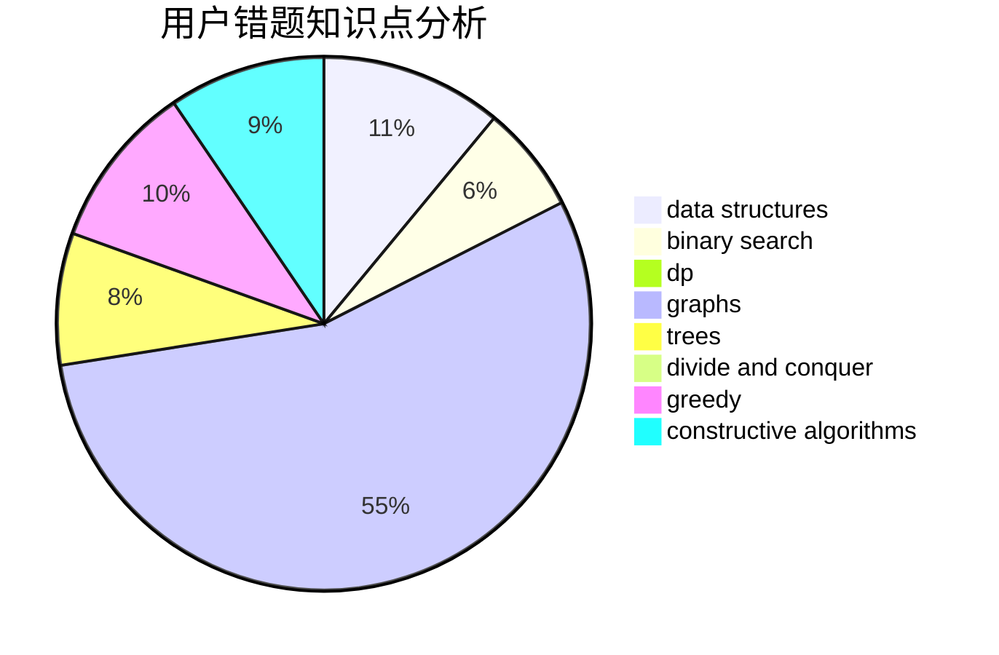

# Overmout

<!-- tabs:start -->

#### **用户提交结果分析**

#### **用户做题类型偏好分析**

#### **用户错题知识点分析**

<!-- tabs:end -->
# 推荐题目
[1162D](https://codeforces.com/contest/1162/problem/D)		dsu,graphs,sortings,trees		  
[768G](https://codeforces.com/contest/768/problem/G)		binary search,
                        data structures		  
[62E](https://codeforces.com/contest/62/problem/E)		dp,
                        flows		  
[1101B](https://codeforces.com/contest/1101/problem/B)		greedy,
                        implementation		  
[1218C](https://codeforces.com/contest/1218/problem/C)		dp		  
[1082F](https://codeforces.com/contest/1082/problem/F)		dp,
                        strings,
                        trees		  
[834C](https://codeforces.com/contest/834/problem/C)		dsu,graphs,sortings,trees		  
[1305E](https://codeforces.com/contest/1305/problem/E)		constructive algorithms,
                        greedy,
                        implementation,
                        math		  
[56E](https://codeforces.com/contest/56/problem/E)		binary search,
                        data structures,
                        sortings		  
[924E](https://codeforces.com/contest/924/problem/E)		nan		  
