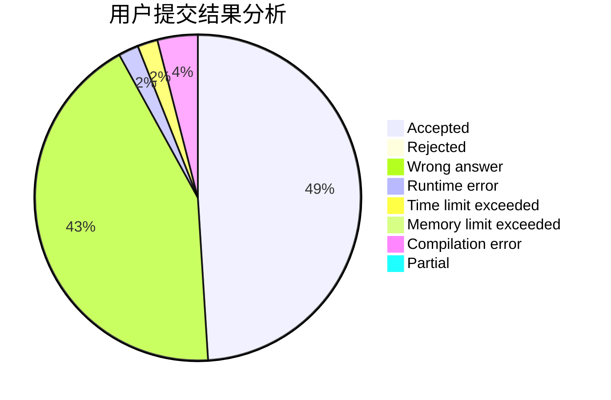
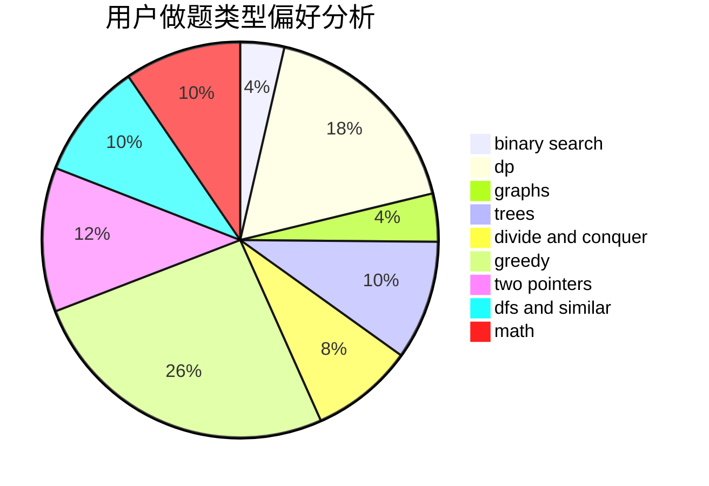

# Overmout

<!-- tabs:start -->

#### **用户提交结果分析**

#### **用户做题类型偏好分析**

<!-- tabs:end -->
# 推荐题目
[1164K](https://codeforces.com/contest/1164/problem/K)
[788E](https://codeforces.com/contest/788/problem/E)
[659G](https://codeforces.com/contest/659/problem/G)
[1101E](https://codeforces.com/contest/1101/problem/E)
[1225E](https://codeforces.com/contest/1225/problem/E)
[1083B](https://codeforces.com/contest/1083/problem/B)
[852D](https://codeforces.com/contest/852/problem/D)
[1314D](https://codeforces.com/contest/1314/problem/D)
[590A](https://codeforces.com/contest/590/problem/A)
[948C](https://codeforces.com/contest/948/problem/C)
