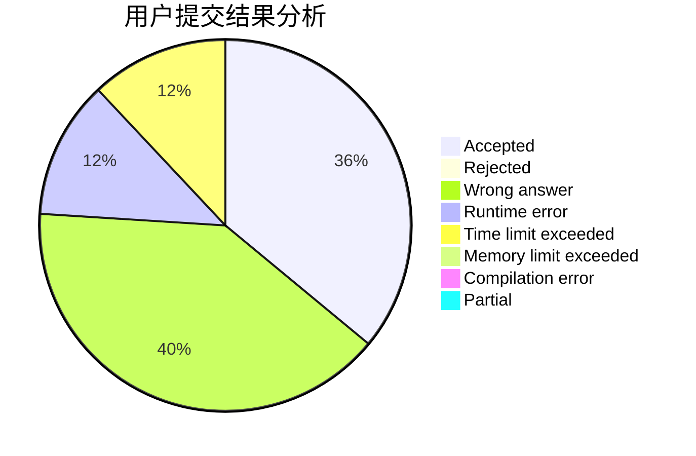
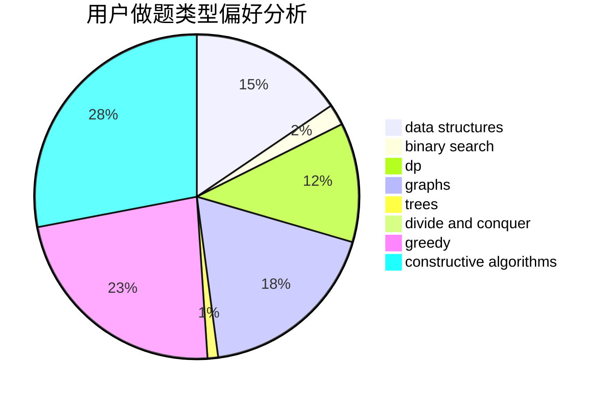
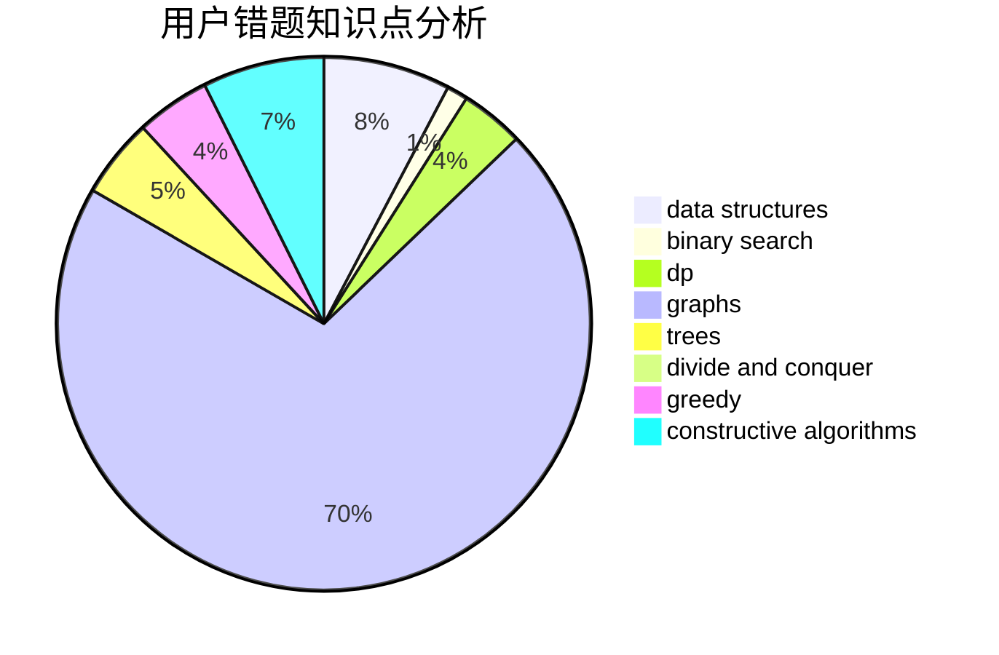

# Overstars

<!-- tabs:start -->

#### **用户提交结果分析**

#### **用户做题类型偏好分析**

#### **用户错题知识点分析**

<!-- tabs:end -->
# 推荐题目
[1498F](https://codeforces.com/contest/1498/problem/F)		bitmasks,
                        data structures,
                        dfs and similar,
                        dp,
                        games,
                        math,
                        trees		  
[833A](https://codeforces.com/contest/833/problem/A)		math,
                        number theory		  
[25D](https://codeforces.com/contest/25/problem/D)		dsu,
                        graphs,
                        trees		  
[1065F](https://codeforces.com/contest/1065/problem/F)		dfs and similar,
                        dp,
                        trees		  
[578B](https://codeforces.com/contest/578/problem/B)		brute force,
                        greedy		  
[1169B](https://codeforces.com/contest/1169/problem/B)		graphs,
                        implementation		  
[383D](https://codeforces.com/contest/383/problem/D)		dp		  
[58E](https://codeforces.com/contest/58/problem/E)		dp		  
[771D](https://codeforces.com/contest/771/problem/D)		dp		  
[1395F](https://codeforces.com/contest/1395/problem/F)		dsu,graphs,sortings,trees		  
