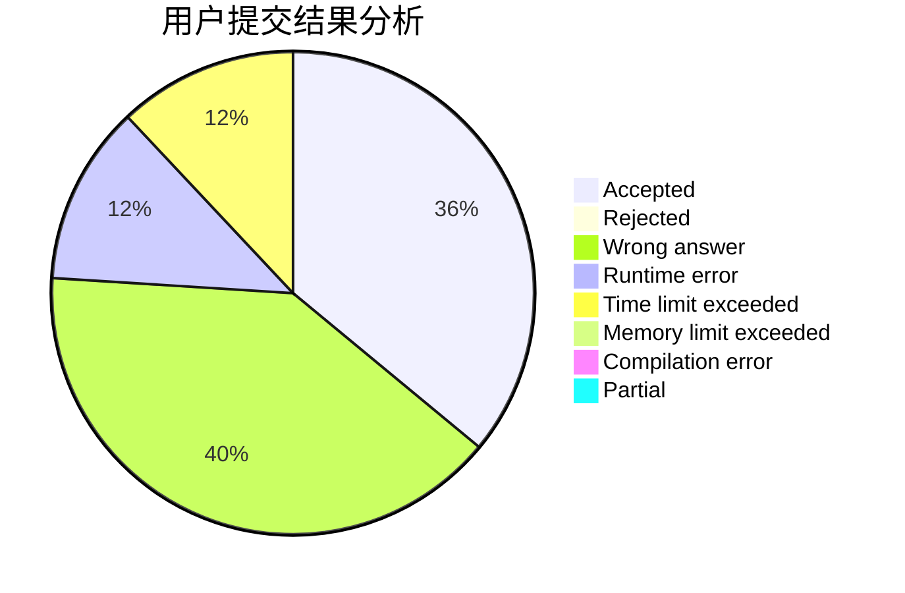
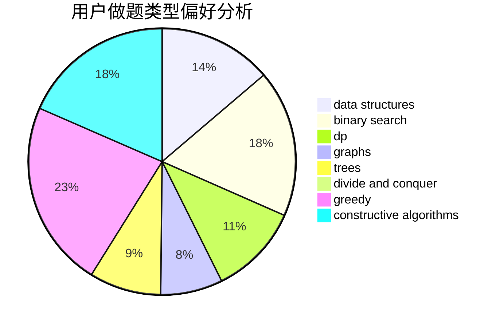

# Overstars
<!-- tabs:start -->
#### **用户提交结果分析**

#### **用户做题类型偏好分析**

#### **用户错题知识点分析**

<!-- tabs:end -->
# 推荐题目
[Tricky Interactor](http://codeforces.com/problemset/problem/1081/F)		constructive algorithms,
                        implementation,
                        interactive		  
[An impassioned circulation of affection](http://codeforces.com/problemset/problem/814/C)		brute force,
                        dp,
                        strings,
                        two pointers		  
[Complicated GCD](http://codeforces.com/problemset/problem/664/A)		math,
                        number theory		  
[Not Wool Sequences](http://codeforces.com/problemset/problem/238/A)		constructive algorithms,
                        math		  
[Vanya and Brackets](http://codeforces.com/problemset/problem/552/E)		brute force,
                        dp,
                        expression parsing,
                        greedy,
                        implementation,
                        strings		  
[Vasya and Isolated Vertices](http://codeforces.com/problemset/problem/1065/B)		constructive algorithms,
                        graphs		  
[Removing Leaves](http://codeforces.com/problemset/problem/1385/F)		data structures,
                        greedy,
                        implementation,
                        trees		  
[Spoilt Permutation](http://codeforces.com/problemset/problem/56/B)		implementation		  
[New Year and Snowy Grid](http://codeforces.com/problemset/problem/750/H)		dfs and similar,
                        dsu,
                        graphs,
                        interactive		  
[Dima and Text Messages](http://codeforces.com/problemset/problem/358/B)		brute force,
                        strings		  
<!-- tabs:start -->
#### **data structures**
[Tricky Interactor](http://codeforces.com/problemset/problem/1385/F)		data structures,
                        greedy,
                        implementation,
                        trees		  
[An impassioned circulation of affection](http://codeforces.com/problemset/problem/701/B)		data structures,
                        math		  
[Complicated GCD](http://codeforces.com/problemset/problem/1251/E2)		binary search,
                        data structures,
                        greedy		  
[Not Wool Sequences](http://codeforces.com/problemset/problem/1499/G)		data structures,
                        graphs,
                        interactive		  
[Vanya and Brackets](http://codeforces.com/problemset/problem/575/I)		data structures		  
[Vasya and Isolated Vertices](http://codeforces.com/problemset/problem/914/D)		data structures,
                        number theory		  
[Removing Leaves](http://codeforces.com/problemset/problem/1492/C)		binary search,
                        data structures,
                        dp,
                        greedy,
                        two pointers		  
[Spoilt Permutation](http://codeforces.com/problemset/problem/1490/G)		binary search,
                        data structures,
                        math		  
[New Year and Snowy Grid](http://codeforces.com/problemset/problem/1479/D)		binary search,
                        bitmasks,
                        brute force,
                        data structures,
                        probabilities,
                        trees		  
[Dima and Text Messages](http://codeforces.com/problemset/problem/1497/A)		brute force,
                        data structures,
                        greedy,
                        sortings		  
#### **binary search**
[Tricky Interactor](http://codeforces.com/problemset/problem/1166/C)		binary search,
                        sortings,
                        two pointers		  
[An impassioned circulation of affection](http://codeforces.com/problemset/problem/1251/E2)		binary search,
                        data structures,
                        greedy		  
[Complicated GCD](http://codeforces.com/problemset/problem/232/A)		binary search,
                        constructive algorithms,
                        graphs,
                        greedy		  
[Not Wool Sequences](http://codeforces.com/problemset/problem/822/E)		binary search,
                        dp,
                        hashing,
                        string suffix structures		  
[Vanya and Brackets](https://codeforces.com/contest/1247/problem/E)		binary search,
                        dp		  
[Vasya and Isolated Vertices](http://codeforces.com/problemset/problem/1100/C)		binary search,
                        geometry,
                        math		  
[Removing Leaves](http://codeforces.com/problemset/problem/912/E)		binary search,
                        dfs and similar,
                        math,
                        meet-in-the-middle,
                        number theory,
                        two pointers		  
[Spoilt Permutation](http://codeforces.com/problemset/problem/1492/C)		binary search,
                        data structures,
                        dp,
                        greedy,
                        two pointers		  
[New Year and Snowy Grid](http://codeforces.com/problemset/problem/1463/D)		binary search,
                        constructive algorithms,
                        greedy,
                        two pointers		  
[Dima and Text Messages](http://codeforces.com/problemset/problem/1490/G)		binary search,
                        data structures,
                        math		  
#### **dp**
[Tricky Interactor](http://codeforces.com/problemset/problem/814/C)		brute force,
                        dp,
                        strings,
                        two pointers		  
[An impassioned circulation of affection](http://codeforces.com/problemset/problem/552/E)		brute force,
                        dp,
                        expression parsing,
                        greedy,
                        implementation,
                        strings		  
[Complicated GCD](http://codeforces.com/problemset/problem/704/C)		dp,
                        graphs,
                        implementation,
                        math		  
[Not Wool Sequences](http://codeforces.com/problemset/problem/225/C)		dp,
                        matrices		  
[Vanya and Brackets](http://codeforces.com/problemset/problem/1040/B)		dp,
                        greedy,
                        math		  
[Vasya and Isolated Vertices](http://codeforces.com/problemset/problem/386/C)		dp,
                        strings,
                        two pointers		  
[Removing Leaves](http://codeforces.com/problemset/problem/180/C)		dp		  
[Spoilt Permutation](http://codeforces.com/problemset/problem/822/E)		binary search,
                        dp,
                        hashing,
                        string suffix structures		  
[New Year and Snowy Grid](http://codeforces.com/problemset/problem/830/D)		combinatorics,
                        dp,
                        graphs,
                        trees		  
[Dima and Text Messages](https://codeforces.com/contest/1247/problem/E)		binary search,
                        dp		  
#### **graph**
[Tricky Interactor](http://codeforces.com/problemset/problem/1065/B)		constructive algorithms,
                        graphs		  
[An impassioned circulation of affection](http://codeforces.com/problemset/problem/750/H)		dfs and similar,
                        dsu,
                        graphs,
                        interactive		  
[Complicated GCD](http://codeforces.com/problemset/problem/704/C)		dp,
                        graphs,
                        implementation,
                        math		  
[Not Wool Sequences](http://codeforces.com/problemset/problem/232/A)		binary search,
                        constructive algorithms,
                        graphs,
                        greedy		  
[Vanya and Brackets](http://codeforces.com/problemset/problem/1167/C)		dfs and similar,
                        dsu,
                        graphs		  
[Vasya and Isolated Vertices](http://codeforces.com/problemset/problem/1184/E1)		graphs,
                        trees		  
[Removing Leaves](http://codeforces.com/problemset/problem/1499/G)		data structures,
                        graphs,
                        interactive		  
[Spoilt Permutation](http://codeforces.com/problemset/problem/830/D)		combinatorics,
                        dp,
                        graphs,
                        trees		  
[New Year and Snowy Grid](http://codeforces.com/problemset/problem/1487/C)		brute force,
                        constructive algorithms,
                        dfs and similar,
                        graphs,
                        greedy,
                        implementation,
                        math		  
[Dima and Text Messages](http://codeforces.com/problemset/problem/1437/C)		dp,
                        flows,
                        graph matchings,
                        greedy,
                        math,
                        sortings		  
#### **trees**
[Tricky Interactor](http://codeforces.com/problemset/problem/1385/F)		data structures,
                        greedy,
                        implementation,
                        trees		  
[An impassioned circulation of affection](http://codeforces.com/problemset/problem/1184/E1)		graphs,
                        trees		  
[Complicated GCD](http://codeforces.com/problemset/problem/830/D)		combinatorics,
                        dp,
                        graphs,
                        trees		  
[Not Wool Sequences](http://codeforces.com/problemset/problem/288/D)		combinatorics,
                        dfs and similar,
                        trees		  
[Vanya and Brackets](http://codeforces.com/problemset/problem/1479/D)		binary search,
                        bitmasks,
                        brute force,
                        data structures,
                        probabilities,
                        trees		  
[Vasya and Isolated Vertices](http://codeforces.com/problemset/problem/1511/C)		brute force,
                        data structures,
                        implementation,
                        trees		  
[Removing Leaves](http://codeforces.com/problemset/problem/1499/F)		combinatorics,
                        dfs and similar,
                        dp,
                        trees		  
[Spoilt Permutation](http://codeforces.com/problemset/problem/1491/E)		brute force,
                        dfs and similar,
                        divide and conquer,
                        number theory,
                        trees		  
[New Year and Snowy Grid](http://codeforces.com/problemset/problem/1466/D)		data structures,
                        greedy,
                        sortings,
                        trees		  
[Dima and Text Messages](http://codeforces.com/problemset/problem/1495/D)		combinatorics,
                        dfs and similar,
                        graphs,
                        math,
                        shortest paths,
                        trees		  
#### **divide and conquer**
[Tricky Interactor](http://codeforces.com/problemset/problem/1461/D)		binary search,
                        brute force,
                        data structures,
                        divide and conquer,
                        implementation,
                        sortings		  
[An impassioned circulation of affection](http://codeforces.com/problemset/problem/1466/G)		combinatorics,
                        divide and conquer,
                        hashing,
                        math,
                        string suffix structures,
                        strings		  
[Complicated GCD](http://codeforces.com/problemset/problem/1490/D)		dfs and similar,
                        divide and conquer,
                        implementation		  
[Not Wool Sequences](https://codeforces.com/contest/1483/problem/C)		data structures,
                        divide and conquer,
                        dp		  
[Vanya and Brackets](http://codeforces.com/problemset/problem/1491/E)		brute force,
                        dfs and similar,
                        divide and conquer,
                        number theory,
                        trees		  
[Vasya and Isolated Vertices](http://codeforces.com/problemset/problem/1303/G)		data structures,
                        divide and conquer,
                        geometry,
                        trees		  
[Removing Leaves](http://codeforces.com/problemset/problem/1494/D)		constructive algorithms,
                        data structures,
                        dfs and similar,
                        divide and conquer,
                        dsu,
                        greedy,
                        sortings,
                        trees		  
[Spoilt Permutation](http://codeforces.com/problemset/problem/1482/E)		data structures,
                        divide and conquer,
                        dp		  
[New Year and Snowy Grid](http://codeforces.com/problemset/problem/566/C)		dfs and similar,
                        divide and conquer,
                        trees		  
[Dima and Text Messages](http://codeforces.com/problemset/problem/1428/F)		binary search,
                        data structures,
                        divide and conquer,
                        dp,
                        two pointers		  
#### **greedy**
[Tricky Interactor](http://codeforces.com/problemset/problem/552/E)		brute force,
                        dp,
                        expression parsing,
                        greedy,
                        implementation,
                        strings		  
[An impassioned circulation of affection](http://codeforces.com/problemset/problem/1385/F)		data structures,
                        greedy,
                        implementation,
                        trees		  
[Complicated GCD](http://codeforces.com/problemset/problem/912/C)		brute force,
                        greedy,
                        sortings		  
[Not Wool Sequences](http://codeforces.com/problemset/problem/1040/B)		dp,
                        greedy,
                        math		  
[Vanya and Brackets](http://codeforces.com/problemset/problem/578/B)		brute force,
                        greedy		  
[Vasya and Isolated Vertices](http://codeforces.com/problemset/problem/1251/E2)		binary search,
                        data structures,
                        greedy		  
[Removing Leaves](http://codeforces.com/problemset/problem/232/A)		binary search,
                        constructive algorithms,
                        graphs,
                        greedy		  
[Spoilt Permutation](https://codeforces.com/contest/1397/problem/E)		dp,
                        greedy,
                        implementation		  
[New Year and Snowy Grid](http://codeforces.com/problemset/problem/1332/C)		dfs and similar,
                        dsu,
                        greedy,
                        implementation,
                        strings		  
[Dima and Text Messages](http://codeforces.com/problemset/problem/1353/A)		constructive algorithms,
                        greedy,
                        math		  
#### **constructive algorithms**
[Tricky Interactor](http://codeforces.com/problemset/problem/1081/F)		constructive algorithms,
                        implementation,
                        interactive		  
[An impassioned circulation of affection](http://codeforces.com/problemset/problem/238/A)		constructive algorithms,
                        math		  
[Complicated GCD](http://codeforces.com/problemset/problem/1065/B)		constructive algorithms,
                        graphs		  
[Not Wool Sequences](http://codeforces.com/problemset/problem/232/A)		binary search,
                        constructive algorithms,
                        graphs,
                        greedy		  
[Vanya and Brackets](http://codeforces.com/problemset/problem/1353/A)		constructive algorithms,
                        greedy,
                        math		  
[Vasya and Isolated Vertices](http://codeforces.com/problemset/problem/1493/A)		constructive algorithms,
                        greedy		  
[Removing Leaves](http://codeforces.com/problemset/problem/1463/D)		binary search,
                        constructive algorithms,
                        greedy,
                        two pointers		  
[Spoilt Permutation](https://codeforces.com/contest/1456/problem/B)		bitmasks,
                        brute force,
                        constructive algorithms		  
[New Year and Snowy Grid](http://codeforces.com/problemset/problem/1492/D)		bitmasks,
                        constructive algorithms,
                        greedy,
                        math		  
[Dima and Text Messages](https://codeforces.com/contest/1504/problem/D)		constructive algorithms,
                        games,
                        interactive		  
#### **sortings**
[Tricky Interactor](http://codeforces.com/problemset/problem/1166/C)		binary search,
                        sortings,
                        two pointers		  
[An impassioned circulation of affection](http://codeforces.com/problemset/problem/912/C)		brute force,
                        greedy,
                        sortings		  
[Complicated GCD](https://codeforces.com/contest/1496/problem/C)		geometry,
                        greedy,
                        math,
                        sortings		  
[Not Wool Sequences](http://codeforces.com/problemset/problem/1495/A)		geometry,
                        greedy,
                        math,
                        sortings		  
[Vanya and Brackets](http://codeforces.com/problemset/problem/1497/A)		brute force,
                        data structures,
                        greedy,
                        sortings		  
[Vasya and Isolated Vertices](http://codeforces.com/problemset/problem/1427/A)		math,
                        sortings		  
[Removing Leaves](http://codeforces.com/problemset/problem/1461/D)		binary search,
                        brute force,
                        data structures,
                        divide and conquer,
                        implementation,
                        sortings		  
[Spoilt Permutation](http://codeforces.com/problemset/problem/1437/C)		dp,
                        flows,
                        graph matchings,
                        greedy,
                        math,
                        sortings		  
[New Year and Snowy Grid](http://codeforces.com/problemset/problem/1473/A)		greedy,
                        implementation,
                        math,
                        sortings		  
[Dima and Text Messages](http://codeforces.com/problemset/problem/1486/B)		binary search,
                        geometry,
                        shortest paths,
                        sortings		  
<!-- tabs:end -->
