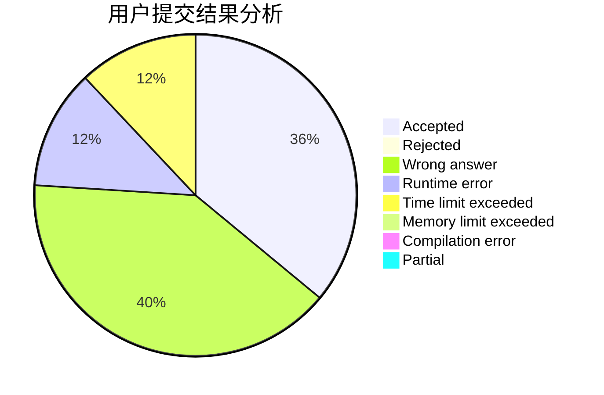
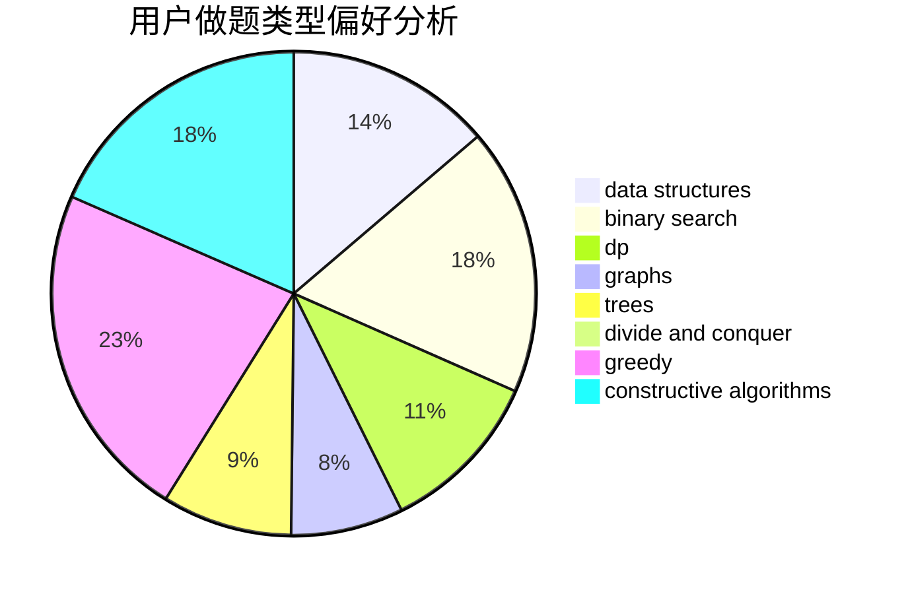

# Overstars

<!-- tabs:start -->

#### **用户提交结果分析**

#### **用户做题类型偏好分析**

#### **用户错题知识点分析**

<!-- tabs:end -->
# 推荐题目
[1490A](https://codeforces.com/contest/1490/problem/A)		greedy,
                        math		  
[814C](https://codeforces.com/contest/814/problem/C)		brute force,
                        dp,
                        strings,
                        two pointers		  
[238A](https://codeforces.com/contest/238/problem/A)		constructive algorithms,
                        math		  
[1065B](https://codeforces.com/contest/1065/problem/B)		constructive algorithms,
                        graphs		  
[552E](https://codeforces.com/contest/552/problem/E)		brute force,
                        dp,
                        expression parsing,
                        greedy,
                        implementation,
                        strings		  
[1166C](https://codeforces.com/contest/1166/problem/C)		binary search,
                        sortings,
                        two pointers		  
[358B](https://codeforces.com/contest/358/problem/B)		brute force,
                        strings		  
[56B](https://codeforces.com/contest/56/problem/B)		implementation		  
[750H](https://codeforces.com/contest/750/problem/H)		dfs and similar,
                        dsu,
                        graphs,
                        interactive		  
[1385F](https://codeforces.com/contest/1385/problem/F)		data structures,
                        greedy,
                        implementation,
                        trees		  
