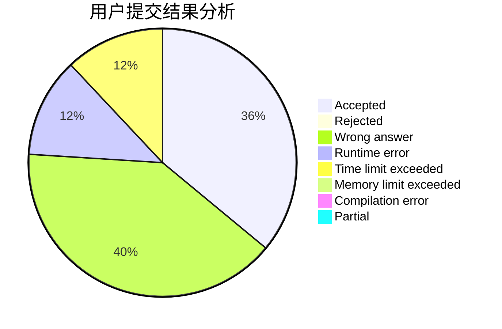
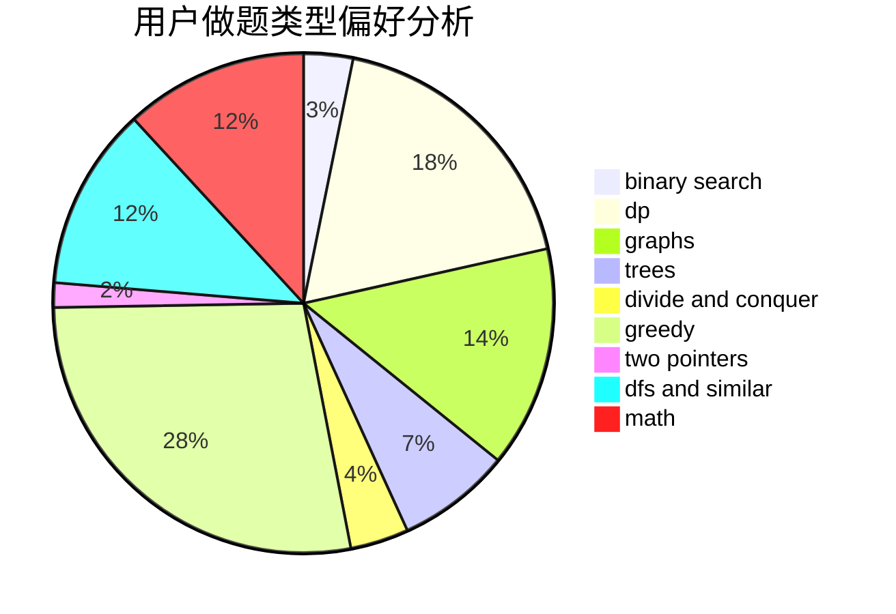

# Overstars

<!-- tabs:start -->

#### **用户提交结果分析**

#### **用户做题类型偏好分析**

<!-- tabs:end -->
# 推荐题目
[1498F](https://codeforces.com/contest/1498/problem/F)
[833A](https://codeforces.com/contest/833/problem/A)
[25D](https://codeforces.com/contest/25/problem/D)
[1065F](https://codeforces.com/contest/1065/problem/F)
[578B](https://codeforces.com/contest/578/problem/B)
[1169B](https://codeforces.com/contest/1169/problem/B)
[383D](https://codeforces.com/contest/383/problem/D)
[58E](https://codeforces.com/contest/58/problem/E)
[771D](https://codeforces.com/contest/771/problem/D)
[1395F](https://codeforces.com/contest/1395/problem/F)
