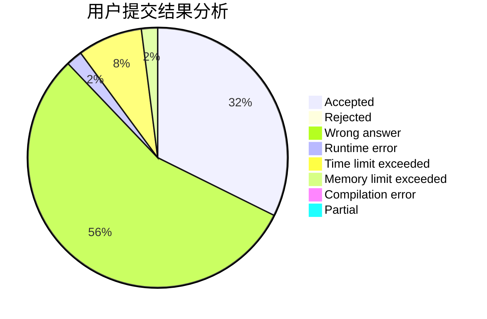
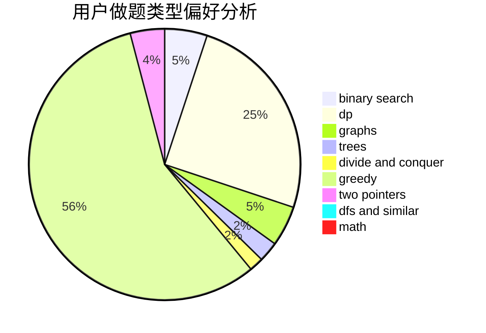

# Owen_codeisking

<!-- tabs:start -->

#### **用户提交结果分析**

#### **用户做题类型偏好分析**

<!-- tabs:end -->
# 推荐题目
[1130E](https://codeforces.com/contest/1130/problem/E)
[977C](https://codeforces.com/contest/977/problem/C)
[273D](https://codeforces.com/contest/273/problem/D)
[1146E](https://codeforces.com/contest/1146/problem/E)
[831B](https://codeforces.com/contest/831/problem/B)
[462B](https://codeforces.com/contest/462/problem/B)
[389A](https://codeforces.com/contest/389/problem/A)
[146B](https://codeforces.com/contest/146/problem/B)
[483E](https://codeforces.com/contest/483/problem/E)
[1158A](https://codeforces.com/contest/1158/problem/A)
