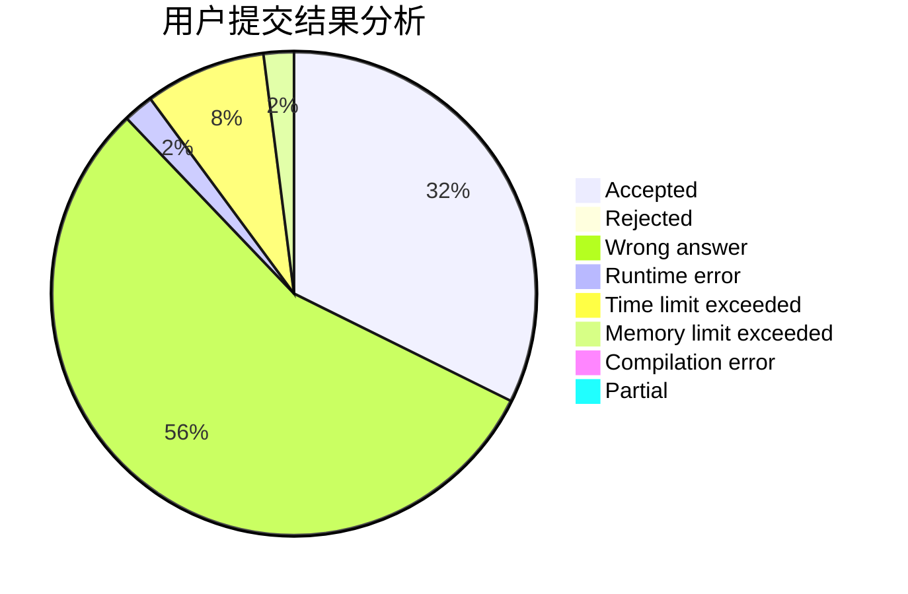
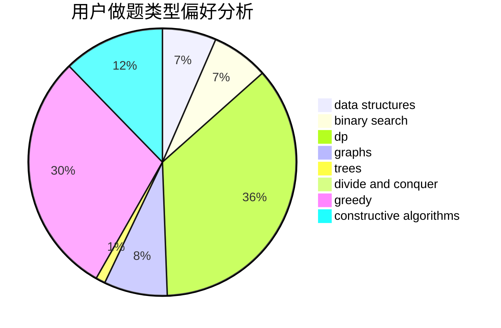
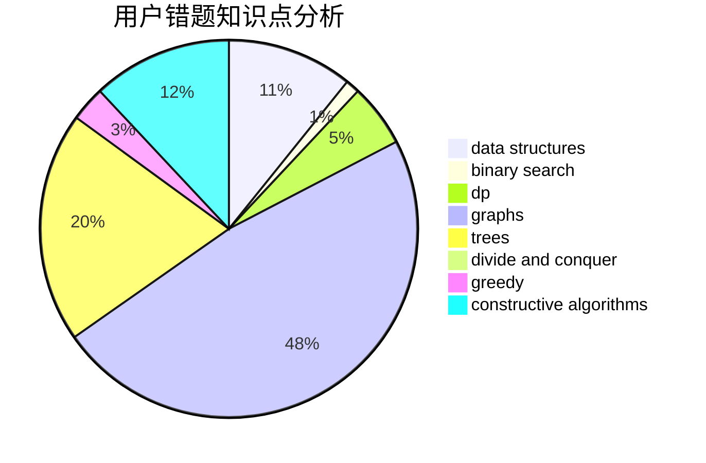

# Owen_codeisking

<!-- tabs:start -->

#### **用户提交结果分析**

#### **用户做题类型偏好分析**

#### **用户错题知识点分析**

<!-- tabs:end -->
# 推荐题目
[1130E](https://codeforces.com/contest/1130/problem/E)		dsu,graphs,sortings,trees		  
[977C](https://codeforces.com/contest/977/problem/C)		sortings		  
[273D](https://codeforces.com/contest/273/problem/D)		dp		  
[1146E](https://codeforces.com/contest/1146/problem/E)		bitmasks,
                        data structures,
                        divide and conquer,
                        implementation		  
[831B](https://codeforces.com/contest/831/problem/B)		implementation,
                        strings		  
[462B](https://codeforces.com/contest/462/problem/B)		greedy		  
[389A](https://codeforces.com/contest/389/problem/A)		greedy,
                        math		  
[146B](https://codeforces.com/contest/146/problem/B)		brute force,
                        implementation		  
[483E](https://codeforces.com/contest/483/problem/E)		dsu,graphs,sortings,trees		  
[1158A](https://codeforces.com/contest/1158/problem/A)		binary search,
                        constructive algorithms,
                        greedy,
                        implementation,
                        math,
                        sortings,
                        two pointers		  
