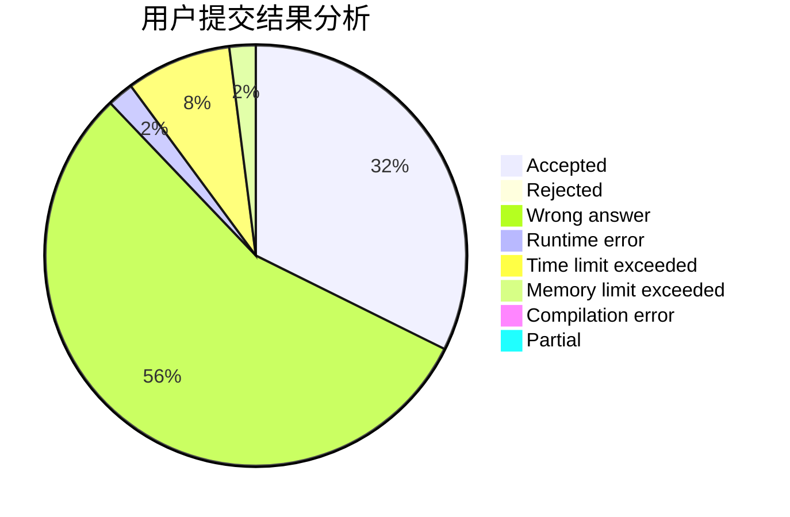
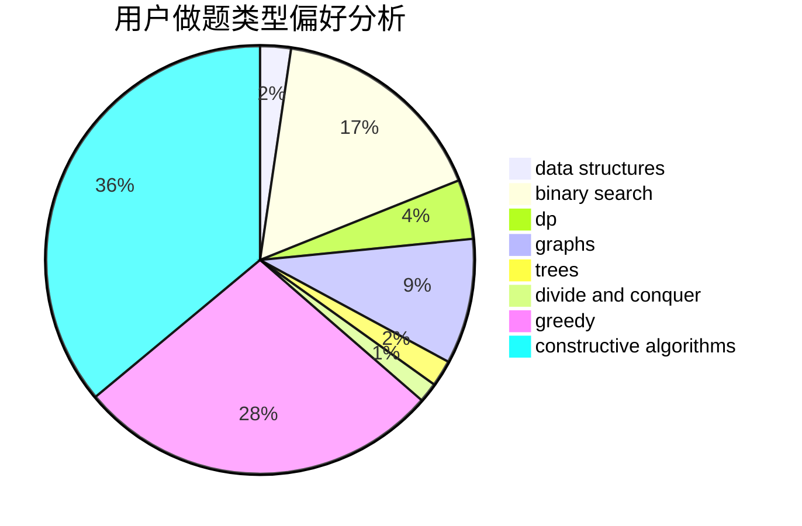
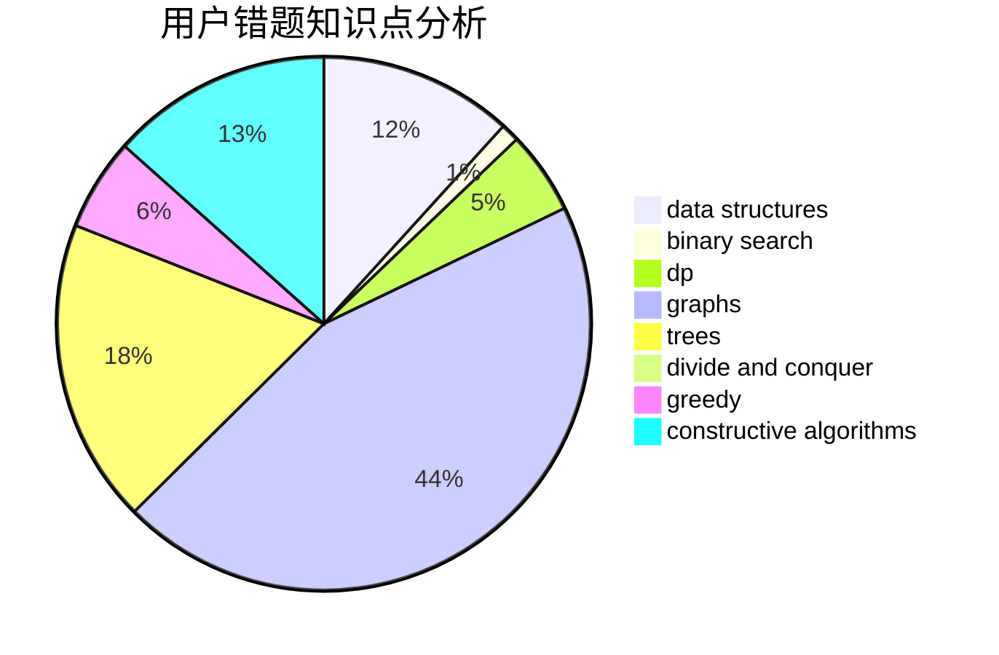

# Owen_codeisking

<!-- tabs:start -->

#### **用户提交结果分析**

#### **用户做题类型偏好分析**

#### **用户错题知识点分析**

<!-- tabs:end -->
# 推荐题目
[1129A1](https://codeforces.com/contest/1129A/problem/1)		brute force,
                        greedy		  
[955C](https://codeforces.com/contest/955/problem/C)		binary search,
                        math,
                        number theory		  
[254D](https://codeforces.com/contest/254/problem/D)		brute force,
                        dfs and similar,
                        graphs,
                        implementation,
                        shortest paths		  
[1144D](https://codeforces.com/contest/1144/problem/D)		constructive algorithms,
                        greedy		  
[812E](https://codeforces.com/contest/812/problem/E)		games,
                        trees		  
[441D](https://codeforces.com/contest/441/problem/D)		constructive algorithms,
                        dsu,
                        graphs,
                        implementation,
                        math,
                        string suffix structures		  
[360E](https://codeforces.com/contest/360/problem/E)		graphs,
                        greedy,
                        shortest paths		  
[1462E1](https://codeforces.com/contest/1462E/problem/1)		binary search,
                        combinatorics,
                        math,
                        sortings,
                        two pointers		  
[464A](https://codeforces.com/contest/464/problem/A)		greedy,
                        strings		  
[1156C](https://codeforces.com/contest/1156/problem/C)		binary search,
                        greedy,
                        sortings,
                        ternary search,
                        two pointers		  
