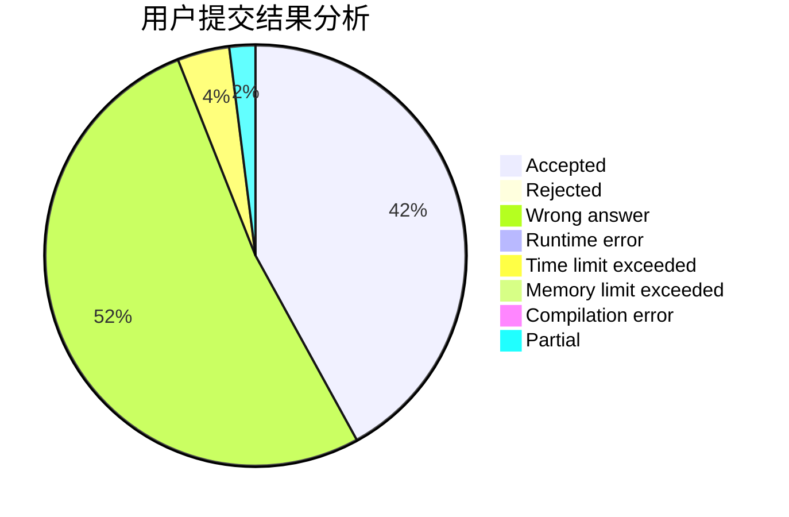
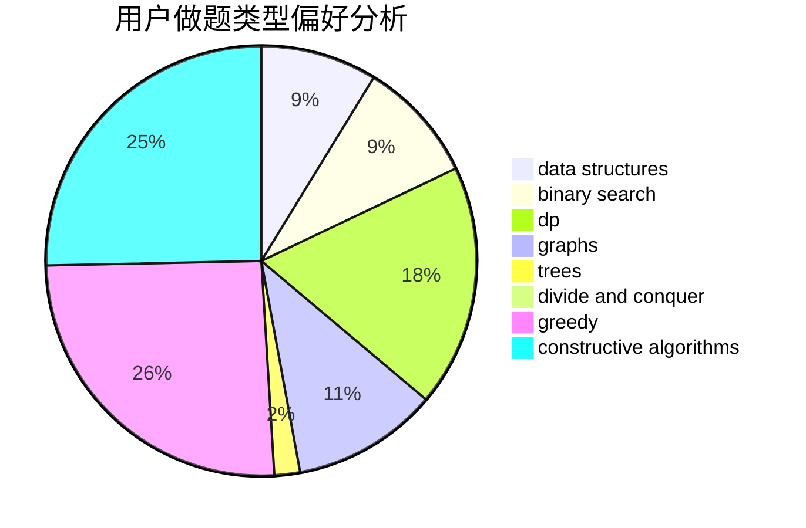

# P.Y.Y

<!-- tabs:start -->

#### **用户提交结果分析**

#### **用户做题类型偏好分析**

#### **用户错题知识点分析**

<!-- tabs:end -->
# 推荐题目
[304B](https://codeforces.com/contest/304/problem/B)		brute force,
                        implementation		  
[777A](https://codeforces.com/contest/777/problem/A)		constructive algorithms,
                        implementation,
                        math		  
[576E](https://codeforces.com/contest/576/problem/E)		binary search,
                        data structures		  
[1168E](https://codeforces.com/contest/1168/problem/E)		constructive algorithms,
                        math		  
[1105A](https://codeforces.com/contest/1105/problem/A)		brute force,
                        implementation		  
[822D](https://codeforces.com/contest/822/problem/D)		brute force,
                        dp,
                        greedy,
                        math,
                        number theory		  
[864A](https://codeforces.com/contest/864/problem/A)		implementation,
                        sortings		  
[650A](https://codeforces.com/contest/650/problem/A)		data structures,
                        geometry,
                        math		  
[524F](https://codeforces.com/contest/524/problem/F)		data structures,
                        greedy,
                        hashing,
                        string suffix structures,
                        strings		  
[1331F](https://codeforces.com/contest/1331/problem/F)		brute force,
                        dp,
                        strings		  
