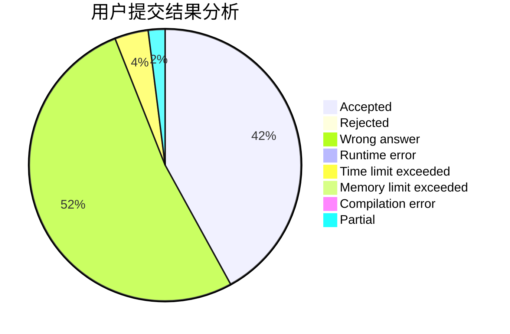
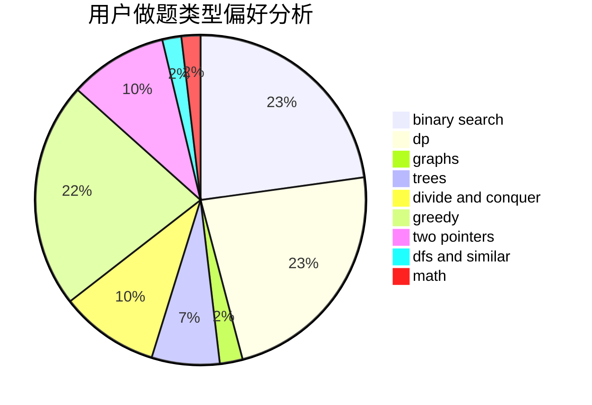

# P.Y.Y

<!-- tabs:start -->

#### **用户提交结果分析**

#### **用户做题类型偏好分析**

<!-- tabs:end -->
# 推荐题目
[323C](https://codeforces.com/contest/323/problem/C)
[794G](https://codeforces.com/contest/794/problem/G)
[598E](https://codeforces.com/contest/598/problem/E)
[1173A](https://codeforces.com/contest/1173/problem/A)
[1105D](https://codeforces.com/contest/1105/problem/D)
[842C](https://codeforces.com/contest/842/problem/C)
[883I](https://codeforces.com/contest/883/problem/I)
[672D](https://codeforces.com/contest/672/problem/D)
[549C](https://codeforces.com/contest/549/problem/C)
[1337E](https://codeforces.com/contest/1337/problem/E)
