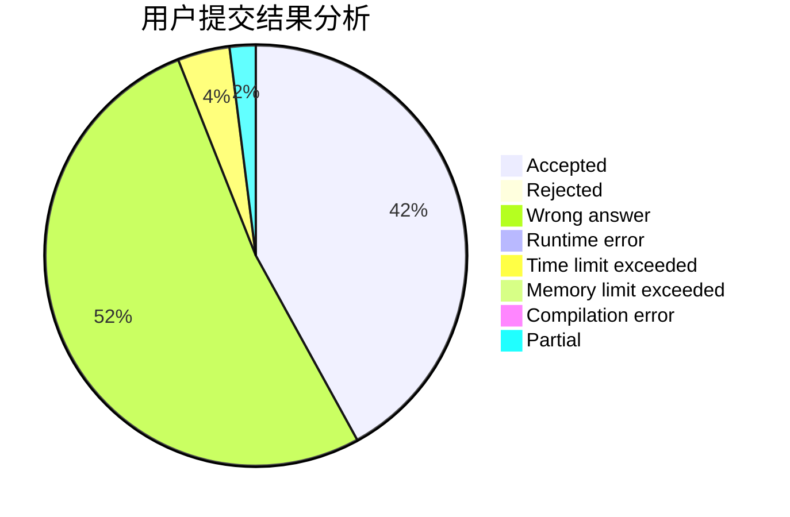
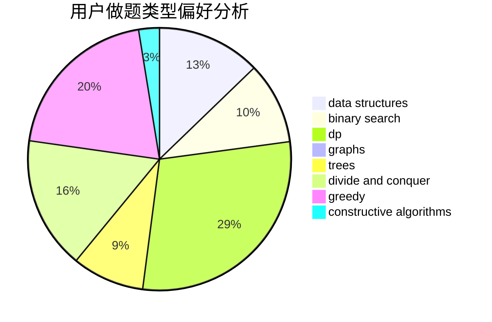

# P.Y.Y

<!-- tabs:start -->

#### **用户提交结果分析**

#### **用户做题类型偏好分析**

#### **用户错题知识点分析**

<!-- tabs:end -->
# 推荐题目
[323C](https://codeforces.com/contest/323/problem/C)		data structures		  
[794G](https://codeforces.com/contest/794/problem/G)		combinatorics,
                        dp,
                        math		  
[598E](https://codeforces.com/contest/598/problem/E)		brute force,
                        dp		  
[1173A](https://codeforces.com/contest/1173/problem/A)		greedy		  
[1105D](https://codeforces.com/contest/1105/problem/D)		dfs and similar,
                        graphs,
                        implementation,
                        shortest paths		  
[842C](https://codeforces.com/contest/842/problem/C)		dfs and similar,
                        graphs,
                        math,
                        number theory,
                        trees		  
[883I](https://codeforces.com/contest/883/problem/I)		binary search,
                        dp		  
[672D](https://codeforces.com/contest/672/problem/D)		dsu,graphs,sortings,trees		  
[549C](https://codeforces.com/contest/549/problem/C)		games		  
[1337E](https://codeforces.com/contest/1337/problem/E)		dsu,graphs,sortings,trees		  
