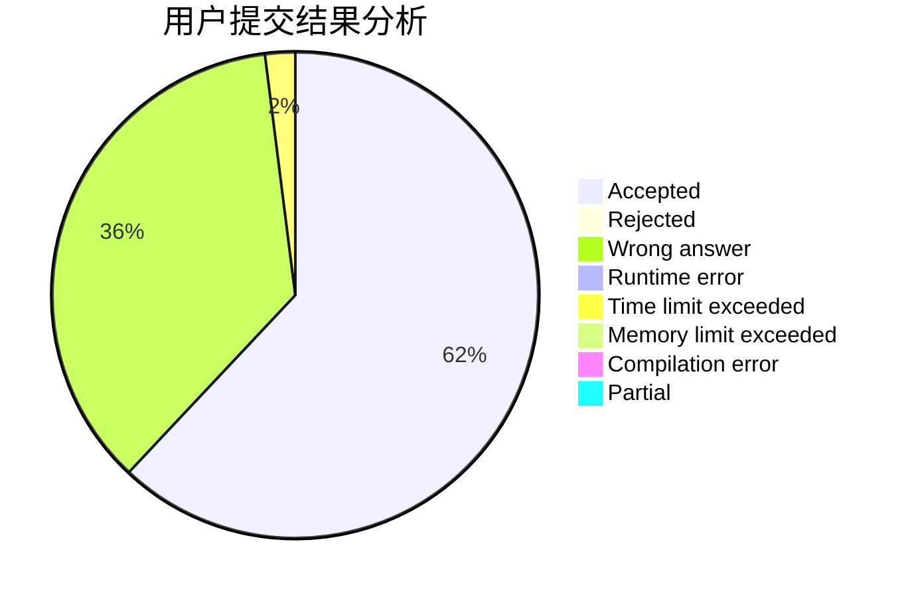
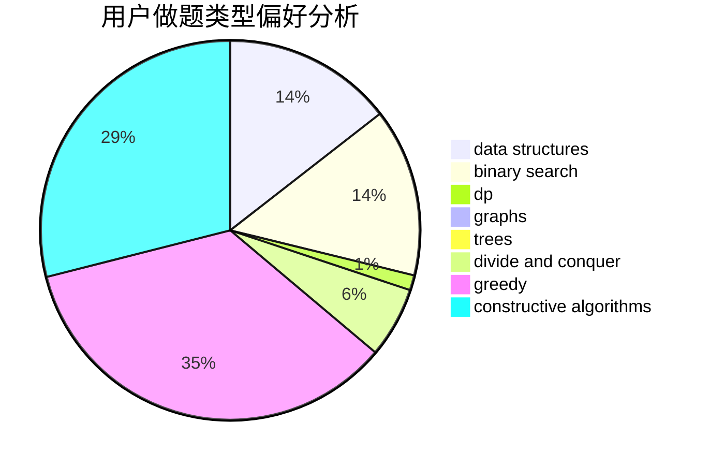
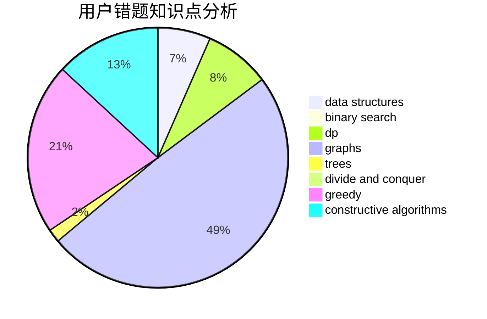

# P1atforM

<!-- tabs:start -->

#### **用户提交结果分析**

#### **用户做题类型偏好分析**

#### **用户错题知识点分析**

<!-- tabs:end -->
# 推荐题目
[612C](https://codeforces.com/contest/612/problem/C)		data structures,
                        expression parsing,
                        math		  
[1422B](https://codeforces.com/contest/1422/problem/B)		greedy,
                        implementation,
                        math		  
[1471D](https://codeforces.com/contest/1471/problem/D)		dsu,graphs,sortings,trees		  
[626E](https://codeforces.com/contest/626/problem/E)		binary search,
                        math,
                        ternary search		  
[47B](https://codeforces.com/contest/47/problem/B)		implementation		  
[578C](https://codeforces.com/contest/578/problem/C)		ternary search		  
[449D](https://codeforces.com/contest/449/problem/D)		bitmasks,
                        combinatorics,
                        dp		  
[1421D](https://codeforces.com/contest/1421/problem/D)		brute force,
                        constructive algorithms,
                        greedy,
                        implementation,
                        math,
                        shortest paths		  
[549F](https://codeforces.com/contest/549/problem/F)		data structures,
                        divide and conquer		  
[1329E](https://codeforces.com/contest/1329/problem/E)		binary search,
                        greedy		  
