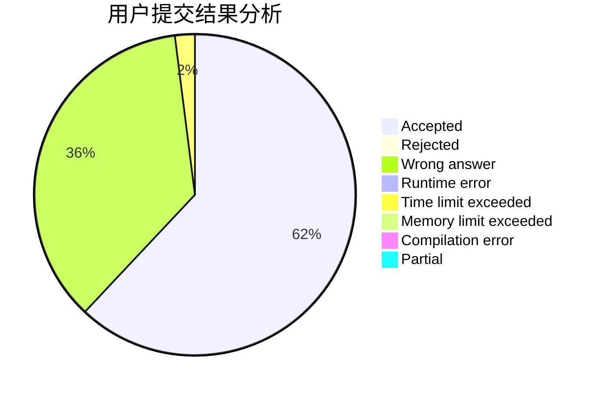
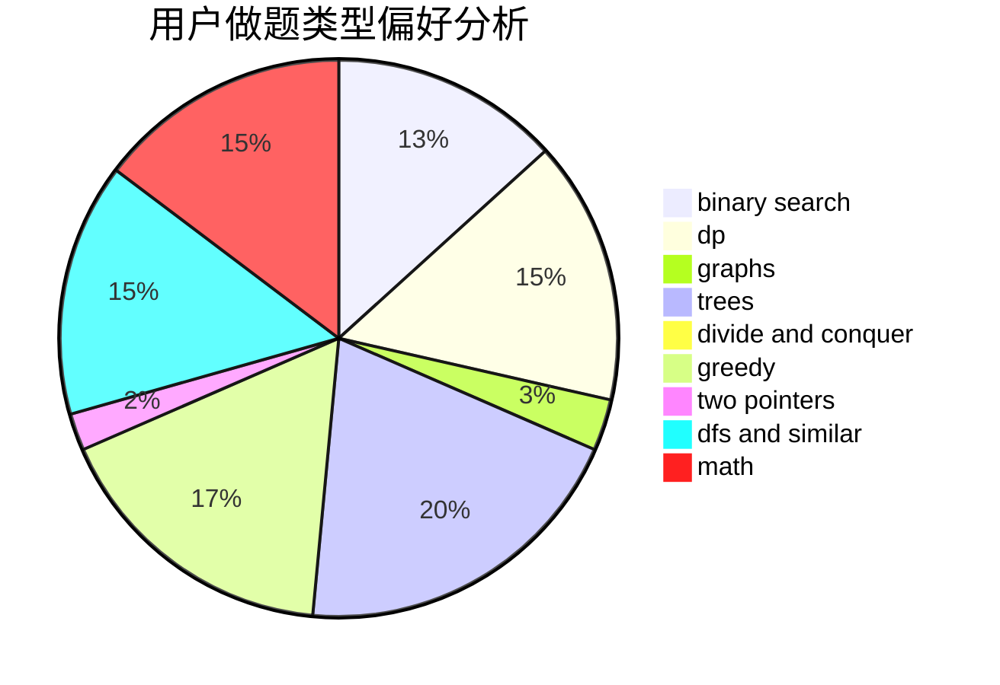

# P1atforM

<!-- tabs:start -->

#### **用户提交结果分析**

#### **用户做题类型偏好分析**

<!-- tabs:end -->
# 推荐题目
[631E](https://codeforces.com/contest/631/problem/E)
[142D](https://codeforces.com/contest/142/problem/D)
[147B](https://codeforces.com/contest/147/problem/B)
[652F](https://codeforces.com/contest/652/problem/F)
[4C](https://codeforces.com/contest/4/problem/C)
[599E](https://codeforces.com/contest/599/problem/E)
[46A](https://codeforces.com/contest/46/problem/A)
[1428H](https://codeforces.com/contest/1428/problem/H)
[574D](https://codeforces.com/contest/574/problem/D)
[1335F](https://codeforces.com/contest/1335/problem/F)
