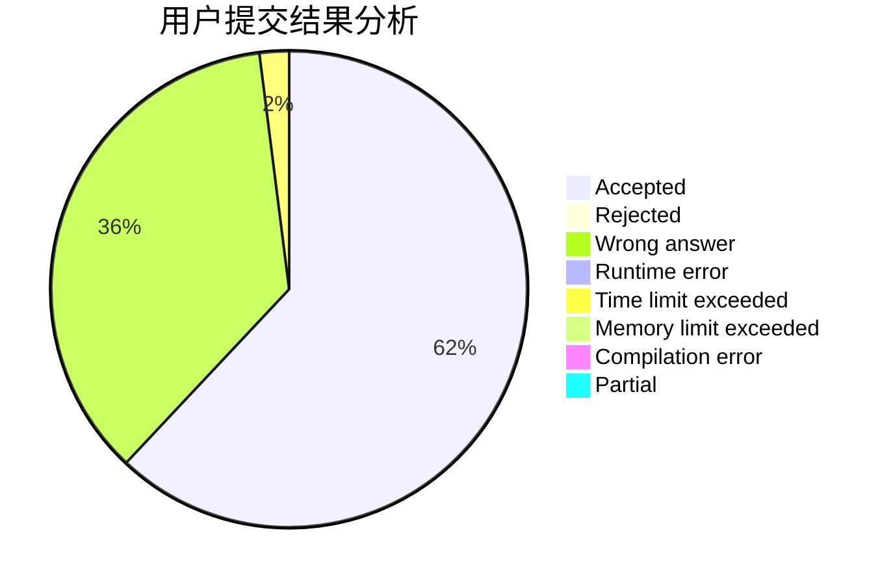
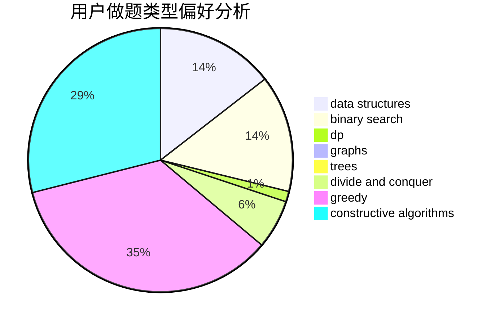
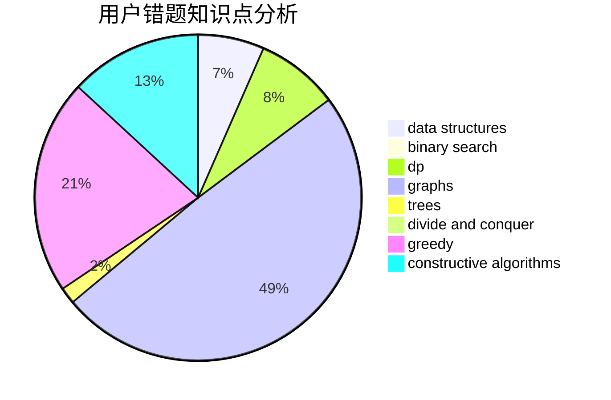

# P1atforM
<!-- tabs:start -->
#### **用户提交结果分析**

#### **用户做题类型偏好分析**

#### **用户错题知识点分析**

<!-- tabs:end -->
# 推荐题目
[Replace To Make Regular Bracket Sequence](http://codeforces.com/problemset/problem/612/C)		data structures,
                        expression parsing,
                        math		  
[Simple Skewness](http://codeforces.com/problemset/problem/626/E)		binary search,
                        math,
                        ternary search		  
[Jzzhu and Numbers](http://codeforces.com/problemset/problem/449/D)		bitmasks,
                        combinatorics,
                        dp		  
[Harry Potter and Three Spells](http://codeforces.com/problemset/problem/65/A)		implementation,
                        math		  
[Chip Game](http://codeforces.com/problemset/problem/1033/G)		games		  
[Trip For Meal](http://codeforces.com/problemset/problem/876/A)		math		  
[Semifinals](http://codeforces.com/problemset/problem/378/B)		implementation,
                        sortings		  
[Be Positive](http://codeforces.com/problemset/problem/1130/A)		implementation		  
[Coins](http://codeforces.com/problemset/problem/47/B)		implementation		  
[Yura and Developers](http://codeforces.com/problemset/problem/549/F)		data structures,
                        divide and conquer		  
<!-- tabs:start -->
#### **data structures**
[Replace To Make Regular Bracket Sequence](http://codeforces.com/problemset/problem/612/C)		data structures,
                        expression parsing,
                        math		  
[Simple Skewness](http://codeforces.com/problemset/problem/549/F)		data structures,
                        divide and conquer		  
[Jzzhu and Numbers](http://codeforces.com/problemset/problem/1156/E)		data structures,
                        divide and conquer,
                        dsu,
                        two pointers		  
[Harry Potter and Three Spells](http://codeforces.com/problemset/problem/1155/D)		brute force,
                        data structures,
                        divide and conquer,
                        dp,
                        greedy		  
[Chip Game](http://codeforces.com/problemset/problem/1286/D)		data structures,
                        math,
                        matrices,
                        probabilities		  
[Trip For Meal](https://codeforces.com/contest/651/problem/C)		data structures,
                        geometry,
                        math		  
[Semifinals](http://codeforces.com/problemset/problem/1408/E)		data structures,
                        dsu,
                        graphs,
                        greedy,
                        sortings,
                        trees		  
[Be Positive](http://codeforces.com/problemset/problem/1492/C)		binary search,
                        data structures,
                        dp,
                        greedy,
                        two pointers		  
[Coins](http://codeforces.com/problemset/problem/1490/G)		binary search,
                        data structures,
                        math		  
[Yura and Developers](http://codeforces.com/problemset/problem/1479/D)		binary search,
                        bitmasks,
                        brute force,
                        data structures,
                        probabilities,
                        trees		  
#### **binary search**
[Replace To Make Regular Bracket Sequence](http://codeforces.com/problemset/problem/626/E)		binary search,
                        math,
                        ternary search		  
[Simple Skewness](http://codeforces.com/problemset/problem/1329/E)		binary search,
                        greedy		  
[Jzzhu and Numbers](http://codeforces.com/problemset/problem/1492/C)		binary search,
                        data structures,
                        dp,
                        greedy,
                        two pointers		  
[Harry Potter and Three Spells](http://codeforces.com/problemset/problem/1463/D)		binary search,
                        constructive algorithms,
                        greedy,
                        two pointers		  
[Chip Game](http://codeforces.com/problemset/problem/1490/G)		binary search,
                        data structures,
                        math		  
[Trip For Meal](http://codeforces.com/problemset/problem/1479/D)		binary search,
                        bitmasks,
                        brute force,
                        data structures,
                        probabilities,
                        trees		  
[Semifinals](http://codeforces.com/problemset/problem/1436/E)		binary search,
                        data structures,
                        two pointers		  
[Be Positive](http://codeforces.com/problemset/problem/1461/D)		binary search,
                        brute force,
                        data structures,
                        divide and conquer,
                        implementation,
                        sortings		  
[Coins](http://codeforces.com/problemset/problem/1493/C)		binary search,
                        brute force,
                        constructive algorithms,
                        greedy,
                        strings		  
[Yura and Developers](http://codeforces.com/problemset/problem/1487/D)		binary search,
                        brute force,
                        math,
                        number theory		  
#### **dp**
[Replace To Make Regular Bracket Sequence](http://codeforces.com/problemset/problem/449/D)		bitmasks,
                        combinatorics,
                        dp		  
[Simple Skewness](http://codeforces.com/problemset/problem/1350/B)		dp,
                        math,
                        number theory		  
[Jzzhu and Numbers](http://codeforces.com/problemset/problem/960/E)		combinatorics,
                        dfs and similar,
                        divide and conquer,
                        dp,
                        probabilities,
                        trees		  
[Harry Potter and Three Spells](http://codeforces.com/problemset/problem/906/C)		bitmasks,
                        brute force,
                        dp,
                        graphs		  
[Chip Game](http://codeforces.com/problemset/problem/1155/D)		brute force,
                        data structures,
                        divide and conquer,
                        dp,
                        greedy		  
[Trip For Meal](http://codeforces.com/problemset/problem/401/D)		bitmasks,
                        brute force,
                        combinatorics,
                        dp,
                        number theory		  
[Semifinals](http://codeforces.com/problemset/problem/1324/E)		dp,
                        implementation		  
[Be Positive](http://codeforces.com/problemset/problem/835/D)		brute force,
                        dp,
                        hashing,
                        strings		  
[Coins](http://codeforces.com/problemset/problem/1492/C)		binary search,
                        data structures,
                        dp,
                        greedy,
                        two pointers		  
[Yura and Developers](https://codeforces.com/contest/1457/problem/C)		brute force,
                        dp,
                        implementation		  
#### **graph**
[Replace To Make Regular Bracket Sequence](http://codeforces.com/problemset/problem/906/C)		bitmasks,
                        brute force,
                        dp,
                        graphs		  
[Simple Skewness](https://codeforces.com/contest/1471/problem/D)		bitmasks,
                        graphs,
                        hashing,
                        math,
                        number theory		  
[Jzzhu and Numbers](http://codeforces.com/problemset/problem/1005/F)		brute force,
                        dfs and similar,
                        graphs,
                        shortest paths		  
[Harry Potter and Three Spells](http://codeforces.com/problemset/problem/1408/E)		data structures,
                        dsu,
                        graphs,
                        greedy,
                        sortings,
                        trees		  
[Chip Game](http://codeforces.com/problemset/problem/1487/C)		brute force,
                        constructive algorithms,
                        dfs and similar,
                        graphs,
                        greedy,
                        implementation,
                        math		  
[Trip For Meal](http://codeforces.com/problemset/problem/1437/C)		dp,
                        flows,
                        graph matchings,
                        greedy,
                        math,
                        sortings		  
[Semifinals](http://codeforces.com/problemset/problem/1470/D)		constructive algorithms,
                        dfs and similar,
                        graph matchings,
                        graphs,
                        greedy		  
[Be Positive](http://codeforces.com/problemset/problem/1476/C)		dp,
                        graphs,
                        greedy		  
[Coins](http://codeforces.com/problemset/problem/1304/D)		constructive algorithms,
                        graphs,
                        greedy,
                        two pointers		  
[Yura and Developers](http://codeforces.com/problemset/problem/1475/C)		combinatorics,
                        graphs,
                        math		  
#### **trees**
[Replace To Make Regular Bracket Sequence](http://codeforces.com/problemset/problem/960/E)		combinatorics,
                        dfs and similar,
                        divide and conquer,
                        dp,
                        probabilities,
                        trees		  
[Simple Skewness](http://codeforces.com/problemset/problem/1408/E)		data structures,
                        dsu,
                        graphs,
                        greedy,
                        sortings,
                        trees		  
[Jzzhu and Numbers](http://codeforces.com/problemset/problem/1479/D)		binary search,
                        bitmasks,
                        brute force,
                        data structures,
                        probabilities,
                        trees		  
[Harry Potter and Three Spells](http://codeforces.com/problemset/problem/1511/C)		brute force,
                        data structures,
                        implementation,
                        trees		  
[Chip Game](http://codeforces.com/problemset/problem/1499/F)		combinatorics,
                        dfs and similar,
                        dp,
                        trees		  
[Trip For Meal](http://codeforces.com/problemset/problem/1491/E)		brute force,
                        dfs and similar,
                        divide and conquer,
                        number theory,
                        trees		  
[Semifinals](http://codeforces.com/problemset/problem/1466/D)		data structures,
                        greedy,
                        sortings,
                        trees		  
[Be Positive](http://codeforces.com/problemset/problem/1495/D)		combinatorics,
                        dfs and similar,
                        graphs,
                        math,
                        shortest paths,
                        trees		  
[Coins](http://codeforces.com/problemset/problem/1303/G)		data structures,
                        divide and conquer,
                        geometry,
                        trees		  
[Yura and Developers](http://codeforces.com/problemset/problem/1454/E)		combinatorics,
                        dfs and similar,
                        graphs,
                        trees		  
#### **divide and conquer**
[Replace To Make Regular Bracket Sequence](http://codeforces.com/problemset/problem/549/F)		data structures,
                        divide and conquer		  
[Simple Skewness](http://codeforces.com/problemset/problem/960/E)		combinatorics,
                        dfs and similar,
                        divide and conquer,
                        dp,
                        probabilities,
                        trees		  
[Jzzhu and Numbers](http://codeforces.com/problemset/problem/1156/E)		data structures,
                        divide and conquer,
                        dsu,
                        two pointers		  
[Harry Potter and Three Spells](http://codeforces.com/problemset/problem/1155/D)		brute force,
                        data structures,
                        divide and conquer,
                        dp,
                        greedy		  
[Chip Game](http://codeforces.com/problemset/problem/1461/D)		binary search,
                        brute force,
                        data structures,
                        divide and conquer,
                        implementation,
                        sortings		  
[Trip For Meal](http://codeforces.com/problemset/problem/1466/G)		combinatorics,
                        divide and conquer,
                        hashing,
                        math,
                        string suffix structures,
                        strings		  
[Semifinals](http://codeforces.com/problemset/problem/1490/D)		dfs and similar,
                        divide and conquer,
                        implementation		  
[Be Positive](https://codeforces.com/contest/1483/problem/C)		data structures,
                        divide and conquer,
                        dp		  
[Coins](http://codeforces.com/problemset/problem/1491/E)		brute force,
                        dfs and similar,
                        divide and conquer,
                        number theory,
                        trees		  
[Yura and Developers](http://codeforces.com/problemset/problem/1303/G)		data structures,
                        divide and conquer,
                        geometry,
                        trees		  
#### **greedy**
[Replace To Make Regular Bracket Sequence](http://codeforces.com/problemset/problem/1155/D)		brute force,
                        data structures,
                        divide and conquer,
                        dp,
                        greedy		  
[Simple Skewness](http://codeforces.com/problemset/problem/1329/E)		binary search,
                        greedy		  
[Jzzhu and Numbers](http://codeforces.com/problemset/problem/1148/A)		greedy		  
[Harry Potter and Three Spells](http://codeforces.com/problemset/problem/1421/D)		brute force,
                        constructive algorithms,
                        greedy,
                        implementation,
                        math,
                        shortest paths		  
[Chip Game](https://codeforces.com/contest/1464/problem/B)		brute force,
                        greedy,
                        implementation,
                        strings		  
[Trip For Meal](http://codeforces.com/problemset/problem/1422/B)		greedy,
                        implementation,
                        math		  
[Semifinals](http://codeforces.com/problemset/problem/1408/E)		data structures,
                        dsu,
                        graphs,
                        greedy,
                        sortings,
                        trees		  
[Be Positive](http://codeforces.com/problemset/problem/1492/C)		binary search,
                        data structures,
                        dp,
                        greedy,
                        two pointers		  
[Coins](https://codeforces.com/contest/1496/problem/C)		geometry,
                        greedy,
                        math,
                        sortings		  
[Yura and Developers](http://codeforces.com/problemset/problem/1493/A)		constructive algorithms,
                        greedy		  
#### **constructive algorithms**
[Replace To Make Regular Bracket Sequence](http://codeforces.com/problemset/problem/1144/C)		constructive algorithms,
                        sortings		  
[Simple Skewness](http://codeforces.com/problemset/problem/1421/D)		brute force,
                        constructive algorithms,
                        greedy,
                        implementation,
                        math,
                        shortest paths		  
[Jzzhu and Numbers](http://codeforces.com/problemset/problem/1493/A)		constructive algorithms,
                        greedy		  
[Harry Potter and Three Spells](http://codeforces.com/problemset/problem/1463/D)		binary search,
                        constructive algorithms,
                        greedy,
                        two pointers		  
[Chip Game](https://codeforces.com/contest/1456/problem/B)		bitmasks,
                        brute force,
                        constructive algorithms		  
[Trip For Meal](http://codeforces.com/problemset/problem/1492/D)		bitmasks,
                        constructive algorithms,
                        greedy,
                        math		  
[Semifinals](https://codeforces.com/contest/1504/problem/D)		constructive algorithms,
                        games,
                        interactive		  
[Be Positive](https://codeforces.com/contest/1483/problem/A)		brute force,
                        constructive algorithms,
                        greedy,
                        implementation		  
[Coins](https://codeforces.com/contest/1457/problem/D)		bitmasks,
                        brute force,
                        constructive algorithms		  
[Yura and Developers](http://codeforces.com/problemset/problem/1513/A)		constructive algorithms,
                        implementation		  
#### **sortings**
[Replace To Make Regular Bracket Sequence](http://codeforces.com/problemset/problem/378/B)		implementation,
                        sortings		  
[Simple Skewness](http://codeforces.com/problemset/problem/1144/C)		constructive algorithms,
                        sortings		  
[Jzzhu and Numbers](http://codeforces.com/problemset/problem/1408/E)		data structures,
                        dsu,
                        graphs,
                        greedy,
                        sortings,
                        trees		  
[Harry Potter and Three Spells](https://codeforces.com/contest/1496/problem/C)		geometry,
                        greedy,
                        math,
                        sortings		  
[Chip Game](http://codeforces.com/problemset/problem/1495/A)		geometry,
                        greedy,
                        math,
                        sortings		  
[Trip For Meal](http://codeforces.com/problemset/problem/1497/A)		brute force,
                        data structures,
                        greedy,
                        sortings		  
[Semifinals](http://codeforces.com/problemset/problem/1427/A)		math,
                        sortings		  
[Be Positive](http://codeforces.com/problemset/problem/1461/D)		binary search,
                        brute force,
                        data structures,
                        divide and conquer,
                        implementation,
                        sortings		  
[Coins](http://codeforces.com/problemset/problem/1437/C)		dp,
                        flows,
                        graph matchings,
                        greedy,
                        math,
                        sortings		  
[Yura and Developers](http://codeforces.com/problemset/problem/1473/A)		greedy,
                        implementation,
                        math,
                        sortings		  
<!-- tabs:end -->
