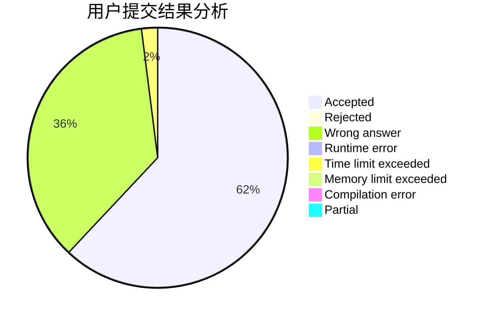
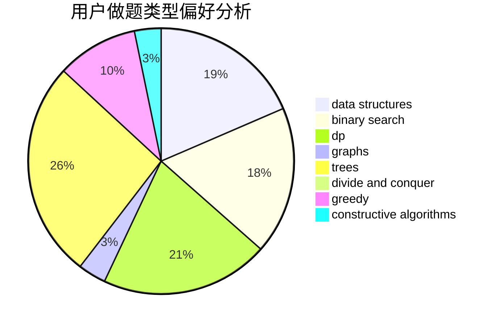

# P1atforM

<!-- tabs:start -->

#### **用户提交结果分析**

#### **用户做题类型偏好分析**

#### **用户错题知识点分析**

<!-- tabs:end -->
# 推荐题目
[631E](https://codeforces.com/contest/631/problem/E)		data structures,
                        dp,
                        geometry		  
[142D](https://codeforces.com/contest/142/problem/D)		games		  
[147B](https://codeforces.com/contest/147/problem/B)		binary search,
                        graphs,
                        matrices		  
[652F](https://codeforces.com/contest/652/problem/F)		constructive algorithms,
                        math		  
[4C](https://codeforces.com/contest/4/problem/C)		data structures,
                        hashing,
                        implementation		  
[599E](https://codeforces.com/contest/599/problem/E)		bitmasks,
                        dp,
                        trees		  
[46A](https://codeforces.com/contest/46/problem/A)		brute force,
                        implementation		  
[1428H](https://codeforces.com/contest/1428/problem/H)		binary search,
                        interactive		  
[574D](https://codeforces.com/contest/574/problem/D)		dsu,graphs,sortings,trees		  
[1335F](https://codeforces.com/contest/1335/problem/F)		data structures,
                        dfs and similar,
                        dsu,
                        graphs,
                        greedy,
                        matrices		  
