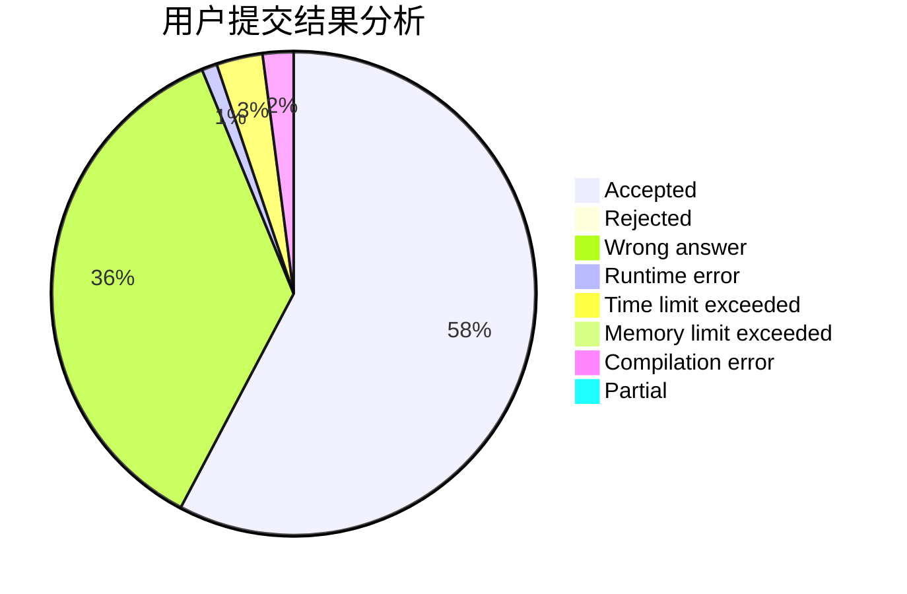
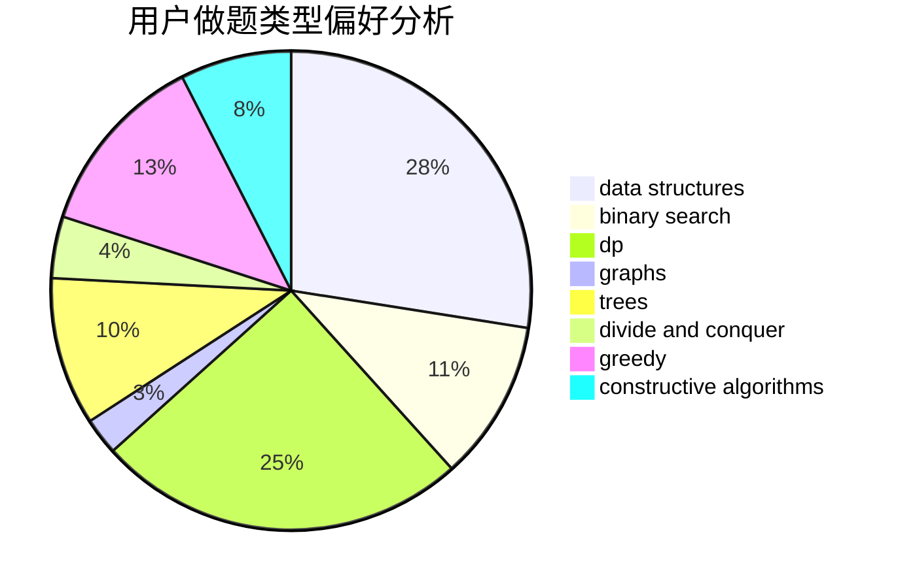
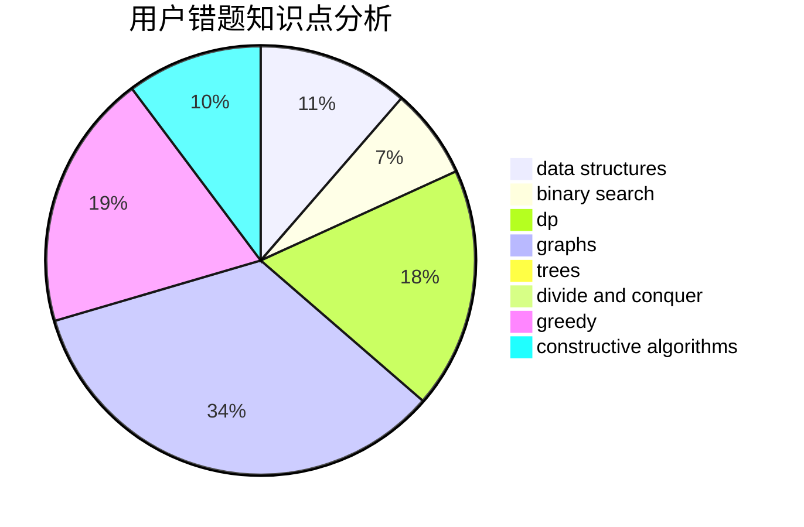

# P500

<!-- tabs:start -->

#### **用户提交结果分析**

#### **用户做题类型偏好分析**

#### **用户错题知识点分析**

<!-- tabs:end -->
# 推荐题目
[57D](https://codeforces.com/contest/57/problem/D)		dp,
                        math		  
[1045E](https://codeforces.com/contest/1045/problem/E)		constructive algorithms,
                        geometry		  
[1470D](https://codeforces.com/contest/1470/problem/D)		constructive algorithms,
                        dfs and similar,
                        graph matchings,
                        graphs,
                        greedy		  
[7A](https://codeforces.com/contest/7/problem/A)		brute force,
                        constructive algorithms		  
[982E](https://codeforces.com/contest/982/problem/E)		geometry,
                        number theory		  
[730E](https://codeforces.com/contest/730/problem/E)		greedy,
                        implementation		  
[271D](https://codeforces.com/contest/271/problem/D)		data structures,
                        strings		  
[460B](https://codeforces.com/contest/460/problem/B)		brute force,
                        implementation,
                        math,
                        number theory		  
[1197C](https://codeforces.com/contest/1197/problem/C)		greedy,
                        sortings		  
[508A](https://codeforces.com/contest/508/problem/A)		brute force		  
