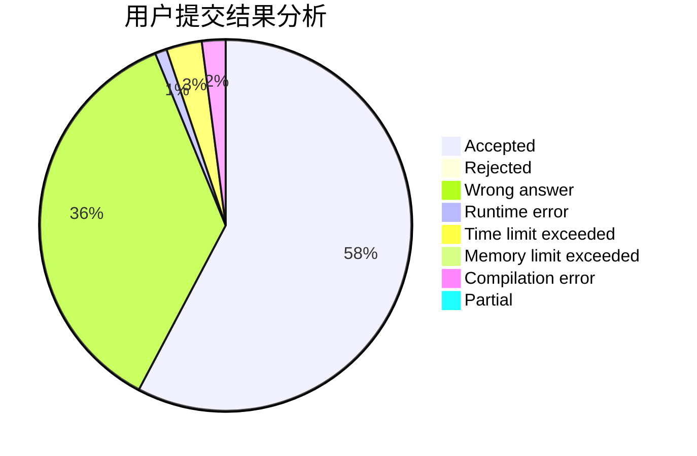
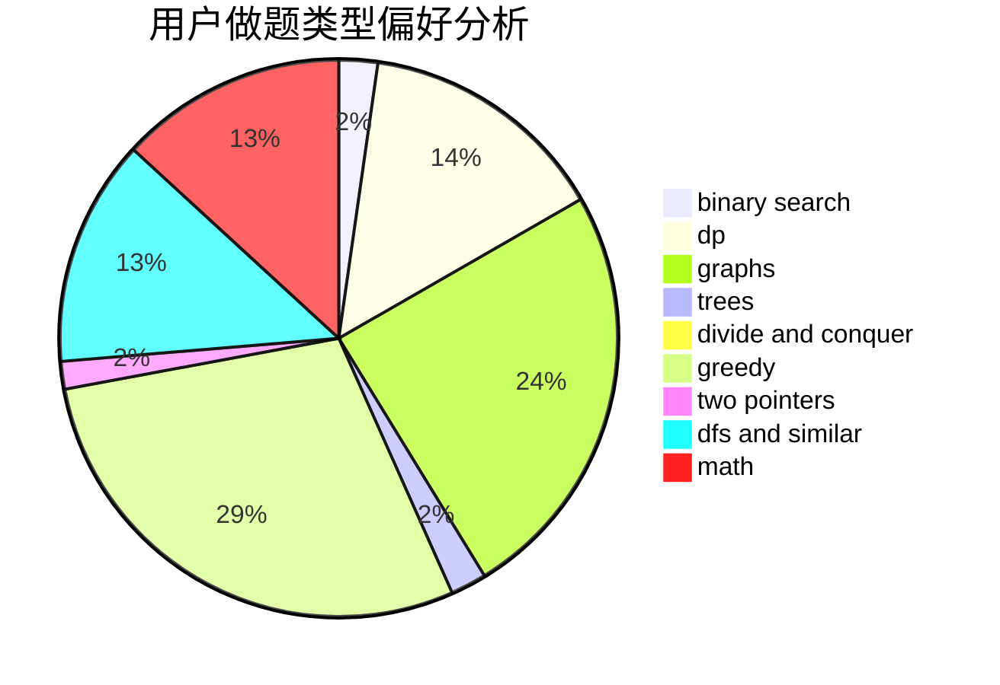

# P500

<!-- tabs:start -->

#### **用户提交结果分析**

#### **用户做题类型偏好分析**

<!-- tabs:end -->
# 推荐题目
[57D](https://codeforces.com/contest/57/problem/D)
[1045E](https://codeforces.com/contest/1045/problem/E)
[1470D](https://codeforces.com/contest/1470/problem/D)
[7A](https://codeforces.com/contest/7/problem/A)
[982E](https://codeforces.com/contest/982/problem/E)
[730E](https://codeforces.com/contest/730/problem/E)
[271D](https://codeforces.com/contest/271/problem/D)
[460B](https://codeforces.com/contest/460/problem/B)
[1197C](https://codeforces.com/contest/1197/problem/C)
[508A](https://codeforces.com/contest/508/problem/A)
