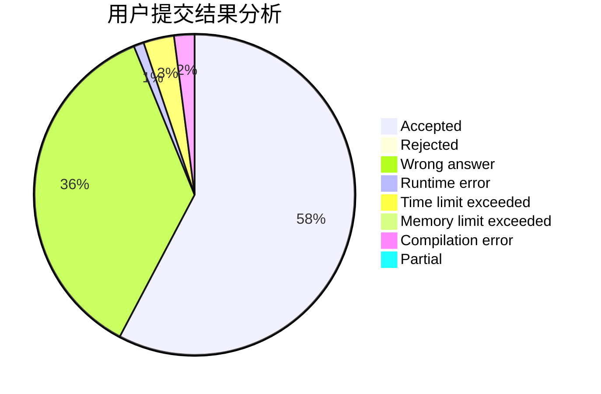
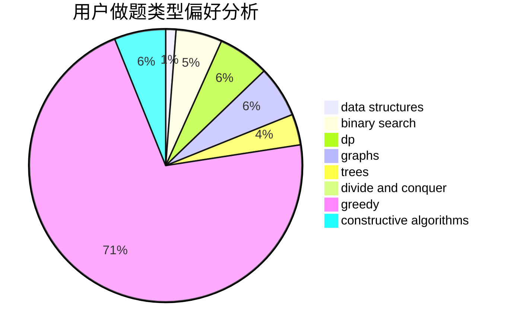
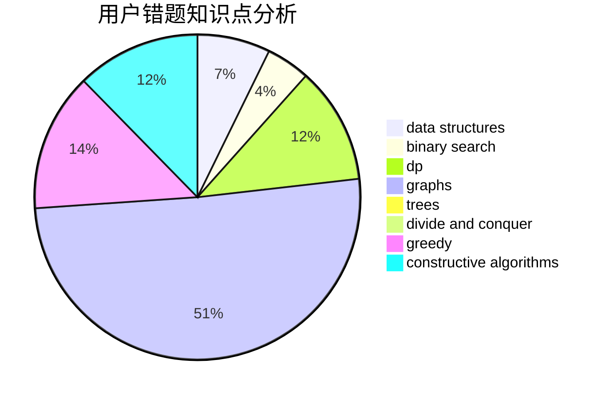

# P500

<!-- tabs:start -->

#### **用户提交结果分析**

#### **用户做题类型偏好分析**

#### **用户错题知识点分析**

<!-- tabs:end -->
# 推荐题目
[555C](https://codeforces.com/contest/555/problem/C)		data structures		  
[1044D](https://codeforces.com/contest/1044/problem/D)		data structures,
                        dsu		  
[1463C](https://codeforces.com/contest/1463/problem/C)		implementation		  
[781C](https://codeforces.com/contest/781/problem/C)		dsu,graphs,sortings,trees		  
[960F](https://codeforces.com/contest/960/problem/F)		data structures,
                        dp,
                        graphs		  
[710B](https://codeforces.com/contest/710/problem/B)		brute force,
                        sortings		  
[253D](https://codeforces.com/contest/253/problem/D)		brute force,
                        two pointers		  
[438D](https://codeforces.com/contest/438/problem/D)		data structures,
                        math		  
[1191D](https://codeforces.com/contest/1191/problem/D)		dsu,graphs,sortings,trees		  
[487A](https://codeforces.com/contest/487/problem/A)		binary search,
                        brute force,
                        implementation		  
