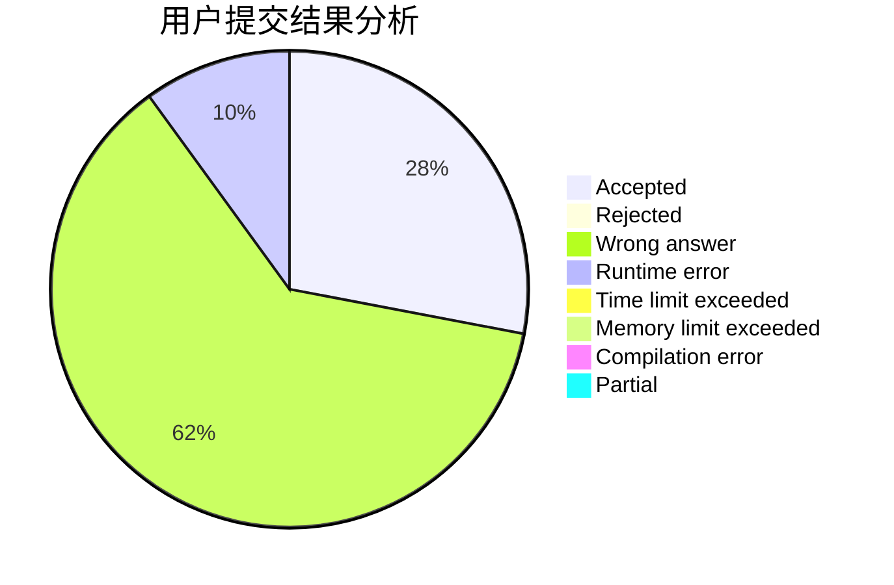
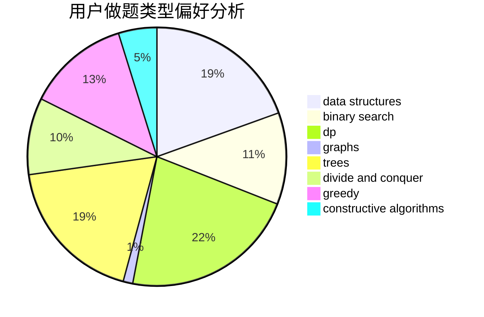

# P600

<!-- tabs:start -->

#### **用户提交结果分析**

#### **用户做题类型偏好分析**

#### **用户错题知识点分析**

<!-- tabs:end -->
# 推荐题目
[893D](https://codeforces.com/contest/893/problem/D)		data structures,
                        dp,
                        greedy,
                        implementation		  
[860B](https://codeforces.com/contest/860/problem/B)		dsu,graphs,sortings,trees		  
[13351](https://codeforces.com/contest/1335/problem/1)		dsu,graphs,sortings,trees		  
[585B](https://codeforces.com/contest/585/problem/B)		dfs and similar,
                        graphs,
                        shortest paths		  
[47B](https://codeforces.com/contest/47/problem/B)		implementation		  
[525C](https://codeforces.com/contest/525/problem/C)		greedy,
                        math,
                        sortings		  
[1411A](https://codeforces.com/contest/1411/problem/A)		implementation		  
[13562](https://codeforces.com/contest/1356/problem/2)		dsu,graphs,sortings,trees		  
[873A](https://codeforces.com/contest/873/problem/A)		implementation		  
[981E](https://codeforces.com/contest/981/problem/E)		bitmasks,
                        data structures,
                        divide and conquer,
                        dp		  
