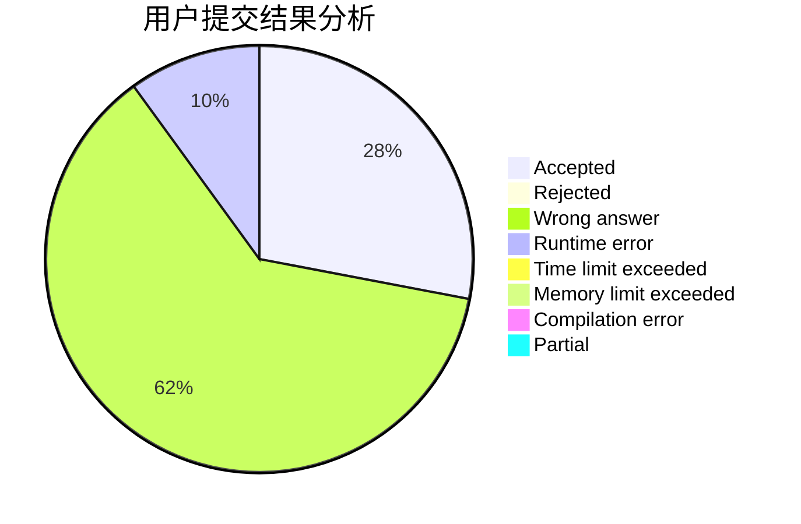
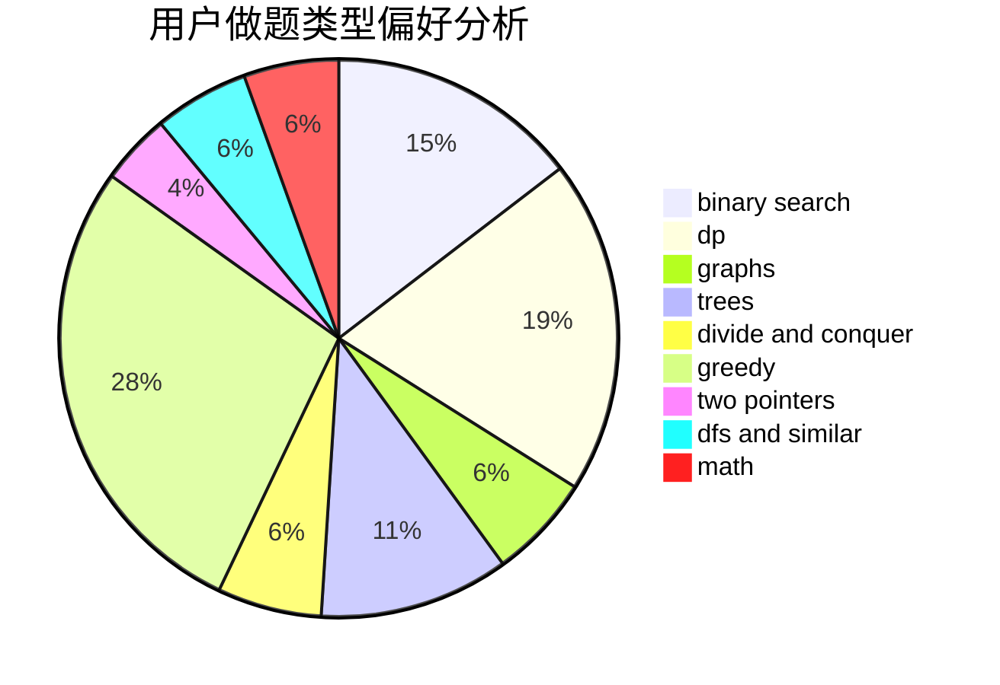

# P600

<!-- tabs:start -->

#### **用户提交结果分析**

#### **用户做题类型偏好分析**

<!-- tabs:end -->
# 推荐题目
[893D](https://codeforces.com/contest/893/problem/D)
[860B](https://codeforces.com/contest/860/problem/B)
[13351](https://codeforces.com/contest/1335/problem/1)
[585B](https://codeforces.com/contest/585/problem/B)
[47B](https://codeforces.com/contest/47/problem/B)
[525C](https://codeforces.com/contest/525/problem/C)
[1411A](https://codeforces.com/contest/1411/problem/A)
[13562](https://codeforces.com/contest/1356/problem/2)
[873A](https://codeforces.com/contest/873/problem/A)
[981E](https://codeforces.com/contest/981/problem/E)
