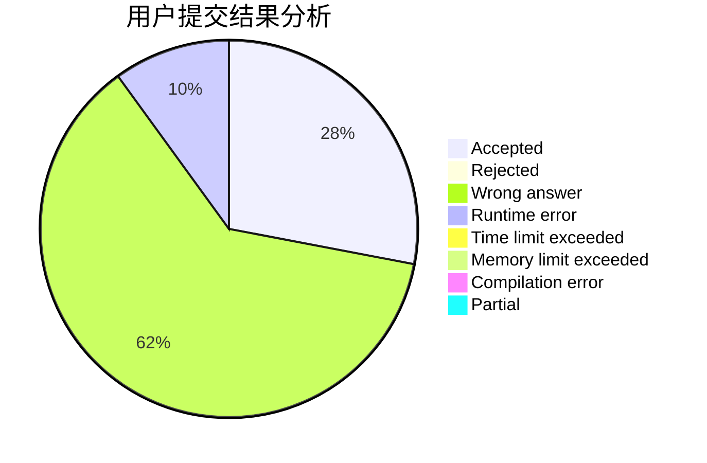
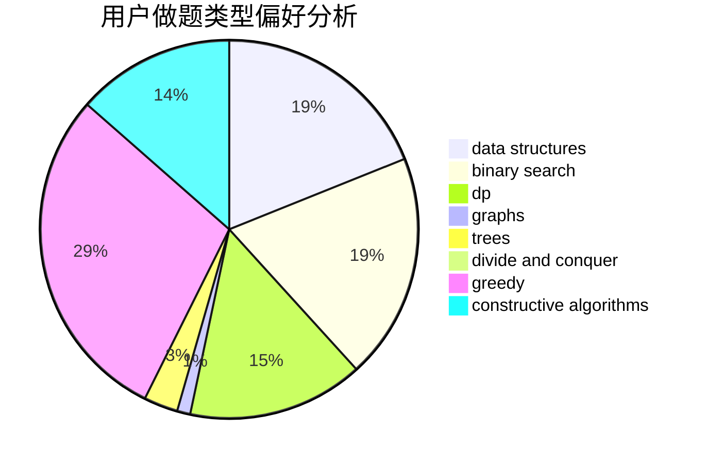

# P600

<!-- tabs:start -->

#### **用户提交结果分析**

#### **用户做题类型偏好分析**

#### **用户错题知识点分析**

<!-- tabs:end -->
# 推荐题目
[872B](https://codeforces.com/contest/872/problem/B)		dsu,graphs,sortings,trees		  
[841B](https://codeforces.com/contest/841/problem/B)		games,
                        math		  
[1328E](https://codeforces.com/contest/1328/problem/E)		dfs and similar,
                        graphs,
                        trees		  
[566C](https://codeforces.com/contest/566/problem/C)		dfs and similar,
                        divide and conquer,
                        trees		  
[460D](https://codeforces.com/contest/460/problem/D)		brute force,
                        constructive algorithms,
                        math		  
[505A](https://codeforces.com/contest/505/problem/A)		brute force,
                        implementation,
                        strings		  
[1400F](https://codeforces.com/contest/1400/problem/F)		brute force,
                        dfs and similar,
                        dp,
                        string suffix structures,
                        strings		  
[1349D](https://codeforces.com/contest/1349/problem/D)		math,
                        probabilities		  
[854C](https://codeforces.com/contest/854/problem/C)		dsu,graphs,sortings,trees		  
[95A](https://codeforces.com/contest/95/problem/A)		implementation,
                        strings		  
