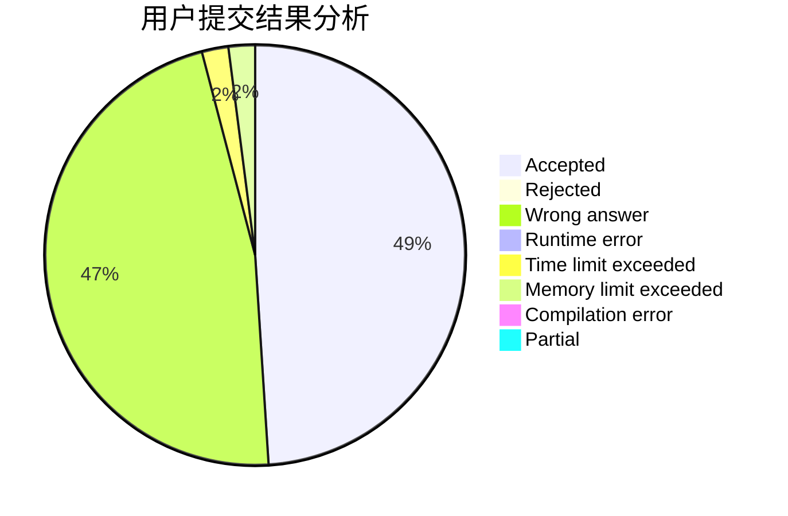
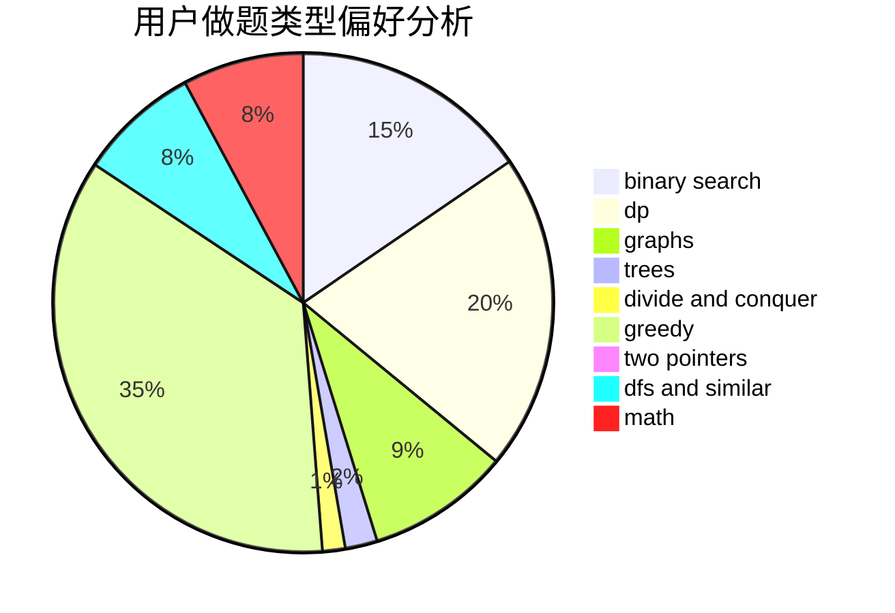

# ABCsfree

<!-- tabs:start -->

#### **用户提交结果分析**

#### **用户做题类型偏好分析**

<!-- tabs:end -->
# 推荐题目
[1471E](https://codeforces.com/contest/1471/problem/E)
[1477F](https://codeforces.com/contest/1477/problem/F)
[1187B](https://codeforces.com/contest/1187/problem/B)
[1332D](https://codeforces.com/contest/1332/problem/D)
[1312G](https://codeforces.com/contest/1312/problem/G)
[1475G](https://codeforces.com/contest/1475/problem/G)
[1368F](https://codeforces.com/contest/1368/problem/F)
[1096C](https://codeforces.com/contest/1096/problem/C)
[1477E](https://codeforces.com/contest/1477/problem/E)
[1058E](https://codeforces.com/contest/1058/problem/E)
