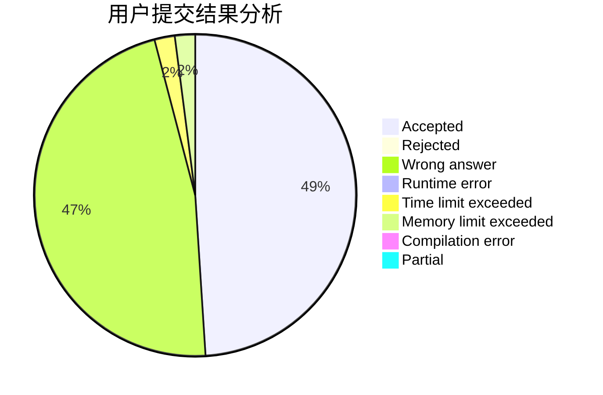
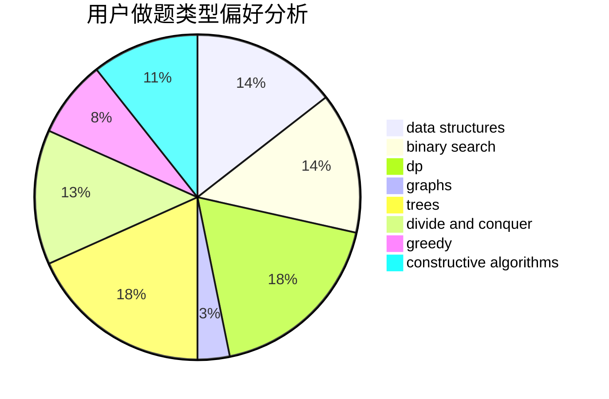
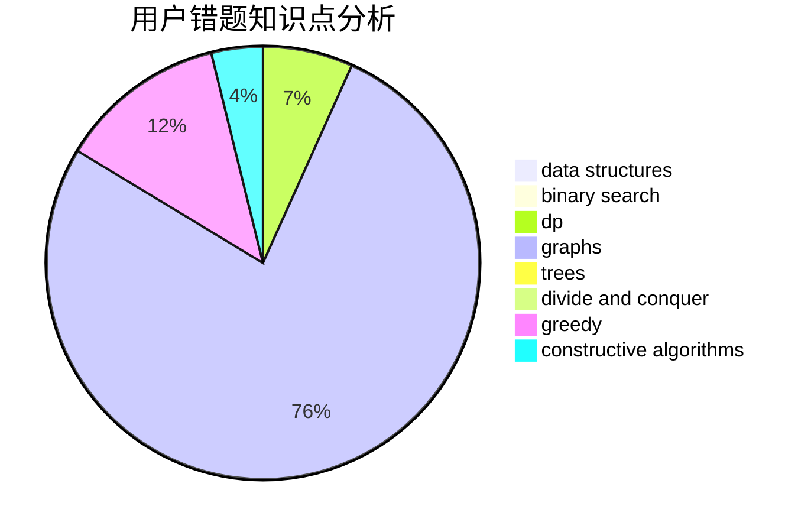

# ABCsfree

<!-- tabs:start -->

#### **用户提交结果分析**

#### **用户做题类型偏好分析**

#### **用户错题知识点分析**

<!-- tabs:end -->
# 推荐题目
[1471E](https://codeforces.com/contest/1471/problem/E)		dsu,graphs,sortings,trees		  
[1477F](https://codeforces.com/contest/1477/problem/F)		combinatorics,
                        fft,
                        math,
                        probabilities		  
[1187B](https://codeforces.com/contest/1187/problem/B)		binary search,
                        implementation,
                        strings		  
[1332D](https://codeforces.com/contest/1332/problem/D)		bitmasks,
                        constructive algorithms,
                        math		  
[1312G](https://codeforces.com/contest/1312/problem/G)		data structures,
                        dfs and similar,
                        dp		  
[1475G](https://codeforces.com/contest/1475/problem/G)		dp,
                        math,
                        number theory,
                        sortings		  
[1368F](https://codeforces.com/contest/1368/problem/F)		games,
                        implementation,
                        interactive,
                        math		  
[1096C](https://codeforces.com/contest/1096/problem/C)		brute force,
                        geometry		  
[1477E](https://codeforces.com/contest/1477/problem/E)		data structures,
                        greedy		  
[1058E](https://codeforces.com/contest/1058/problem/E)		dsu,graphs,sortings,trees		  
