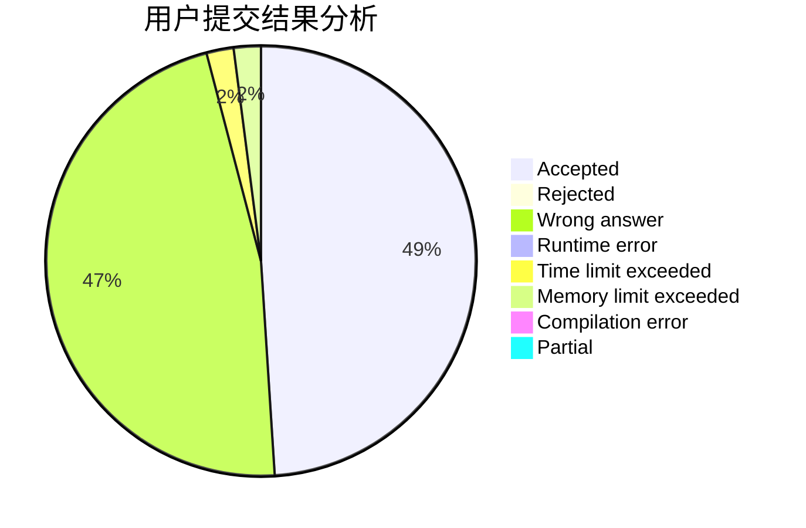
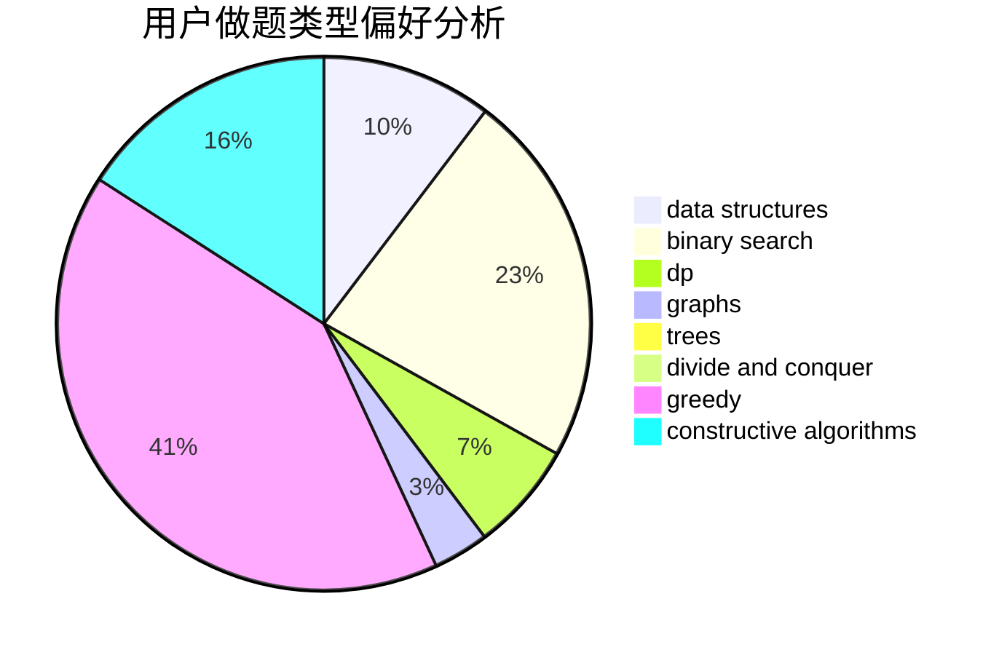
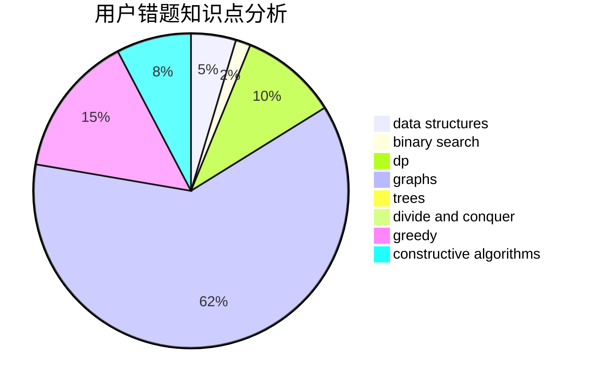

# ABCsfree

<!-- tabs:start -->

#### **用户提交结果分析**

#### **用户做题类型偏好分析**

#### **用户错题知识点分析**

<!-- tabs:end -->
# 推荐题目
[1464D](https://codeforces.com/contest/1464/problem/D)		dsu,graphs,sortings,trees		  
[1469E](https://codeforces.com/contest/1469/problem/E)		bitmasks,
                        brute force,
                        hashing,
                        string suffix structures,
                        strings,
                        two pointers		  
[1184A1](https://codeforces.com/contest/1184A/problem/1)		brute force,
                        math,
                        number theory		  
[1326B](https://codeforces.com/contest/1326/problem/B)		implementation,
                        math		  
[1304B](https://codeforces.com/contest/1304/problem/B)		brute force,
                        constructive algorithms,
                        greedy,
                        implementation,
                        strings		  
[1468F](https://codeforces.com/contest/1468/problem/F)		geometry,
                        hashing,
                        number theory		  
[1360G](https://codeforces.com/contest/1360/problem/G)		constructive algorithms,
                        greedy,
                        math		  
[1095F](https://codeforces.com/contest/1095/problem/F)		dsu,
                        graphs,
                        greedy		  
[1469D](https://codeforces.com/contest/1469/problem/D)		brute force,
                        constructive algorithms,
                        math,
                        number theory		  
[1058B](https://codeforces.com/contest/1058/problem/B)		dsu,graphs,sortings,trees		  
